# SCP(Samsung Cloud Platform) v2 기반 Terraform IaC 실무 심화 과정 (TechCamp 특강)

## 과정 소개
클라우드 인프라 관리의 패러다임이 '수동 설정'에서 '코드 기반 자동화(Infrastructure as Code)'로 변화하고 있습니다. 본 과정은 Samsung Cloud Platform (SCP) v2 환경에 특화된 실전형 Terraform 교육 과정입니다.

본 과정은 이론 20%와 실습 80%로 구성되어 있으며, 단순히 Terraform의 문법을 익히는 것을 넘어 네트워크(VPC) 구축부터 데이터베이스(DBaaS), 그리고 컨테이너 오케스트레이션의 핵심인 Kubernetes(SKE) 클러스터 및 스토리지 연동까지 엔터프라이즈급 3-Tier 아키텍처 전체를 코드로 직접 정의하고 배포·운영하는 실무 자동화 역량 확보를 목표로 합니다. 특히 각 일차의 마지막 세션에 배치된 시나리오 기반 과제 해결형 미션(Mission)을 통해 실제 운영 환경에서의 문제 해결 능력을 체득할 수 있습니다.

### 교육 대상
본 과정은 다음과 같은 역할을 수행하거나 인프라 자동화 역량을 확보하고자 하는 분들을 대상으로 합니다.
*   **시스템/네트워크 엔지니어**: SCP 환경으로 인프라를 전환하고 구성하는 데 필요한 Terraform 기반 IaC 실무 역량을 확보하려는 분
*   **클라우드 운영 관리자**: SCP 환경에서 인프라 배포 및 관리 작업을 자동화하여 업무 효율을 높이고자 하는 분
*   **DevOps 담당자**: VPC, VM, DB, Kubernetes 등의 핵심 클라우드 자원을 코드로 정의하고 일관되게 관리하려는 분
*   **인프라 아키텍트/실무자**: 수동 설정 방식의 복잡성에서 벗어나 표준화되고 재현 가능한 인프라 배포 체계를 구축하려는 분

### 선수 지식
본 과정의 원활한 수강과 실습 진행을 위해 아래의 선수 지식을 권장합니다.

#### 필수 선수 지식
*   **클라우드 인프라 운영**: SCP 또는 타 퍼블릭 클라우드 환경에서 가상 자원을 구축하고 운영해 본 경험
*   **리눅스/CLI 활용**: 리눅스 환경에서의 CLI 기반 명령어 조작 능력
*   **네트워크 기초 이론**: 퍼블릭 클라우드 환경에서의 VPC, Subnet, 보안 정책(Firewall, Security Group) 등 기본적인 네트워크 아키텍처 구성에 대한 이해

#### 권장 선수 지식
*   **정형 데이터 구조**: JSON 또는 YAML 데이터 포맷의 구조적 특징과 표현 방식에 대한 기초적인 이해
*   **IaC 개념**: 코드 기반 인프라 정의 및 형상 관리 도구의 기본 동작 원리에 대한 이해
*   **Kubernetes 기초**: 쿠버네티스 서비스의 주요 구성 요소(Node, Pod, Service 등)와 기본적인 트래픽 라우팅 동작 원리에 대한 기본 지식

## 목차
0. SCP v2 주요 변화
1. IaC와 Terraform의 동작 원리
2. [실습] 실습 개발 환경 구성 (Console & CLI)
3. [실습] SCP Provider 및 인증 연동
4. [실습] HCL 문법 및 표준 워크플로우
5. State 관리 및 협업 운영 전략
6. Terraform으로 SCP 리소스 정의하기
7. [실습] 테라폼 기초 실습 및 네트워크 리소스 정의
8. 1일차 복습: 테라폼 기본 워크플로우 및 SCP 기초 리소스 구성 회고
9. Terraform으로 SCP 리소스 심화 정의 (변수와 출력)
10. [실습] SCP 3-Tier 네트워크 인프라 구축
11. [실습] 데이터베이스 및 컴퓨팅 인프라 구축
12. [실습] Kubernetes 클러스터 배포 (미션 수행형)
13. 환경 정리 및 라이프사이클 마무리
14. [부록] Gateway API 및 Gateway Controller 배포

## 강의 시간표

### 🗓️ 1일차: Terraform 문법 및 기초 네트워크 실습

*   **일자 주제**: Terraform의 핵심 메커니즘을 이해하고, 기초 네트워크 리소스를 정의 및 생성하는 방법을 습득한다.

| 시간 | 방식 | 연동 목차 (교재 링크) | 세부 교육 내용 (요약) |
| :--- | :---: | :--- | :--- |
| **10:00 ~ 10:50** | 이론 | [0. 주요 변화](#0-scp-v2-주요-변화) <br> [1. 동작 원리](#1-iac와-terraform의-동작-원리) | 과정 소개, SCP v2 변화점, IaC 철학 및 타 도구 비교 |
| **11:00 ~ 12:00** | 실습 | [2. 개발 환경 구성](#2-실습-실습-개발-환경-구성-console--cli) <br> [3. Provider 및 인증 연동](#3-실습-scp-provider-및-인증-연동) | Web-IDE 실습 환경 구축 (VPC/Subnet/VM 생성, VS Code 접속), Access/Secret Key 설정, provider.tf 구성 및 init 검증 |
| **12:00 ~ 13:00** | 휴식 | **점심 시간** | 점심 식사 및 휴식 |
| **13:00 ~ 14:40** | 이론<br>+예제 | [4. HCL 문법 및 워크플로우](#4-실습-hcl-문법-및-표준-워크플로우) | HCL 4대 블록, 표현식(삼항연산자/반복문), 5단계 워크플로우 |
| **14:40 ~ 15:20** | 실습 | [5. State 관리](#5-state-관리-및-협업-운영-전략) | tfstate 파일 JSON 구조 분석, state CLI 명령어 활용 실습 |
| **15:20 ~ 15:40** | 이론<br>+실전 | [6. 리소스 정의](#6-terraform으로-scp-리소스-정의하기) & [9. 심화 정의](#9-terraform으로-scp-리소스-심화-정의-변수와-출력) | Registry 문서 매핑, 변수/출력 설계 |
| **16:40 ~ 17:00** | 실습<br>+과제 | [7. 기초 네트워크 및 미션 1](#7-실습-테라폼-기초-실습-및-네트워크-리소스-정의) | 기본 네트워크(VPC/IGW/SG) 배포 및 [미션 1] 샌드박스 수행 |

---

### 🗓️ 2일차: Advanced 서비스/Kubernetes 배포 및 운영 자동화

*   **일자 주제**: 3-Tier 아키텍처를 구축하고, 상위 계층(DB, 가상 서버, SKE 클러스터)의 통합 및 State 관리 전략을 학습한다.

| 시간 | 방식 | 연동 목차 (교재 링크) | 세부 교육 내용 (요약) |
| :--- | :---: | :--- | :--- |
| **10:00 ~ 10:30** | 리뷰 | [8. 1일차 복습 & 회고](#8-1일차-복습-테라폼-기본-워크플로우-및-scp-기초-리소스-구성-회고) | 1일차 네트워크 코드 복습 및 에러 점검 |
| **10:30 ~ 12:00** | 실습 | [10. 3-Tier 네트워크 구축](#10-실습-scp-3-tier-네트워크-인프라-구축) | 3-Tier 아키텍처 네트워크(VPC, IGW, Subnet 3개, SG, FW) 구축 |
| **12:00 ~ 13:00** | 휴식 | **점심 시간** | 점심 식사 및 휴식 |
| **13:00 ~ 13:30** | 실습 | [11. DB & 컴퓨팅 인프라](#11-실습-데이터베이스-및-컴퓨팅-인프라-구축) | Private Subnet 내 MariaDB 생성 및 실시간 상태 모니터링 |
| **13:40 ~ 14:30** | 실습 | [11. DB & 컴퓨팅 인프라](#11-실습-데이터베이스-및-컴퓨팅-인프라-구축) | Bastion Host(VM) 프로비저닝, SSH Keypair 및 Public IP 연동 |
| **14:40 ~ 15:00** | 실습 | [11. DB & 컴퓨팅 인프라](#11-실습-데이터베이스-및-컴퓨팅-인프라-구축) | Bastion Host SSH 접속 및 MariaDB 내부 연결성 검증 |
| **15:10 ~ 16:20** | 과제 | [12. SKE 클러스터 및 미션 2](#12-실습-kubernetes-클러스터-배포-미션-수행형) | SKE 클러스터, 노드풀, File Storage, NAT Gateway 통합 배포 |
| **16:20 ~ 16:40** | 실습 | [13. 환경 정리 및 마무리](#13-환경-정리-및-라이프사이클-마무리) | terraform destroy를 활용한 전체 리소스 삭제 및 수동 자원 정리 |
| **16:40 ~ 17:00** | 정리 | [13. 환경 정리 및 마무리](#13-환경-정리-및-라이프사이클-마무리) | 과정 총정리, 실무 적용 체크리스트 안내 및 종합 Q&A |


## 0. SCP v2 주요 변화
### 0.1 학습목표
SCP v1과 비교하여 AI 최적화 환경, UX 편의성, 인프라 성능 및 보안/거버넌스 측면에서 진화한 SCP v2의 주요 차별점과 핵심 가치를 설명할 수 있습니다.

### 0.2 들어가기
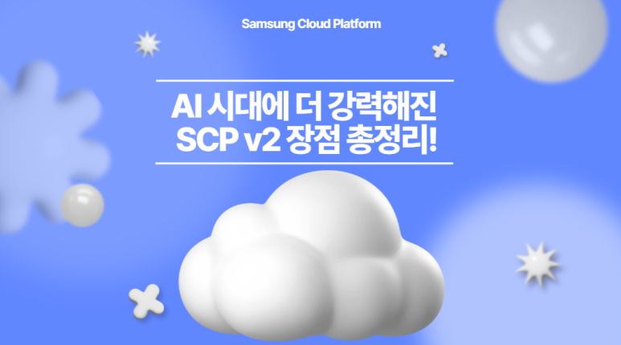

Samsung Cloud Platform(SCP)은 기업 고객의 비즈니스 안정성을 위해 엔터프라이즈 환경에 특화된 고성능 클라우드 서비스를 지속적으로 제공해 왔습니다. 최근 AI 연산의 보편화와 급격한 기술 인프라 고도화 트렌드에 대응하기 위해 신규 아키텍처 및 고성능 인프라 성능 개선을 골자로 하는 **Samsung Cloud Platform v2 (SCP v2)**를 론칭하였습니다.

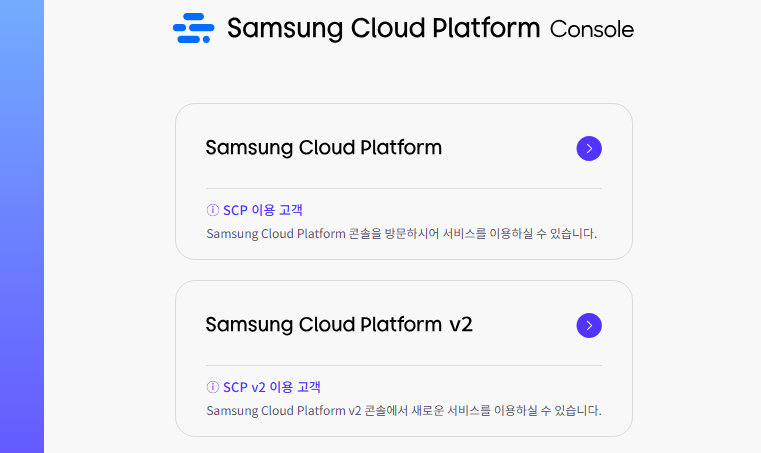

기존 SCP v1 대비 한층 강력해진 SCP v2는 비즈니스 가치를 극대화하고 복잡한 관리 업무를 자동화하기 위해 설계되었으며, 크게 네 가지 핵심 차별화 장점을 지니고 있습니다.

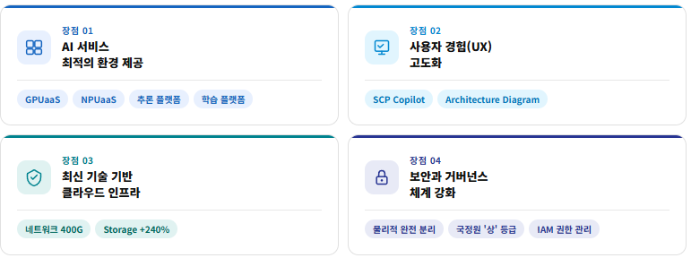

---

### 0.3 SCP v2의 4대 차별점

#### ☁️ 1. AI 서비스 최적의 환경 제공 (AI-Ready Cloud)
인프라 수준의 GPU 프로비저닝부터 상위 추론/학습 프레임워크 플랫폼까지 고성능 연산이 즉시 가능하도록 빌트인 환경을 갖추고 있습니다.

*   **최신 NVIDIA B300 GPUaaS 최초 제공**: 고가의 AI 물리 서버를 구매하여 장기간 구축하는 대신, 필요할 때 클라우드 콘솔에서 즉시 가상 GPU 서버를 프로비저닝하고 사용한 만큼만 지불할 수 있도록 최신 GPU 가속기 서비스(NVIDIA B300 기반)를 국내 최초로 서비스 형태(GPUaaS)로 도입하였습니다.
*   **국산 NPUaaS 출시 예정**: 신경망 연산(AI Deep Learning 추론 및 학습)에 특화된 NPU(Neural Processing Unit)를 편리하게 구독하여 사용할 수 있도록 국내 반도체 디자인 및 칩 제조사들과 연계한 NPUaaS 가동이 예정되어 있습니다.

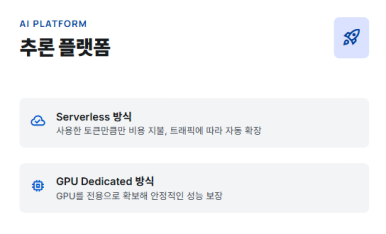

*   **추론 및 학습 전용 AI 플랫폼 탑재**: AI 모델을 실제 프로덕션 서비스 환경에 신속하게 배포하고 서빙하는 '추론 플랫폼'과 거대 기초 데이터를 분산 학습시키기 위한 '학습 플랫폼' 2종을 플랫폼 내에 기본 빌트인하여, 복잡하고 까다로운 AI 분석/구동 환경 구축 과정 없이 AI 비즈니스를 즉각적으로 착수할 수 있게 되었습니다.

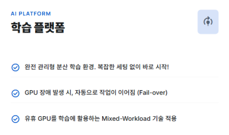

#### ☁️ 2. 사용자 경험(UX) 고도화 (Advanced User Experience)
기존의 다소 건조하고 복잡했던 자원 관리 뷰에서 벗어나 클라우드를 처음 다루는 관리자도 한눈에 설정을 이해하고 편리하게 조작할 수 있도록 대화형 비서 서비스와 지능형 가상 아키텍처 시각화를 탑재했습니다.

*   **생성형 AI 기반 'SCP Copilot' 비서**: 클라우드 콘솔 전반에 생성형 AI 기술을 도입한 가상 비서 Copilot을 탑재하였습니다. 사용자는 콘솔 우측의 대화창을 통해 자연어 대화로 "특정 CIDR 대역의 프라이빗 서브넷을 추가하려면 어떻게 설계하나요?", "방화벽 인바운드와 보안 그룹의 차이가 무엇인가요?" 등을 실시간 문의하고 맞춤 가이드를 제공받아 휴먼 에러에 의한 설정 오류를 획기적으로 줄여줍니다.

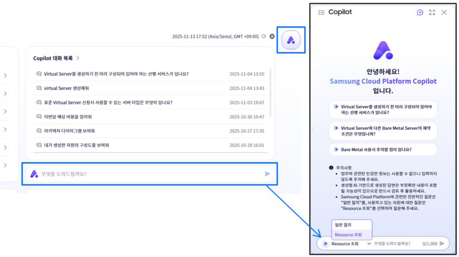

*   **자동 시각화 'Architecture Diagram'**: 콘솔 내부에서 사용자가 직접 생성하고 연결한 가상 서버(VM), 네트워크(VPC/Subnet), 보안 그룹(SG), 로드 밸런서 등의 자원 토폴로지를 인지하여 실시간 아키텍처 다이어그램(그림)으로 자동 변환해 줍니다. 나아가 해당 아키텍처의 자원 소요 비용 및 가변 예상 비용을 대화형으로 결합하여 시각화함으로써 인프라 분석 및 비용 절감 포인트를 효율적으로 발굴할 수 있습니다.

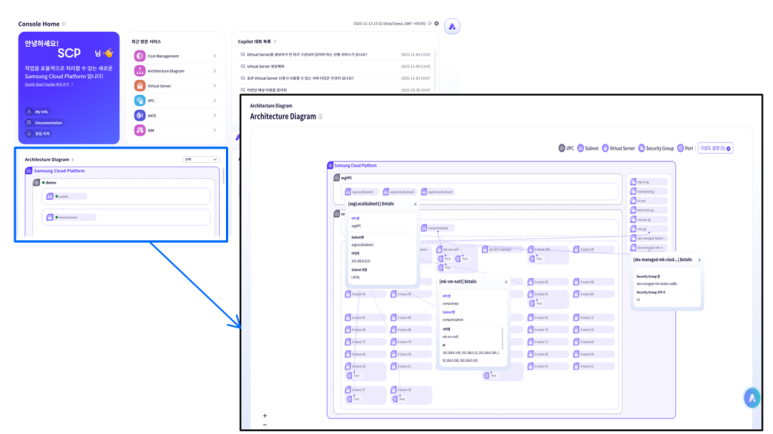

#### ☁️ 3. 최신 기술 기반 클라우드 인프라 성능 개선 (Next-Gen Infrastructure)
고성능 분산 데이터 처리가 빈번한 클라우드 네이티브 아키텍처의 요구사항을 반영하여 가상 컴퓨팅, 백플레인 네트워크 전송폭 및 초고속 스토리지(SSD)의 IOPS 스펙을 대대적으로 개선하였습니다.

*   **네트워크 대역폭 및 트래픽 병목 최소화**: 고속도로의 차선을 늘리듯 백본 통신 네트워크 전송 대역폭을 획기적으로 확장하여 대용량 AI 데이터 세트 송수신이나 분산 처리 시 발생할 수 있는 네트워크 전송 병목 현상을 원천적으로 최소화하고, 서버 개별 자원의 활용도를 극대화했습니다.

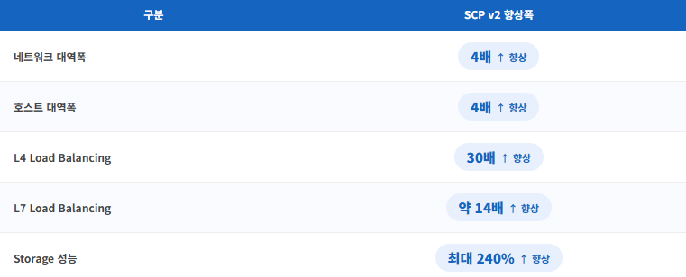

#### ☁️ 4. 강력한 보안 및 거버넌스 체계 (Enhanced Security & Governance)
엔터프라이즈 및 공공 비즈니스 영위를 위해 설계 단계부터 타협 없는 최고 수준의 보안 아키텍처와 통합 권한 관리 거버넌스를 설계하였습니다.

*   **Control Plane과 Data Plane의 물리적/논리적 분리 격리**: 클라우드 리소스를 구성하고 지시를 내리는 관리부망(Control Plane)과 사용자 트래픽 및 기밀 데이터가 실제로 교환되는 실 데이터 전송망(Data Plane)의 접점을 완벽하게 원천 격리하여, 공격자의 관리망 탈취 시도로부터 실 고객 데이터를 철저하게 보존하는 구조적 안정성을 완성했습니다.
*   **국가정보원 '상' 등급 보안 검증 완료**: 공공/금융 등 최고 보안을 요하는 민관협력형 클라우드(PPP) 인프라센터에 우선 탑재되어 성능을 검증받았으며, 국내 보안 인증 가이드라인 중 가장 강력한 국가정보원의 '상' 등급 보안 검증 기준 요건을 완벽히 만족하였습니다.
*   **IAM 및 계정 체계 고도화**: 멀티 테넌트 환경에서의 Root 사용자와 하위 IAM(Identity and Access Management) 사용자의 역할 및 세부 권한(Resource Policy) 제어 경계를 보다 미세하게 분리함으로써 대규모 조직 내 규정 표준화와 거버넌스 통제를 한층 더 매끄럽게 지원합니다.

---

## 1. IaC와 Terraform의 동작 원리
### 1.1 학습목표
Terraform과 Ansible, CloudFormation, ARM Template 등 다른 주요 자동화 도구의 역할과 차이점을 구분할 수 있습니다.

### 1.2 들어가기
#### 인프라 자동화의 진화: 수동 작업에서 컨테이너까지
인프라 관리 기술은 하드웨어 종속적인 수동 관리에서 소프트웨어 정의(Software-Defined) 기반의 유연한 자동화 관리로 진화해 왔습니다.

##### **인프라 자동화의 진화 흐름도**
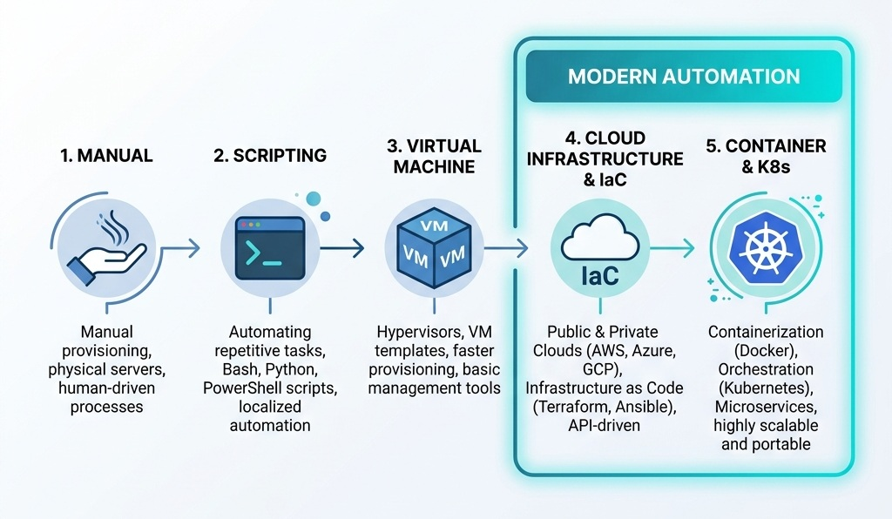

##### **인프라 관리의 5단계 진화**

1.  **1단계: 매뉴얼 (Manual)**
    *   **방식**: 관리자가 데이터센터에서 직접 서버를 설치하고, 터미널에 접속하여 명령어를 하나씩 입력하는 방식입니다.
    *   **특징**: 작업 지시서(Runbook)에 의존하며, 작업자마다 결과가 다를 수 있는 '눈송이 서버(Snowflake Server)' 문제가 발생합니다.
2.  **2단계: 스크립트 (Scripting)**
    *   **방식**: Shell, Python 스크립트를 작성하여 반복적인 설정을 자동화합니다.
    *   **특징**: 수동보다는 빠르지만, 코드가 복잡해지면 유지보수가 어렵고 실행 환경에 따라 결과가 달라질 수 있는 절차적 방식의 한계가 있습니다.
3.  **3단계: 가상 머신 (Virtual Machine)**
    *   **방식**: 하이퍼바이저를 통해 하나의 물리 서버를 여러 대의 가상 서버로 분할하여 사용합니다.
    *   **특징**: 하드웨어 효율성이 극대화되었으며, 골든 이미지(Snapshot)를 통해 비교적 일관된 환경 복제가 가능해졌습니다.
4.  **4단계: 클라우드 인프라 & IaC (Cloud & IaC)**
    *   **방식**: API를 통해 인프라를 즉시 생성하고, Terraform과 같은 도구로 '선언적' 코드를 통해 관리합니다.
    *   **특징**: **현재의 표준**입니다. 인프라의 전체 생명주기를 코드로 관리하며, 버전 관리와 자동화된 변경 감지가 가능합니다.
5.  **5단계: 컨테이너 (Container)**
    *   **방식**: 애플리케이션 실행에 필요한 모든 환경을 패키징하여 운영체제 레벨에서 격리하여 실행합니다.
    *   **특징**: '한 번 빌드하면 어디서나 실행(Build once, run anywhere)'이 가능하며, Kubernetes와 같은 오케스트레이션 도구와 결합하여 고도의 자동화를 달성합니다.

##### **[비교] 인프라 관리 단계별 특성**

| 비교 항목 | 매뉴얼/스크립트 | 가상 머신 (VM) | 클라우드 & IaC | 컨테이너 (Cloud Native) |
| :--- | :--- | :--- | :--- | :--- |
| **배포 단위** | 물리 서버 (Bare-metal) | 가상 이미지 (OVA/Template) | 코드 (HCL/JSON) | 이미지 (Docker Image) |
| **배포 속도** | 며칠 ~ 몇 주 | 몇 분 ~ 몇 시간 | **몇 초 ~ 몇 분** | **밀리초 ~ 초 단위** |
| **일관성** | 낮음 (작업자 의존) | 보통 (이미지 기반) | **높음 (코드 기반)** | **매우 높음 (불변 인프라)** |
| **확장성** | 매우 어려움 | 수동 확장 | **자동 확장 (Auto-scaling)** | **동적 오케스트레이션** |
| **리소스 효율** | 낮음 | 보통 | 높음 | **매우 높음** |


#### 인프라 자동화의 발전: 스크립트 기반에서 IaC로의 패러다임 변화
클라우드 환경이 복잡해지면서 인프라를 수동으로 설정하는 것은 비효율적이고 오류를 유발합니다. 초기 자동화는 쉘 스크립트나 Python 스크립트 같은 절차적(Procedural) 방식에 의존했습니다. 이는 '어떻게(How)' 변경할지를 명령하지만, 결과의 일관성을 보장하기 어렵고 버전 관리가 어렵다는 단점이 있었습니다.

**IaC(Infrastructure as Code)**는 인프라를 코드 파일로 정의하고, Git과 같은 버전 관리 시스템으로 관리하며, 자동화된 도구로 배포하는 새로운 패러다임입니다. 이는 인프라를 애플리케이션 코드처럼 취급하여, 개발 및 배포의 모든 단계를 일관성 있게, 반복 가능하게, 투명하게 만듭니다.

#### IaC의 핵심 가치: 인프라 관리의 혁신
IaC를 도입하면 다음과 같은 핵심적인 이점을 얻을 수 있습니다.
- 일관성 (Consistency) & 재현성 (Reproducibility): 동일한 코드는 항상 동일한 환경을 구축합니다. 개발, 테스트, 운영 환경 간의 차이로 인한 버그를 최소화합니다.
- 버전 관리 (Version Control): 모든 인프라 변경 사항이 Git에 기록되어 누가, 언제, 무엇을 변경했는지 추적할 수 있습니다. 문제가 발생하면 이전 버전으로 쉽게 **롤백(Rollback)**할 수 있습니다.
- 효율성 및 속도: 수동 작업 시간을 줄이고, 몇 분 만에 대규모 인프라를 프로비저닝하여 시장 출시 시간(Time-to-Market)을 단축합니다.
- 문서화: 코드가 곧 인프라 구성의 최신 문서가 됩니다.

##### **[참고] 주요 IaC 도구 비교**
테라폼은 선언적 방식을 채택하여 인프라의 '최종 상태'를 관리하는 데 특화되어 있습니다.

| 비교 항목 | Terraform | Ansible | CloudFormation / ARM |
| :--- | :--- | :--- | :--- |
| **방식** | 선언적 (Declarative) | 절차적 (Procedural) | 선언적 (Declarative) |
| **주 역할** | 인프라 프로비저닝 | 소프트웨어 구성 관리(CM) | 인프라 프로비저닝 |
| **상태 관리** | State 파일 사용 | 상태 관리 없음 (상시 체크) | 클라우드 내부 관리 |
| **가변성** | 불변 (Immutable) | 가변 (Mutable) | 불변 (Immutable) |
| **대상 플랫폼** | 멀티 클라우드 (SCP, AWS 등) | OS 내부, 애플리케이션 | 특정 클라우드 전용 |

#### Terraform의 특징과 철학: 선언적, 상태 기반, 멀티 클라우드
Terraform은 HashiCorp에서 개발한 대표적인 IaC 도구로, 다음 세 가지 핵심 특징을 가집니다.
- 선언적 구문 (Declarative Syntax): 사용자는 '어떻게 만들지'가 아닌 **무엇을 원하는지(Desired State)**를 HCL(HashiCorp Configuration Language)이라는 코드로 정의합니다. Terraform은 현재 상태와 원하는 상태를 비교하여 필요한 변경 사항만 적용합니다.
- 상태 기반 관리 (State-based Management): Terraform은 배포된 인프라의 실제 상태를 추적하기 위해 **State 파일(terraform.tfstate)**을 사용합니다. 이 파일은 Terraform이 리소스를 생성, 수정, 삭제하는 데 있어 필수적인 기준점이 되며, 리소스 간의 의존성을 관리하는 핵심 역할을 수행합니다.
- 멀티 클라우드 및 프로바이더 에코시스템 (Multi-Cloud & Provider Ecosystem): Terraform은 특정 클라우드에 종속되지 않고, Provider라는 플러그인 아키텍처를 통해 SCP, AWS, Azure, GCP뿐만 아니라 SaaS, 온프레미스 등 수많은 플랫폼의 리소스를 통합적으로 관리할 수 있습니다.

Terraform, CloudFormation, ARM Template은 인프라 자체를 생성하고 관리하는 **프로비저닝(Provisioning)** 도구이며, Ansible은 생성된 인프라 내부에 소프트웨어를 설치하고 설정을 관리하는 **구성 관리(Configuration Management)** 도구입니다. 특히 Terraform은 특정 클라우드 서비스에 종속되지 않고 동일한 워크플로우로 다양한 환경을 관리할 수 있는 **멀티 클라우드** 유연성을 제공합니다.

##### Ansible: 구성 관리 및 자동화의 강자
Ansible은 주로 **구성 관리(Configuration Management)**에 초점을 맞춘 도구로, 이미 생성된 서버에 접속하여 패키지를 설치하거나 사용자 계정을 설정하고 애플리케이션을 배포하는 작업에 최적화되어 있습니다. SSH를 기반으로 하는 **에이전트리스(Agentless)** 방식이라 별도의 에이전트 설치 없이 바로 사용할 수 있으며, YAML 기반의 'Playbook'을 통해 가독성 높은 코드를 작성할 수 있습니다. 일반적으로 Terraform으로 인프라를 먼저 구성한 후, Ansible을 통해 소프트웨어 설정을 자동화하는 방식으로 상호 보완하여 사용합니다.

##### AWS CloudFormation: AWS 환경의 완벽한 통합
CloudFormation은 AWS에서 제공하는 네이티브 IaC 도구로, AWS의 모든 서비스와 가장 깊고 빠르게 통합됩니다. **Stack**이라는 단위로 자원 묶음을 관리하며, 생성 중 오류 발생 시 자동으로 이전 상태로 되돌리는 **롤백(Rollback)** 기능이 매우 강력합니다. AWS 환경에만 집중한다면 별도의 상태 파일 관리 없이 AWS 콘솔에서 직접 배포 현황을 시각적으로 편리하게 관리할 수 있는 장점이 있습니다.

##### Azure ARM Template: Azure 리소스를 위한 청사진
ARM(Azure Resource Manager) Template은 Microsoft Azure 환경을 정의하기 위한 JSON 기반의 IaC 도구입니다. Azure 플랫폼의 핵심 아키텍처인 ARM과 직접 통신하므로, 새로운 Azure 서비스가 출시될 때 즉시 대응이 가능합니다. 최근에는 JSON의 복잡도를 해결하기 위해 **Bicep**이라는 더 간결한 언어를 함께 제공하고 있으며, Azure Portal 및 Azure DevOps와 밀접하게 연동된다는 특징이 있습니다.

#### 최종 아키텍처 소개
본 과정 완료 시, 수강생은 SCP 환경에 다음과 같은 3계층 아키텍처를 코드로 구현할 수 있게 됩니다.
- 네트워크 계층: VPC, Public/Private Subnet, IGW, NAT Gateway
- 데이터 및 컴퓨팅 계층: Bastion Host (VM), 관리형 데이터베이스 (Managed DB)
- 애플리케이션 계층: SKE(Kubernetes Engine) 클러스터, Load Balancer, 웹 애플리케이션

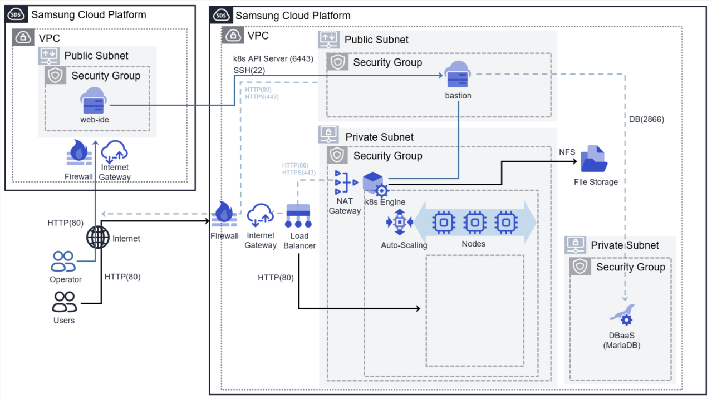

### 1.3 따라하기
#### Terraform 작동 원리 분석

<!-- 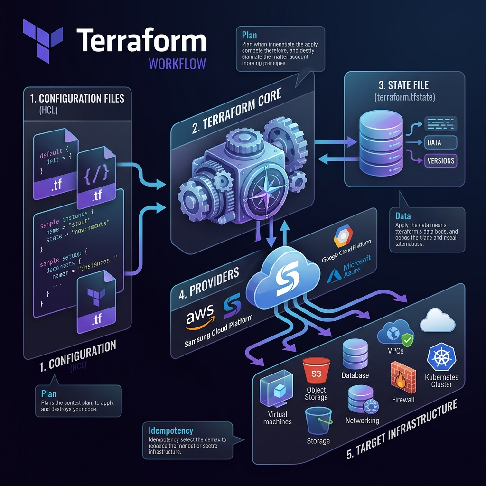 -->
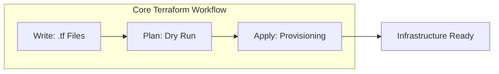
```mermaid
graph LR
    A[Write: .tf Files] --> B[Plan: Dry Run]
    B --> C[Apply: Provisioning]
    C --> D[Infrastructure Ready]
    subgraph "Core Terraform Workflow"
    A
    B
    C
    end
```

Terraform이 코드를 실제 인프라로 변환하는 과정을 단계별로 분석합니다.
1.  구성 분석 (Configuration Parsing): 사용자가 작성한 HCL(`.tf` 파일)을 읽어 들여 희망 상태(Desired State)를 파악합니다.
2.  상태 로드 (State Loading): 기존에 배포된 인프라의 정보를 담고 있는 **State 파일(`terraform.tfstate`)**을 로드하여 현재 상태(Current State)를 확인합니다.
3.  Refresh: Provider를 통해 SCP API에 접속하여 실제 클라우드 인프라의 상태를 가져와 Current State를 최신화합니다.
4.  계획 생성 (`terraform plan`): Desired State와 Current State를 비교하여, 두 상태의 차이를 해소하기 위해 어떤 리소스를 생성, 수정, 삭제할지 결정하고 실행 계획을 수립합니다.
5.  실행 (`terraform apply`): 수립된 계획에 따라 Provider를 통해 SCP API를 호출하고 리소스를 생성하거나 변경합니다.
6.  상태 업데이트 (State Update): 변경 작업이 완료되면, 최신 인프라 정보가 State 파일에 저장됩니다.

### 1.4 정리하기
- IaC는 인프라를 코드로 관리하여 일관성, 재현성, 버전 관리를 달성하는 핵심 패러다임입니다.
- Terraform은 선언적 방식으로 인프라를 프로비저닝하는 도구이며, State 파일을 사용하여 인프라의 상태를 추적합니다.
- Terraform의 작동 원리는 **'현재 상태(Current State)'**와 **'희망 상태(Desired State)'**를 비교하여 Plan을 세우고 Apply를 통해 이를 실행하는 것입니다.

## 2. [실습] 실습 개발 환경 구성 (Console & CLI)

### 2.1 학습목표

- Docker를 사용하여 컨테이너 기반의 `web-ide` 개발 환경을 배포할 수 있다.
- `web-ide` 환경에 접속하여 Terraform, Kubectl, Helm 등 사전 설치된 도구를 사용할 수 있다.

### 2.2 들어가기

#### 2.2.1 서비스 개념도

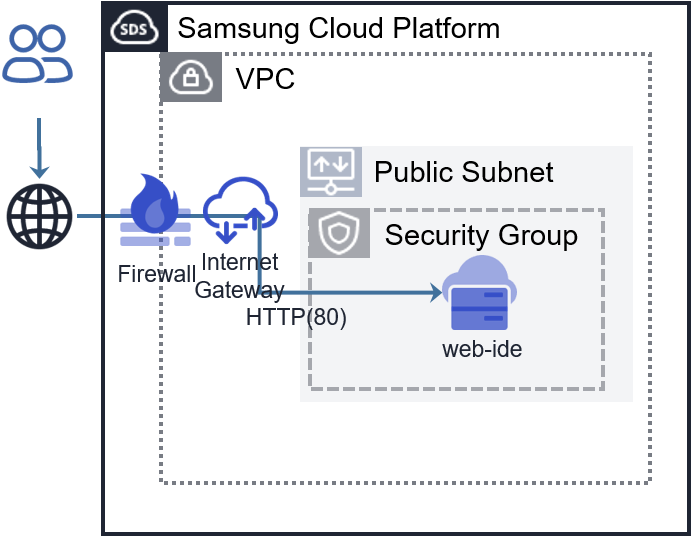

#### 2.2.2 관련 용어

| No | 용어 | 설명 |
| --- | --- | --- |
| 1 | Code-Server | VS Code를 웹 브라우저에서 사용할 수 있게 해주는 IDE 서버입니다. 일관된 개발 환경을 제공합니다. |
| 2 | VPC | Virtual Private Cloud의 약자로, 클라우드 환경에서 사용하는 격리된 가상 네트워크입니다. |
| 3 | IGW | Internet Gateway의 약자로, VPC가 인터넷과 통신할 수 있도록 하는 관문 역할을 합니다. |
| 4 | Subnet | VPC 내의 IP 주소 범위로, 네트워크를 더 작은 단위로 분할하여 관리합니다. |
| 5 | Firewall | 네트워크 트래픽을 제어하는 보안 시스템으로, IGW에 적용되어 외부와의 통신을 관리합니다. |
| 6 | Security Group | VM 인스턴스에 적용되는 가상 방화벽으로, 더 세분화된 인바운드/아웃바운드 트래픽 제어를 합니다. |

#### 2.2.3 리소스 접근 안내

모든 SCP 서비스 리소스는 다음의 표준화된 방법으로 접근할 수 있습니다.

- **접근 방법:** **콘솔 상단 메뉴의 [서비스] → [해당 서비스 카테고리 (예: Networking, Compute)] → [원하는 리소스 (예: VPC, Virtual Server)]**

예를 들어, VPC를 생성하라는 가이드가 나오면, `서비스 → Networking → VPC` 경로를 통해 해당 메뉴로 이동하면 됩니다. 

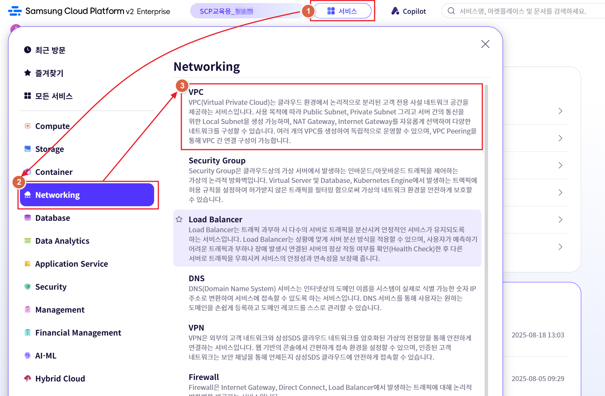

#### 2.2.4 내 Public IP 주소 확인 방법

실습 중 방화벽 규칙 등에 자신의 Public IP 주소를 입력하는 설정이 있습니다. 자신의 Public IP 주소는 웹 브라우저를 통해 쉽게 확인할 수 있습니다.

##### 웹 브라우저 사용
- 웹 브라우저 주소창에 아래 URL을 입력하여 접속합니다.

  ```
  https://ifconfig.me
  ```

- 화면에 표시되는 IP 주소가 현재 사용 중인 Public IP 주소입니다.

### 2.3 따라하기

#### 2.3.1 VPC 생성

실습에 필요한 리소스들을 생성할 격리된 가상 네트워크 공간(VPC)을 생성합니다.

##### 1. 서비스 경로
- 서비스 → Networking → VPC → `[VPC 생성]`
##### 2. 입력 정보
- VPC명 : `vpc-webide-hol4`
- IP 대역 : `192.168.0.0/16`

#### 2.3.2 IGW 생성

생성한 VPC가 외부 인터넷과 통신할 수 있도록 관문 역할을 하는 인터넷 게이트웨이(IGW)를 생성하고 연결합니다.

##### 1. 서비스 경로
- 서비스 → Networking → VPC → Internet Gateway → `[Internet Gateway 생성]` 

##### 2. 입력 정보
- VPC 선택: 방금 생성한 `vpc-webide-hol4`
- 구분: Internet Gateway
- Firewall 사용: 체크
- Firewall 로그 저장 여부: 체크 해제(사용 안함)

#### 2.3.3 Subnet 생성

VPC 내부에 VM과 같은 리소스들이 실제로 배치될 네트워크 영역인 서브넷을 생성합니다.

##### 1. 서비스 경로
- 서비스 → Networking → VPC → Subnet → `[Subnet 생성]`

##### 2. 입력 정보
- Subnet 유형: General
- VPC: `vpc-webide-hol4`
- Subnet명: `pubsubhol4`
- IP 대역: `192.168.0.0/24`

#### 2.3.4 Firewall 규칙 추가

IGW를 통해 외부와 통신하기 위한 방화벽 규칙을 설정합니다. Inbound는 외부에서 내부로, Outbound는 내부에서 외부로의 통신을 의미합니다.

##### 1. 서비스 경로
- 서비스 → Networking  → Firewall → `FW_IGW_vpc-webide-hol4` → ( [규칙] → [규칙 추가] )


##### 2. 입력 정보
- web-ide접속 규칙
    - 출발지 IP:`my public ip`
    - 목적지 IP: `192.168.0.0/24`
    - 유형 : `TCP`
    - TCP 목적지 포트: `80`
    - 방향: `inbound`
    - **용도:** `80`포트는 HTTP 웹 트래픽을 위한 기본 포트입니다. Web-IDE(code-server)에 접속에 사용됩니다.

- outbound 외부 인터넷 규칙
    - 출발지 IP: `192.168.0.0/24`
    - 목적지 IP: `0.0.0.0/0`
    - 유형 : `TCP`
    - TCP 목적지 포트: `22, 80, 443, 6443` (6443은 K8s API 서버 통신용)
    - 방향: `outbound`
    - **용도:** `22`포트는 SSH 접속을 위한 포트입니다. `80, 443`포트는 VM에서 외부 인터넷 리소스(패키지 다운로드, 외부 API 호출 등)에 접근하기 위해 필요합니다. `6443`포트는 Kubernetes API 서버와 통신하기 위한 포트로, ArgoCD와 같은 도구가 Kubernetes 클러스터와 통신할 때 사용됩니다.


| 규칙 이름 | 방향 | 출발지 IP | 목적지 IP | 유형 (포트) | 용도 |
| :--- | :--- | :--- | :--- | :--- | :--- |
| Web-IDE 접속 (HTTP) | `inbound` | `my public ip` | `192.168.0.0/24` | `TCP` (80) | Web-IDE 접속 및 Let's Encrypt 인증서 발급 |
| Outbound 인터넷 | `outbound` | `192.168.0.0/24` | `0.0.0.0/0` | `TCP` (22, 80, 443, 6443) | 외부 인터넷 및 K8s API 서버 통신 |

#### 2.3.5 Security Group 생성 및 규칙 추가

VM에 직접 적용되는 가상 방화벽입니다. 더욱 세분화된 접근 제어가 가능합니다.

##### 1. 서비스 경로
- 서비스 → Networking → Security Group → `[Security Group 생성]`

##### 2. 입력 정보
- Security Group명: `pubsub-sg-hol4`
- 로깅 여부 : `체크 해제(사용 안함)`

##### 3. 규칙 추가

- web-ide 접속 규칙(http)
  - 방향: `inbound`
  - 유형: `HTTP` (80) 선택
  - 대상주소: `my public ip`
  - **용도:** Web-IDE(code-server)에 HTTP 프로토콜로 접속하기 위한 규칙입니다.

- outbound 인터넷 접속 규칙(ssh)
  - 방향: `outbound`
  - 유형: `SSH` (22) 선택
  - 대상주소: `0.0.0.0/0`
  - **용도:** Web-IDE(code-server)에 SSH 프로토콜로 접속하기 위한 규칙입니다.

- outbound 인터넷 접속 규칙(http)
  - 방향: `outbound`
  - 유형: `HTTP` (80) 선택
  - 대상주소: `0.0.0.0/0`
  - **용도:** VM에서 외부 HTTP 리소스(패키지 저장소, 웹 서비스 등)에 접근하기 위한 규칙입니다.

- outbound 인터넷 접속 규칙(https)
  - 방향: `outbound`
  - 유형: `HTTPS` (443) 선택
  - 대상주소: `0.0.0.0/0`
  - **용도:** VM에서 외부 HTTPS 리소스(패키지 저장소, 웹 서비스 등)에 접근하기 위한 규칙입니다.

- outbound 인터넷 접속 규칙(k8s)
  - 방향: `outbound`
  - 허용 포트: `사용자 지정 TCP`
  - 포트 범위: `6443` (6443은 K8s API 서버 통신용)
  - 대상주소: `0.0.0.0/0`
  - **용도:** VM에서 외부 Kubernetes API에 안전하게 접근하기 위한 규칙입니다.


| 규칙 이름 | 방향 | 유형 (허용 포트) | 대상 주소 | 용도 |
| :--- | :--- | :--- | :--- | :--- |
| web-ide 접속 규칙 (http) | `inbound` | `HTTP` (80) | `0.0.0.0/0` | Web-IDE 접속 |
| outbound ssh 접속 규칙 | `outbound` | `SSH` (22) | `0.0.0.0/0` | VM에서 외부 SSH 접속 |
| outbound 인터넷 접속 규칙 (http) | `outbound` | `HTTP` (80) | `0.0.0.0/0` | VM에서 외부 HTTP 리소스 접근 |
| outbound 인터넷 접속 규칙 (https) | `outbound` | `HTTPS` (443) | `0.0.0.0/0` | VM에서 외부 HTTPS 리소스 접근 |
| outbound 인터넷 접속 규칙 (k8s) | `outbound` | `사용자 지정 TCP` (6443) | `0.0.0.0/0` | VM에서 외부 Kubernetes API 접근 |

#### 2.3.6 Virtual Server생성(Key pair 생성)

실습을 진행할 개발 환경인 Web-IDE(code-server)를 설치할 가상머신(Virtual Server)을 생성합니다. VM에 안전하게 접속하기 위한 Key pair도 함께 생성합니다.

##### 1. 서비스 경로
- 서비스 → Compute → Virtual Server → `[Virtual Server 생성]`

##### 2. 입력 정보
- 이미지 선택: Custom : `ubuntu 24.04`
- 서비스 정보 입력
  - 서버 수: `1`
  - 상품 유형:
    - 서버타입: `Standard-1/s1v1m2(vCPU 1 | Memory 2G)`
  - Block Storage:
    - 기본 OS: `6` Units
  - 필수 정보 입력
    - 서버명 : `web-ide`
    - 네트워크 설정:
      - VPC: `vpc-webide-hol4`
      - 일반 서브넷: `pubsubhol4`
      - Public NAT: `사용 체크` → 신규 생성
      - Security Group: `pubsub-sg-hol4`
    - 서버 Key pair : `mykey-hol4` (신규 생성 후 **pem 키를 반드시 다운로드하여 보관**)
    - **Init script:** 아래 스크립트를 복사하여 붙여넣습니다. 이 스크립트는 web-ide를 설치하고 Virual Server 생성 시 동적으로 할당되는 Public IP를 설정 파일에 자동으로 업데이트합니다.

```bash
#!/bin/bash
set -e
REPO_URL="https://github.com/cwj3688/init-webide.git"
REPO_DIR="init-webide"
IMAGE_NAME="cwj3688/code-server-hol3"
HOME_DIR="/home/ubuntu"
PROJECT_DIR="${HOME_DIR}/project"
git clone "$REPO_URL"
cd "$REPO_DIR"
git checkout no-tls
chmod +x install_docker.sh
./install_docker.sh
docker pull "$IMAGE_NAME"
mkdir -p "$PROJECT_DIR"
mkdir -p "${HOME_DIR}/.scp" "${HOME_DIR}/.scpconf" "${HOME_DIR}/.kube" "${HOME_DIR}/.config" "${HOME_DIR}/.local"
PASSWORD=$(openssl rand -base64 12)
echo "Your Web-IDE Password: ${PASSWORD}" > "${PROJECT_DIR}/env-info.txt"
DOCKER_GID=$(getent group docker | cut -d: -f3) PASSWORD=${PASSWORD} docker compose up -d
chown -R 1000:1000 "$HOME_DIR"
echo "================================================================"
echo "   A new password for the Web-IDE has been generated."
echo "   Password: ${PASSWORD}"
echo "   It has been saved to: ${PROJECT_DIR}/env-info.txt"
echo "================================================================"
echo "Web-IDE setup is complete!"
```

> **참고:** Virtual Server 생성 및 초기화 스크립트(code-server 구성)가 완료되기까지 **약 10~15분** 정도 소요될 수 있습니다.

#### 2.3.7 web-ide 접속

##### 1. 접속 IP 정보 확인
- **생성된 VM의 Public IP 주소를 확인합니다.**
  - SCP 콘솔에 로그인합니다.
  - **경로**: 서비스 → Compute → Virtual Server → `[web-ide]`
  - 생성한 VM (web-ide)을 목록에서 찾아 선택합니다.
  - 상세 정보 화면에서 Public IP 주소를 복사해 둡니다.

##### 2. 패스워드 확인
- VM이 처음 생성될 때 초기화 스크립트(Init Script)가 실행되며, 이 과정에서 web-ide 접속을 위한 임시 비밀번호가 자동으로 생성됩니다. 이 비밀번호는 콘솔 로그에서 확인할 수 있습니다.
  - VM 상세 정보 화면에서 [콘솔 로그] 탭을 클릭합니다.
  - 로그 내용 중에서 아래와 같이 PASSWORD가 포함된 부분을 찾아 비밀번호를 확인하고 복사합니다. 

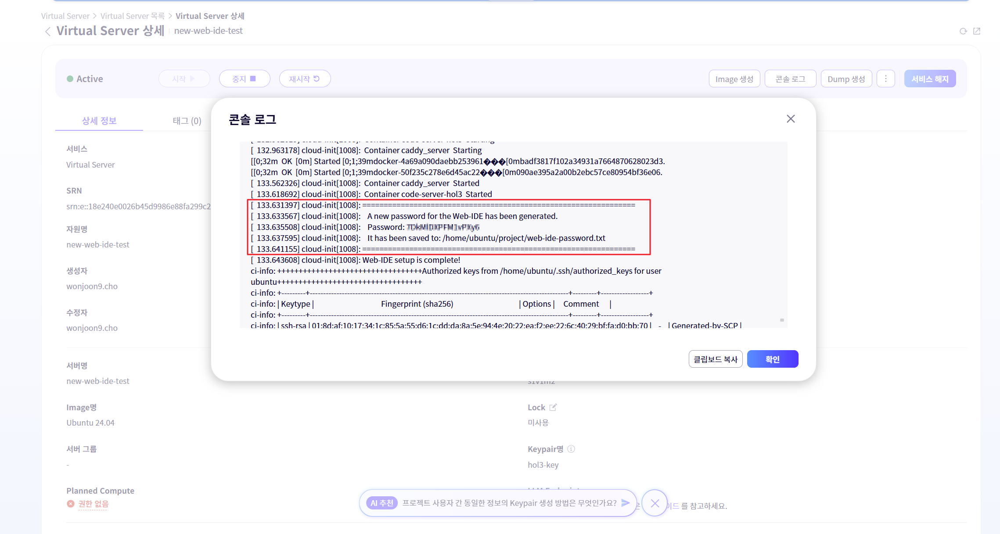

##### 3. web-ide 접속 및 로그인

- 이제 확인한 IP 주소와 비밀번호를 사용하여 웹 브라우저에서 web-ide에 접속합니다.
  - 웹 브라우저를 열고 주소창에 **http://<VM의-Public-IP>.sslip.io** 형식으로 입력합니다.
    (예시: `http://123.45.67.89.sslip.io`)
  - 로그인 화면이 나타나면, 2단계에서 확인한 비밀번호를 입력하여 접속합니다.

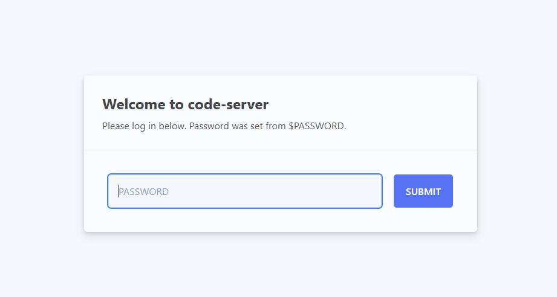


> **sslip.io 란?**
>
> `sslip.io`는 DNS 설정 없이 IP 주소를 기반으로 임시 도메인을 생성해주는 무료 와일드카드 DNS 서비스입니다.
> 예를 들어, VM의 Public IP가 `123.45.67.89` 이라면, 별도의 도메인 구매나 DNS 레코드 설정 없이 `http://123.45.67.89.sslip.io` 와 같은 주소로 즉시 접속할 수 있습니다.
> `sslip.io`는 주소에 포함된 IP 주소를 자동으로 인식하여 해당 IP로 연결해주는 원리로 동작합니다.
> 이번 실습에서는 이 서비스를 활용하여 우리가 배포하는 Gitea, Jenkins, ArgoCD 및 최종 애플리케이션에 쉽게 접근할 수 있는 도메인을 생성합니다.

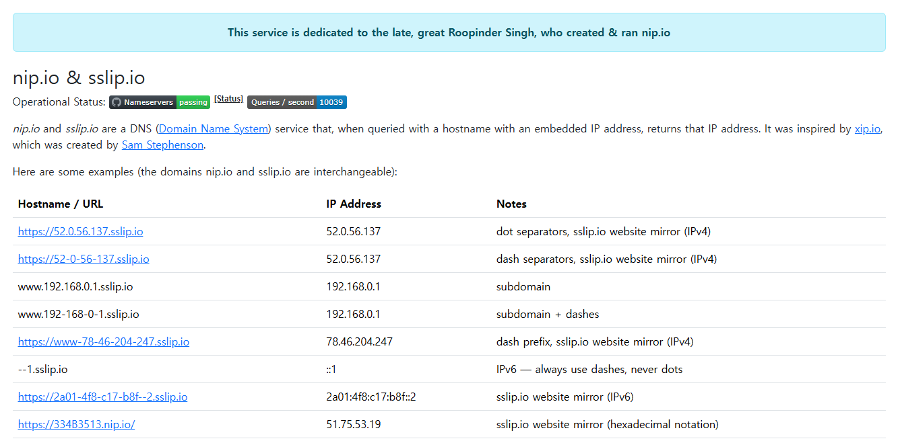


##### 4. 작업 폴더의 파일들을 신뢰하고 모든 기능을 활성화
- 작업 폴더 신뢰하기: 보안 경고창이 나타나면, "Yes, I trust the authors" 버튼을 클릭하여 작업 폴더의 모든 파일을 신뢰하고 web-ide의 전체 기능을 활성화합니다.

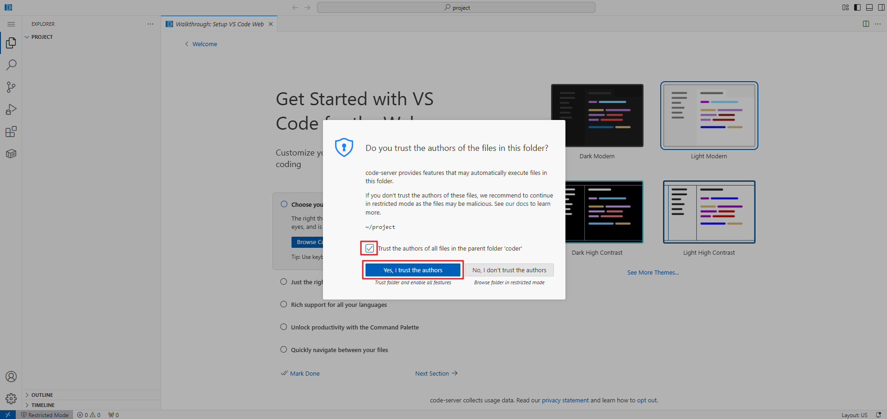

##### 4. 테마 설정(선택 사항)
- 원하는 에디터 테마를 선택합니다. 이 설정은 나중에 언제든지 변경할 수 있습니다.

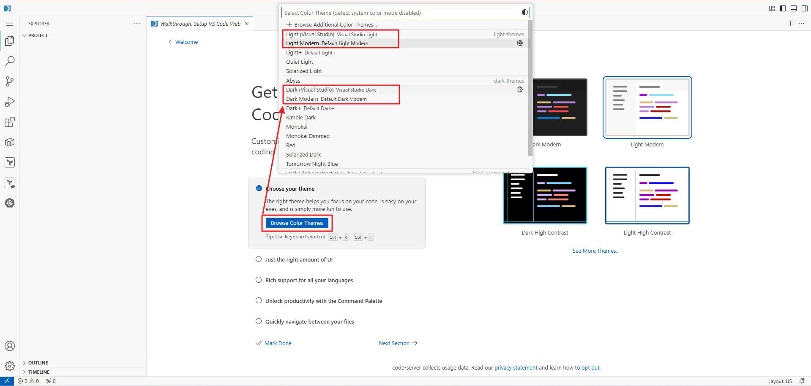


**이제부터 모든 터미널 작업은 이 `web-ide`의 웹 터미널에서 진행합니다.**

#### 2.3.8 web-ide 구성 및 명령어 테스트

이 개발환경은 `code-server`를 기반으로 구성된 표준 클라우드 개발 환경에 대한 설명입니다. 운영자나 개발자들이 언제 어디서든 일관된 환경에서 효율적으로 작업할 수 있도록 다양한 도구와 확장이 사전 설치되어 있습니다.

##### 1. 기본 환경 (Base Environment)

본 개발 환경은 `code-server`의 특정 버전을 기반으로 구축되어, 웹 브라우저를 통해 Visual Studio Code의 강력한 기능을 그대로 사용할 수 있습니다.

- **`code-server` 버전:** `4.103.1`
- **기본 OS:** ubuntu 24.04
- **기본 셸:** `bash`

##### 2. 설치된 주요 도구 및 버전

클라우드 네이티브 애플리케이션 개발과 인프라 관리를 위해 다음과 같은 필수 도구들이 설치되어 있습니다.

| 도구 | 버전 | 설명 |
| --- | --- | --- |
| **Terraform** | 최신 안정 버전 | HashiCorp에서 개발한 IaC(Infrastructure as Code) 도구로, 인프라를 코드로 정의하고 프로비저닝합니다. |
| **Docker CLI** | 최신 안정 버전 | 컨테이너를 빌드하고 관리하기 위한 커맨드 라인 인터페이스입니다. (Docker Engine은 포함되지 않음) |
| **OpenJDK** | `17` | Java 애플리케이션 개발 및 실행을 위한 오픈소스 Java Development Kit입니다. |
| **Node.js** | `20.x` | JavaScript 런타임 환경으로, 백엔드 서비스 및 프론트엔드 개발에 사용됩니다. |
| **npm** | 최신 안정 버전 | Node.js 패키지 매니저입니다. |
| **Helm** | 최신 3.x 버전 | 쿠버네티스 패키지 매니저로, 애플리케이션 차트를 관리하고 배포합니다. |
| **Kubectl** | `1.31.8` | 쿠버네티스 클러스터를 제어하기 위한 커맨드 라인 도구입니다. |

##### 3. VS Code 확장 프로그램 (Extensions)

개발 생산성을 극대화하기 위해 아래의 VS Code 확장 프로그램들을 실습 환경에 직접 설치하여 사용하는 것을 권장합니다. 기본적으로 설치되어 있지 않으므로, 수동으로 설치하여 사용하면 개발 효율성이 크게 향상됩니다.

- **`hashicorp.terraform`**: Terraform 코드의 구문 강조, 자동 완성, 포맷팅 및 유효성 검사 기능을 제공합니다.
- **`ms-azuretools.vscode-docker`**: Dockerfile 및 `docker-compose.yml` 파일 작성 지원, 컨테이너 및 이미지 관리 기능을 제공합니다.
- **`vscjava.vscode-java-pack`**: Java 개발을 위한 필수 확장 기능 모음으로, 코드 탐색, 디버깅, 테스트 등을 지원합니다.
- **`dbaeumer.vscode-eslint`**: JavaScript 및 TypeScript 코드의 정적 분석을 통해 잠재적인 오류와 코드 스타일 문제를 찾아줍니다.
- **`esbenp.prettier-vscode`**: 코드를 일관된 스타일로 자동 포맷팅해주는 포맷터입니다.
- **`ms-kubernetes-tools.vscode-kubernetes-tools`**: 쿠버네티스 매니페스트 파일 작성 지원, 클러스터 리소스 탐색 및 관리 기능을 제공합니다.
- **`redhat.vscode-yaml`**: YAML 파일의 유효성 검사, 구문 강조 및 자동 완성 기능을 제공하여 쿠버네티스 및 Helm 차트 작성을 돕습니다.

##### 4. 셸 환경 및 편의 기능

터미널 사용성을 높이기 위해 `bash` 셸에 다음과 같은 자동 완성 및 단축 명령어(alias)가 설정되어 있습니다.

**자동 완성 (Auto-completion)**

- `kubectl` 명령어 자동 완성이 활성화되어 리소스 이름, 명령어 등을 쉽게 입력할 수 있습니다.
- `helm` 명령어 자동 완성이 활성화되어 차트 및 릴리스 관리가 용이합니다.
- `terraform` 명령어 자동 완성이 활성화되어 있습니다.

**단축 명령어 (Alias)**

| 단축 명령어 | 원본 명령어 | 설명 |
| --- | --- | --- |
| `k` | `kubectl` | `kubectl` 명령어를 간결하게 사용합니다. |
| `h` | `helm` | `helm` 명령어를 간결하게 사용합니다. |
| `tf` | `terraform` | `terraform` 명령어를 간결하게 사용합니다. |
| `ll` | `ls -alF` | 파일의 상세 정보와 숨김 파일을 함께 표시합니다. |
| `la` | `ls -A` | `.`과 `..`을 제외한 모든 파일을 표시합니다. |
| `l` | `ls -CF` | 파일을 보기 쉽게 컬럼 형식으로 표시합니다. |
| `cls` | `clear` | 터미널 화면을 지웁니다. |

이처럼 잘 구성된 개발 환경을 통해 운영자/개발자는 복잡한 설정 과정 없이 즉시 프로젝트에 집중할 수 있습니다.

##### 5. 명령어 테스트 실습

- 터미널 열기
  - 메뉴 → Terminal → New Terminal

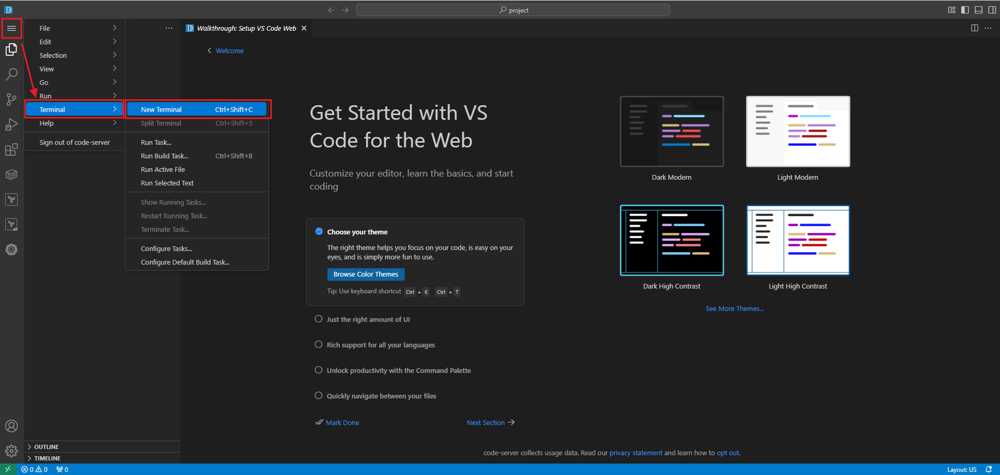


- git command
```bash
git version
```


- terraform command
```bash
terraform version
```


- docker command
```bash
docker --version
```


- java command
```bash
java --version
```


- nodejs command
```bash
nodejs --version
npm --version
```


- helm command
```bash
helm version
```


- kubectl comand
```bash
kubectl version
```


- scp-cli command
```bash
scp-cli --version
```


### 2.4 정리하기

- **개발 환경 구축 완료:** Docker와 `code-server`를 이용해 웹 기반의 표준 개발 환경을 성공적으로 구축했습니다.
- **네트워크 설정 완료:** 실습에 필요한 VPC, Subnet, IGW, Firewall, Security Group 등 모든 네트워크 리소스를 구성했습니다.
- **VM 및 Code-Server 배포:** Init Script를 활용하여 VM 생성과 동시에 `code-server` 환경이 자동으로 배포되도록 구성했습니다.
- **접속 및 기능 확인:** Public IP와 sslip.io를 이용해 도메인으로 `code-server`에 접속하고, 내장된 각종 개발 도구(Terraform, Kubectl 등)가 정상적으로 동작하는 것을 확인했습니다.

## 3. [실습] SCP Provider 및 인증 연동


### 3.1 학습목표

- Terraform이 SCP API를 인증하고 리소스를 생성할 수 있도록 인증 정보를 설정할 수 있다.
- `config.json`과 `credentials.json` 파일을 생성하여 SCP Provider 설정을 완료할 수 있다.
- Provider의 역할과 버전 고정의 중요성을 이해하고, `provider.tf` 파일을 작성할 수 있다.

### 3.2 들어가기

#### 3.2.1 Terraform config 파일 설정

- **설명:** web-ide 터미널에서 Terraform이 SCP API를 인증하고 리소스를 생성할 수 있도록 인증 정보를 설정합니다.
- SCP 콘솔의 **[마이페이지] > [인증키 관리]** 에서 `Access Key`와 `Secret Key`를 생성하고 확인합니다.
- `provider.tf`와 `main.tf` 파일을 작성하여 Terraform 초기 설정을 완료합니다.

### 3.3 따라하기

#### 3.3.1 Terraform config 파일 설정

##### 인증키 생성
- **설명:** Terraform과 같은 외부 도구가 SCP API를 호출하여 리소스를 관리하려면 인증이 필요합니다. 이를 위해 Access Key와 Secret Key로 구성된 인증키를 사용합니다. 이 키는 사용자를 대신하여 API 요청을 인증하는 역할을 합니다.
- **경로:** SCP 콘솔 로그인 → 우측 상단 **[My Info.]** → **[인증키 관리]** → [인증키 생성]
- **입력 정보:**
    - **[인증키 생성]** 버튼을 클릭합니다.
    - 생성된 `Access Key`와 `Secret Key`를 복사하여 사용합니다. 

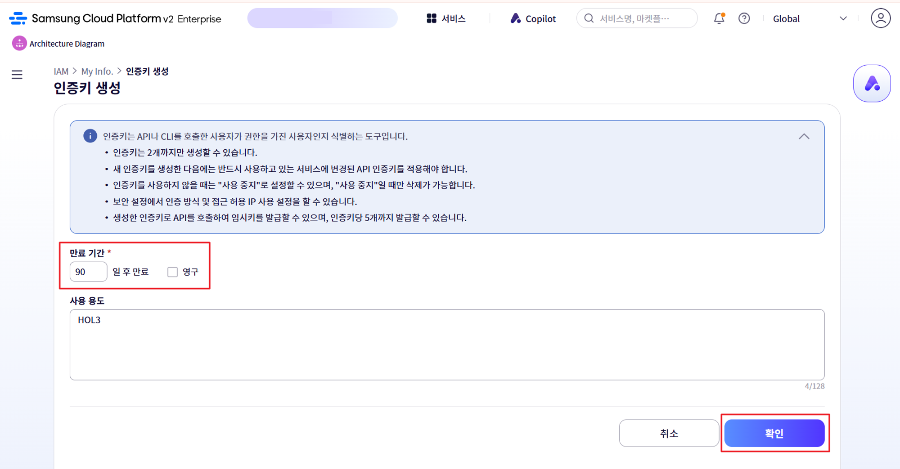

##### 보안 설정
- **인증 방식:** `인증키`를 선택합니다.
- **접근 허용 IP:** `사용`을 선택하고, Web-IDE의 Public IP 주소를 입력한 후 **[추가]** 버튼을 클릭합니다.
    > 💡 **참고:** Web-IDE의 Public IP는 web-ide 터미널에서 `curl ifconfig.me` 명령어로 확인할 수 있습니다. 이 IP 기반 접근 제어는 Terraform 뿐만 아니라, 이후에 생성할 SCP Container Registry에 Docker 이미지를 Push/Pull 하는 등 인증키를 사용하는 다른 서비스에도 동일하게 적용됩니다.

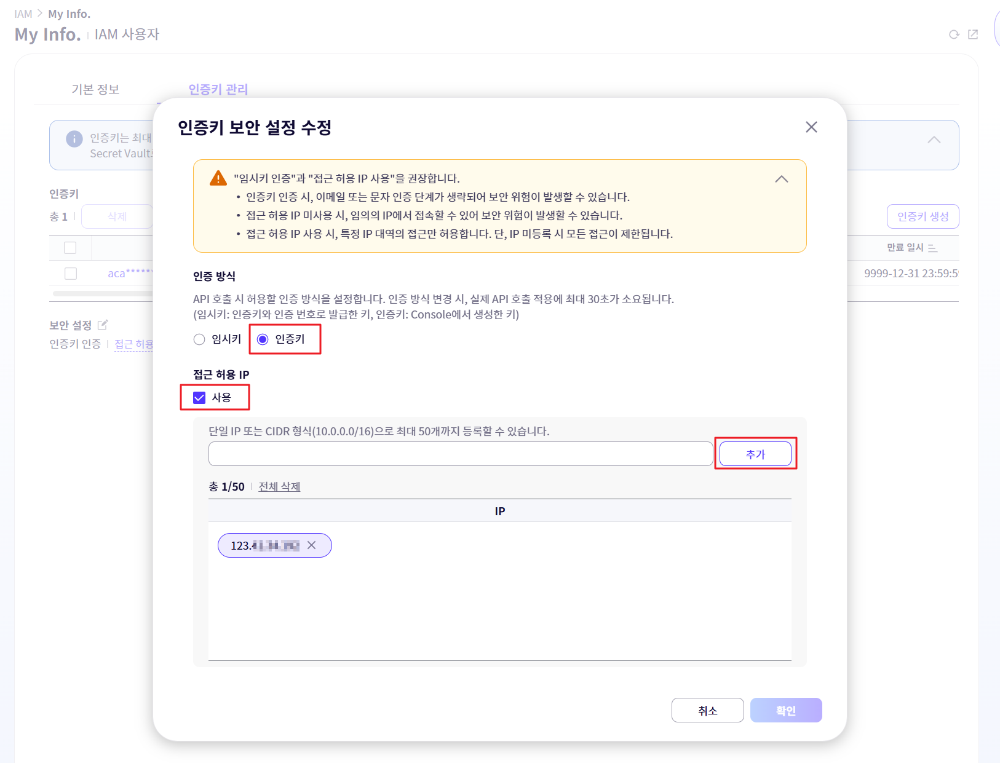

##### 설정 디렉토리 생성 `.scpconf`
> 💡 **참고:** web-ide에 이미 디렉토리 생성되어 있어서 Skip 가능

```bash
mkdir -p ~/.scpconf
```

##### config.json 파일 생성

- `~/.scpconf/config.json` 파일을 생성하고 SCP 플랫폼의 인증 URL과 기본 리전 정보를 설정합니다.
- 이 실습에서는 `KR-WEST1` 리전을 사용합니다.

```bash
code-server ~/.scpconf/config.json
```

```json
{
    "auth-url": "https://iam.e.samsungsdscloud.com/v1",
    "default-region": "kr-west1"
}
```

##### credentials.json 파일 생성

- `~/.scpconf/credentials.json` 파일을 생성하고 SCP API 호출에 사용할 개인 인증키를 설정합니다.
- `xxxxxxxxxxxxxx` 부분을 본인의 `Access Key`와 `Secret Key`로 교체해야 합니다.

```bash
code-server ~/.scpconf/credentials.json
```

```json
{
    "access-key": "xxxxxxxxxxxxxx",
    "secret-key": "xxxxxxxxxxxxxx"
}
```

> 💡 **정보: 환경 변수를 사용한 인증**
>
> 파일 대신 환경 변수를 사용하여 인증 정보를 설정할 수도 있습니다.
> - `SCP_TF_ACCESS_KEY`: Access Key
> - `SCP_TF_SECRET_KEY`: Secret Key
> - `SCP_TF_AUTH_URL`: 인증 URL
> - `SCP_TF_DEFAULT_REGION`: 기본 리전

#### [참고] SCP-cli 환경 설정 방법

SCP-cli는 삼성 클라우드 플랫폼을 CLI 환경에서 관리하기 위한 도구로, 테라폼 프로바이더 설정(`~/.scpconf/`)과 유사하지만 독립적인 설정 파일(`cli-config.json`)을 사용합니다. SCP-cli를 함께 사용하는 경우 아래 경로에 설정 파일을 작성하여 인증을 구성할 수 있습니다.

*   **scp-cli 다운로드 및 설치 (Linux/Web-IDE 터미널):**
    ```bash
    # 1. scp-cli 바이너리 다운로드
    wget https://docs.e.samsungsdscloud.com/tools/cli/linux/scp-cli

    # 2. 실행 권한 부여
    chmod +x scp-cli

    # 3. 전역 명령어로 실행 가능하도록 PATH 경로로 이동
    sudo mv scp-cli /usr/local/bin/
    ```

*   **설정 파일 경로:**
    *   **Windows**: `C:\Users\{사용자명}\.scp\cli-config.json`
    *   **Linux**: `~/.scp/cli-config.json`

*   **설정 파일 생성 (Web-IDE 터미널):**
    ```bash
    mkdir -p ~/.scp
    code-server ~/.scp/cli-config.json
    ```

*   **cli-config.json 작성 예시:**
    ```json
    {
        "auth_url": "https://iam.e.samsungsdscloud.com/v1/endpoints",
        "access_key": "본인의_Access_Key",
        "access_secret_key": "본인의_Secret_Key",
        "default_scp_region": "kr-west1"
    }
    ```

    > ⚠️ **주의**: 테라폼 설정 파일의 키 명칭(`auth-url`, `access-key`, `secret-key`)은 대시(`-`)를 사용하는 반면, SCP-cli 설정 파일의 키 명칭(`auth_url`, `access_key`, `access_secret_key`)은 언더바(`_`)를 사용하므로 설정 시 혼동하지 않도록 주의해야 합니다.

*   **주요 키(Key) 설명:**
    | Key | 설명 | 예시 |
    | :--- | :--- | :--- |
    | `auth_url` | SCP API 인증 엔드포인트 URL | 환경별 URL 참조 |
    | `access_key` | 개인 API 인증 Access Key | `xxxxxxxxxxxxxx` |
    | `access_secret_key`| 개인 API 인증 Secret Key | `xxxxxxxxxxxxxx` |
    | `default_scp_region`| CLI 명령이 기본 실행될 리전 | `kr-west1` |

*   **환경별 인증 URL (`auth_url`) 예시:**
    | 환경 구분 | URL 값 |
    | :--- | :--- |
    | **Enterprise (금융/기업)** | `https://iam.e.samsungsdscloud.com/v1/endpoints` |
    | **Sovereign (공공)** | `https://iam.g.samsungsdscloud.com/v1/endpoints` |
    | **Samsung** | `https://iam.s.samsungsdscloud.com/v1/endpoints` |

#### [참고] 테라폼 레지스트리 문서 활용하기

테라폼으로 인프라를 구축할 때 가장 중요한 것은 공식 문서를 참조하는 능력입니다. 삼성 클라우드 플랫폼(SCP) 프로바이더의 모든 리소스와 데이터 소스에 대한 상세 설명은 **Terraform Registry**에서 확인할 수 있습니다.

*   **공식 문서 주소:** [SCP Provider Documentation](https://registry.terraform.io/providers/SamsungSDSCloud/samsungcloudplatformv2/latest/docs)

**문서에서 핵심 정보를 찾는 방법:**

1.  **Overview (개요):** 프로바이더 설치 방법과 인증 설정을 확인합니다. (방금 우리가 작성한 `config.json` 정보가 여기에 해당합니다.)
2.  **Resources (리소스):** `samsungcloudplatformv2_vpc_vpc`와 같이 실제로 생성할 인프라 구성 요소를 찾습니다. 각 페이지에는 **Example Usage**와 필수/옵션 **Arguments**가 상세히 기술되어 있습니다.
3.  **Data Sources (데이터 소스):** 이미 존재하는 리전(`region`), 프로젝트(`project`) 정보 등을 조회하여 테라폼 코드에서 활용하는 방법을 확인합니다.
4.  **필터 검색:** 왼쪽 사이드바의 `Filter`창을 활용해 `vpc`, `subnet`, `ske` 등 키워드를 입력하면 필요한 문서를 빠르게 찾을 수 있습니다.

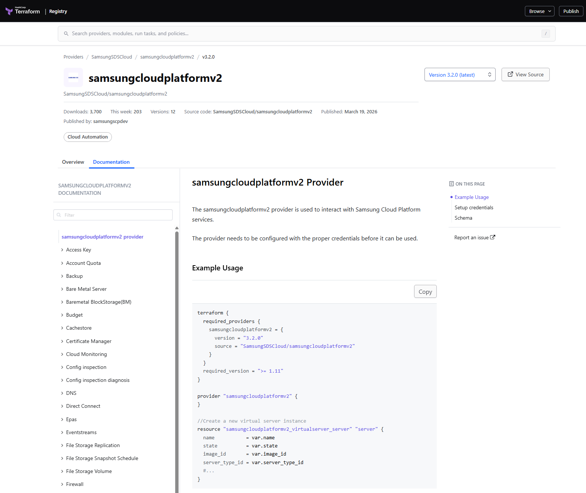

> 💡 **Tip:** 새로운 리소스를 정의해야 할 때는 항상 문서의 **Example Usage** 코드를 복사하여 내 환경에 맞게 수정하는 방식이 가장 빠르고 정확합니다.

#### [참고] Provider의 역할과 버전 관리

##### 1. Provider의 역할: 플랫폼 연동의 중개자

<!-- 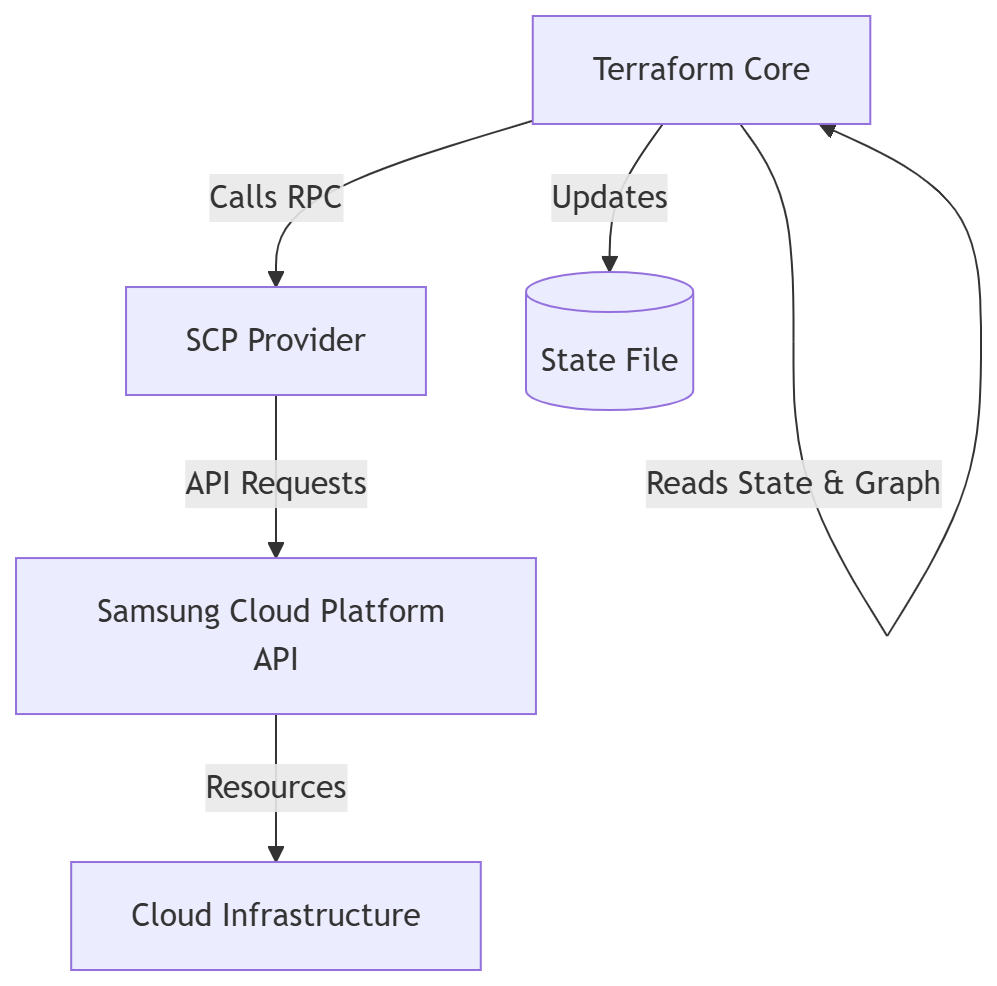 -->
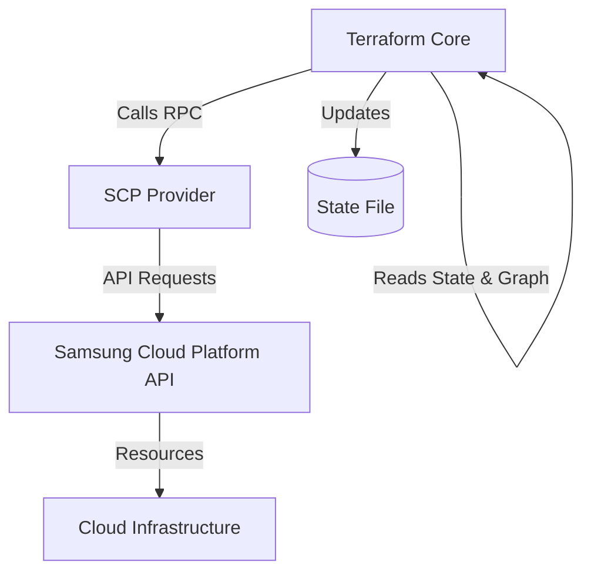
```mermaid
graph TD
    Core[Terraform Core] -- "Reads State & Graph" --> Core
    Core -- "Calls RPC" --> Provider[SCP Provider]
    Provider -- "API Requests" --> SCP[Samsung Cloud Platform API]
    SCP -- "Resources" --> Infra[Cloud Infrastructure]
    Core -- "Updates" --> State[(State File)]
```

Provider는 Terraform Core와 실제 클라우드 플랫폼(SCP, AWS, Azure 등) 간의 번역기이자 인터페이스 역할을 수행합니다.
- **API 상호 작용**: 사용자가 HCL(`resource "scp_vpc"...`)로 정의한 코드를 Provider가 해당 플랫폼의 **API 호출(HTTP 요청)**로 변환하여 리소스를 생성, 조회, 수정, 삭제합니다.
- **리소스 추상화**: Provider는 복잡한 클라우드 API를 Terraform이 이해할 수 있는 리소스 스키마 형태로 추상화합니다.
- **에코시스템**: Terraform Registry에는 수백 개의 공식 및 커뮤니티 Provider가 등록되어 있으며, 이는 클라우드 인프라뿐만 아니라 Kubernetes, DataDog, Helm 차트 등 다양한 서비스까지 코드로 관리할 수 있는 기반을 제공합니다.

##### 2. Provider 버전 관리: 일관성과 안정성의 확보
Provider는 지속적으로 업데이트되며, 새로운 기능이 추가되거나 기존 버그가 수정되지만, 때로는 **하위 호환성을 깨는 변경(Breaking Change)**이 발생하기도 합니다.
- **버전 고정 (Version Constraints)**: 코드의 일관성과 안정성을 유지하기 위해 `required_providers` 블록에서 Provider의 버전을 명시적으로 지정(`version = "4.1.1"` 등)해야 합니다.
- **안정적인 배포**: 버전을 고정하지 않으면, `terraform init` 시 최신 버전이 설치되어 예기치 않은 동작이나 오류를 유발할 수 있습니다.

#### 3.3.2 provider.tf 파일 구성

- Terraform이 SCP 리소스를 관리하기 위해 필요한 Provider 설정을 정의합니다.
- 실습을 위한 `day1` 디렉토리를 생성하고, 해당 디렉토리로 이동하여 `provider.tf` 파일을 생성한 후 아래 내용을 작성합니다.

```bash
mkdir day1
cd day1
code-server provider.tf
```

```hcl
terraform {
  required_providers {
    samsungcloudplatformv2 = {
      version = "4.1.1"
      source = "samsungsdscloud/samsungcloudplatformv2"
    }
    time = {
      source  = "hashicorp/time"
      version = "~> 0.13.0"
    }
    http = {
      source  = "hashicorp/http"
      version = "~> 3.4.5"
    }
    local = {
      source  = "hashicorp/local"
      version = "~> 2.5.2"
    }
  }
  required_version = ">= 1.11"
}

provider "samsungcloudplatformv2" {
}

provider "time" {
}

provider "http" {
}

provider "local" {
}
```

**코드 설명:**

1.  **`terraform` 블록**:
    -   **`required_providers`**: 이 프로젝트에서 사용할 Terraform Provider들의 목록과 버전을 정의합니다.
        -   **`samsungcloudplatformv2`**: SCP 리소스를 관리하기 위한 핵심 Provider입니다. `samsungsdscloud/samsungcloudplatformv2`에서 다운로드하며, 버전 `4.1.1`을 사용합니다.
        -   **`time`**: 시간 지연(`time_sleep`) 등의 시간 관련 리소스를 관리하는 Provider입니다. 리소스 생성 간의 대기 시간이 필요할 때 유용합니다.
        -   **`http`**: 외부 HTTP 요청을 보내거나 데이터를 가져올 때 사용하는 Provider입니다. 예를 들어, 현재 실행 환경의 Public IP를 확인하는 데 사용할 수 있습니다.
        -   **`local`**: 로컬 파일 시스템에 파일을 생성하거나 관리할 때 사용하는 Provider입니다. `kubeconfig` 파일, `keypair` 파일 등을 로컬에 저장할 때 사용됩니다.
    -   **`required_version`**: 이 코드를 실행하기 위해 필요한 Terraform CLI의 최소 버전을 `1.11` 이상으로 지정합니다.

2.  **`provider` 블록**:
    -   각 Provider에 대한 구체적인 설정을 정의하는 곳입니다. 현재는 특별한 설정 없이 빈 블록(`{}`)으로 선언하여 기본 설정을 사용합니다.
    -   `samsungcloudplatformv2` provider의 경우, 앞서 `config.json`과 `credentials.json`을 통해 인증 정보를 설정했으므로 별도의 설정이 필요 없습니다.

#### 3.3.3 main.tf 파일 구성

- Terraform의 진입점 파일인 `main.tf`를 생성합니다.
- 현재 설정된 리전 정보를 조회하여 출력하는 간단한 코드를 작성하여 설정이 올바른지 확인합니다.

```bash
code-server main.tf
```

```hcl
# 프로젝트 메타데이터 설정
locals {
  # 리소스 이름 접두사 정의
  name_prefix = "tf"
  # 프로젝트 이름 정의
  project = "Terraform-Basic-Lab"
  # 환경 구분 정의
  environment = "lab"
  # 공통 태그 정의
  common_tags = {
    Project     = local.project
    Environment = local.environment
    ManagedBy   = "Terraform"
  }
}


# 현재 IP 주소 조회 데이터 소스
data "http" "my_public_ip" {
  url = "https://ipv4.icanhazip.com"
}

# 현재 IP 주소 변수 정의
locals {
  my_current_ip_address = chomp(data.http.my_public_ip.response_body)
}
```

**코드 설명:**

1.  **`locals` 블록 (메타데이터)**:
    -   프로젝트 전반에서 재사용할 공통 변수들을 정의합니다.
    -   `project`, `environment`: 리소스 이름이나 태그에 사용할 프로젝트 및 환경 식별자입니다.
    -   `common_tags`: 모든 리소스에 공통으로 적용할 태그 맵입니다. 이를 통해 리소스의 소유권과 용도를 명확히 관리할 수 있습니다.
    -   `name_prefix`: 리소스 이름 생성 시 사용할 접두사입니다.

2.  **`data` 소스**:
    -   **`http` "my_public_ip"**: 외부 서비스(`icanhazip.com`)를 호출하여 현재 Terraform을 실행 중인 환경(Web-IDE)의 Public IP 주소를 조회합니다. 이 IP는 보안 그룹(Security Group) 설정 등에서 내 IP만 허용하는 규칙을 만들 때 유용하게 사용됩니다.

3.  **`locals` 블록 (IP 주소)**:
    -   `my_current_ip_address`: `data.http.my_public_ip`에서 가져온 응답 본문(`response_body`)에서 불필요한 공백이나 개행 문자를 `chomp` 함수로 제거하여 깔끔한 IP 주소 문자열로 저장합니다.
        > 💡 **참고: `chomp` 내장 함수**
        >
        > - **역할**: `chomp(string)` 함수는 입력된 문자열의 맨 끝에 붙어 있는 개행 문자(`\n` 또는 `\r\n`)를 제거합니다. 문자열의 마지막에 붙은 개행 문자만 제거하며, 문자열 중간의 개행이나 공백은 영향을 받지 않습니다.
        > - **필요성**: `icanhazip.com`이나 `ifconfig.me`와 같이 단순 텍스트로 결과를 반환하는 외부 API들은 대개 응답 값 끝에 눈에 보이지 않는 줄바꿈 문자(`\n`)를 포함하여 전달합니다. (예: `"203.0.113.1\n"`)
        > - **영향**: 테라폼에서 개행 문자가 포함된 값을 보안 그룹(Security Group) 규칙이나 방화벽 IP 목록 등에 그대로 매핑하면, 유효하지 않은 IP 주소 형식이라는 유효성 검사(Validation) 실패 오류가 발생합니다. 따라서 `chomp()`를 사용해 개행 문자가 제거된 온전한 IP 주소 문자열(`"203.0.113.1"`)로 가공해 주어야 합니다.


### 3.4 Terraform 초기화 및 검증

작성한 Terraform 코드가 올바르게 동작하는지 확인하기 위해 초기화 및 검증 과정을 수행합니다.

#### 3.4.1 Terraform 초기화 (`terraform init`)

`provider.tf`에 정의된 Provider 플러그인을 다운로드하고, Terraform 작업 디렉토리를 초기화합니다.

```bash
terraform init
```

**예상 출력:**
```text
Initializing the backend...
Initializing provider plugins...
- Finding hashicorp/time versions matching "~> 0.13.0"...
- Finding hashicorp/http versions matching "~> 3.4.5"...
- Finding hashicorp/local versions matching "~> 2.5.2"...
- Finding samsungsdscloud/samsungcloudplatformv2 versions matching "4.1.1"...
- Installing hashicorp/time v0.13.1...
- Installed hashicorp/time v0.13.1 (signed by HashiCorp)
- Installing hashicorp/http v3.4.5...
- Installed hashicorp/http v3.4.5 (signed by HashiCorp)
- Installing hashicorp/local v2.5.3...
- Installed hashicorp/local v2.5.3 (signed by HashiCorp)
- Installing samsungsdscloud/samsungcloudplatformv2 v4.1.1...
- Installed samsungsdscloud/samsungcloudplatformv2 v4.1.1 (self-signed, key ID 79D5FEFEF12860AF)
Partner and community providers are signed by their developers.
If you'd like to know more about provider signing, you can read about it here:
https://developer.hashicorp.com/terraform/cli/plugins/signing
Terraform has created a lock file .terraform.lock.hcl to record the provider
selections it made above. Include this file in your version control repository
so that Terraform can guarantee to make the same selections by default when
you run "terraform init" in the future.

Terraform has been successfully initialized!
```

#### 3.4.2 설정 검증 (`terraform plan`)

작성한 코드에 문법적 오류가 없는지 확인하고, 실제 리소스를 생성하기 전에 어떤 작업이 수행될지 미리 확인합니다. 또한, 이 단계에서 SCP API 인증이 올바르게 설정되었는지도 검증할 수 있습니다.

```bash
terraform plan
```

**예상 출력:**
```text
data.http.my_public_ip: Reading...
data.http.my_public_ip: Read complete after 0s [id=https://ipv4.icanhazip.com]

No changes. Your infrastructure matches the configuration.

Terraform has compared your real infrastructure against your configuration and found no differences, so no changes are needed.
```

> 💡 **참고:** `terraform plan` 명령어가 오류 없이 성공적으로 실행된다면, `config.json`, `credentials.json`, `provider.tf`, `main.tf` 설정이 모두 올바르게 완료된 것입니다.

### 3.5 정리하기

- **인증키 생성 및 보안 설정:** SCP 콘솔에서 인증키를 생성하고, Web-IDE IP만 접근을 허용하여 보안을 강화했습니다.
- **Terraform 설정 파일 구성:** `~/.scpconf` 디렉토리에 `config.json`과 `credentials.json`을 생성하여 Terraform이 SCP 리소스를 제어할 수 있는 환경을 마련했습니다.
- **Provider 및 Main 파일 작성:** `provider.tf`를 통해 필요한 플러그인을 정의하고, `main.tf`에서 공통 변수와 데이터 소스를 설정했습니다.
- **초기화 및 검증:** `terraform init`과 `terraform plan`을 통해 환경 설정이 정상적으로 완료되었음을 확인했습니다.


## 4. [실습] HCL 문법 및 표준 워크플로우
### 4.1 학습목표
HCL(HashiCorp Configuration Language)의 기본 블록 구조(resource, variable, output, data)와 사용 목적을 구분할 수 있습니다.
Terraform의 표준 5단계 워크플로우를 이해하고 **핵심 명령어(`init, validate, plan, apply, destroy`)**를 순서대로 사용하여 인프라를 관리할 수 있습니다.
`count` 및 `for_each` 등의 반복문, 조건식, 그리고 프로비저너의 역할을 이해하고 코드의 유연성을 높일 수 있습니다.

---

#### **[핵심 연결] IaC 철학에서 실제 코드로**
1장에서 배운 IaC의 철학(선언적 방식, 상태 기반 관리)을 실제 클라우드 인프라로 구현하기 위해서는 두 가지가 필요합니다.
1.  **언어 (Language)**: 인프라의 '희망 상태'를 정의하는 문법인 **HCL**
2.  **행동 (Action)**: 정의된 코드를 실제 리소스로 변환하는 절차인 **워크플로우**

4장에서는 이 두 가지 핵심 요소를 차례대로 학습하여, 테라폼으로 인프라를 구축하는 기초 체력을 다집니다.

---

### 4.2 들어가기: HCL 핵심 개념 및 워크플로우 요약

#### 4.2.1 HCL 4대 기본 블록 정의 (Resource, Variable, Output, Data)
HCL은 Terraform이 인프라를 정의하기 위해 사용하는 언어입니다. 모든 Terraform 구성(`.tf` 파일)은 다음 네 가지 핵심 블록 타입으로 이루어집니다.

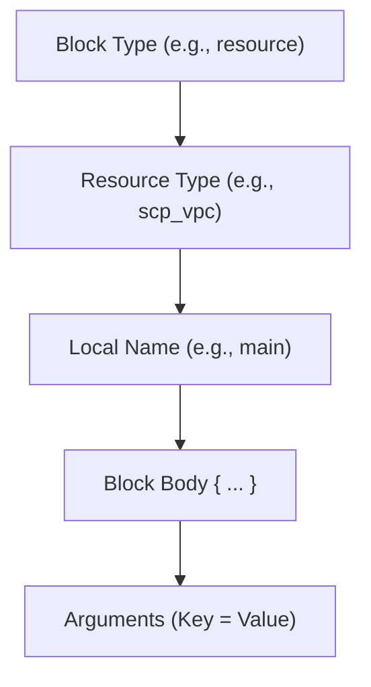
```mermaid
graph TD
    Block["Block Type (e.g., resource)"] --> Label1["Resource Type (e.g., scp_vpc)"]
    Label1 --> Label2["Local Name (e.g., main)"]
    Label2 --> Body["Block Body { ... }"]
    Body --> Arg["Arguments (Key = Value)"]
```

| 블록 타입 | 역할 | 예제 코드 (Structure) |
| --- | --- | --- |
| resource | 인프라 구성 자원(로컬 파일, 클라우드 자원 등)을 생성하고 관리하는 핵심 정의 블록입니다. | `resource "local_file" "example" { content = "hello" }` |
| variable | 코드 외부에서 값을 입력받아 재사용성과 유연성을 높이는 변수 선언 블록입니다. | `variable "user_name" { type = string }` |
| output | 배포 후 생성된 결과 속성(ID, 생성 파일 경로 등)을 터미널에 출력하거나 다른 모듈에 전달합니다. | `output "file_path" { value = local_file.example.filename }` |
| data | Terraform 외부의 파일이나 시스템 상태, 혹은 공용 API 정보 등을 읽어옵니다. | `data "local_file" "config" { filename = "${path.module}/config.txt" }` |

> 💡 **HCL 병합(Merge) 규칙:**
> 테라폼은 파일명이 무엇이든 상관없이 **동일 디렉토리 내의 모든 `.tf` 파일들을 단일 컨텍스트로 합쳐서(Merge) 읽어들입니다.** 따라서 다른 파일에 정의된 `local` 변수나 리소스를 별도의 `import`나 참조 선언 없이 즉시 가져다 쓸 수 있습니다. 단, 동일한 변수명이나 리소스 타입의 명칭이 디렉토리 내에 중복되어 존재할 경우 `Duplicate` 에러가 발생하므로 유의해야 합니다.

##### **Local Values (locals) 블록**
`locals`는 코드 내에서 반복적으로 사용되는 값이나 복잡한 계산식의 결과를 하나의 '지역 변수'처럼 정의할 때 사용합니다. 

| 구분 | `variable` (입력 변수) | `locals` (지역 값) |
| :--- | :--- | :--- |
| **비유** | 함수의 **파라미터(인자)** | 코드 내의 **상수/중간 변수** |
| **외부 입력** | **가능** (CLI, 파일 등) | **불가능** (코드 내 고정) |
| **주요 용도** | 실행 시마다 바뀌는 설정값 주입 | 복잡한 식의 단순화 및 코드 재사용 |

##### **Variable의 외부 입력 방식**
`variable`은 다음과 같은 경로를 통해 코드 외부에서 값을 주입받을 수 있습니다:
1. **명령어 입력 (CLI):** `terraform apply -var="instance_type=m5.large"`
2. **변수 파일 (.tfvars):** `terraform.tfvars` 파일에 정의된 값 자동 로드
3. **환경 변수:** `TF_VAR_variable_name` 형식의 시스템 환경 변수
4. **기본값 (Default):** 외부 입력이 없을 경우 `variable` 블록에 정의된 `default` 값 사용

---

#### 4.2.2 HCL 표현식 및 주요 데이터 타입
HCL은 단순히 리소스를 선언하는 것을 넘어, 데이터를 가공하고 동적으로 참조할 수 있는 풍부한 표현식과 데이터 타입을 제공합니다.

| 분류 | 타입/표현식 | 설명 | 예제 |
| :--- | :--- | :--- | :--- |
| **기본 타입** | `string, number, bool` | 문자열, 숫자, 불리언 기본 단위 | `"app-name", 10, true` |
| **컬렉션 타입** | `list, map, set` | 동일 타입 데이터의 집합 | `["a", "b"], {key = "val"}` |
| **보간법** | `${ ... }` | 문자열 내 동적 값 참조 | `"Name is ${var.user_name}"` |
| **For 표현식** | `for` expressions | 컬렉션 순회 및 변환 | `[for v in var.list : upper(v)]` |
| **Splat** | `[*]` (Splat) | 속성값 일괄 추출 | `local_file.example[*].filename` |
| **Count 반복** | `count` | 리소스 다중 생성 (인덱스 기반) | `count = 3` |
| **For_each 반복**| `for_each` | 리소스 다중 생성 (키-값 기반) | `for_each = local.subnets` |
| **조건식** | `(cond ? t : f)` | 3항 연산자를 이용한 값 분기 | `var.is_prod ? "Standard-2" : "Standard-1"` |

##### **내장 함수 (Built-in Functions)**
Terraform은 문자열 처리(`join(), split()`), 파일 시스템 조작(`file()`), 네트워크 주소 계산(`cidrsubnet()`), 리스트 및 맵 조작(`lookup()`) 등 수많은 내장 함수를 제공하여 복잡한 로직을 HCL 내에서 처리할 수 있게 합니다.

---

#### 4.2.3 테라폼 표준 5단계 워크플로우 개념
HCL로 인프라를 정의했다면, 이제 Terraform CLI를 사용하여 실제 리소스를 생성하고 관리할 차례입니다. 테라폼은 아래와 같은 선순환 워크플로우를 거쳐 인프라를 프로비저닝합니다.

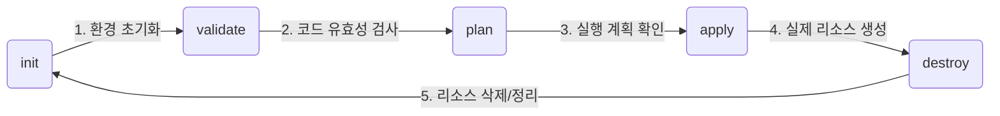
```mermaid
graph LR
    init(init) -- "1. 환경 초기화" --> validate(validate)
    validate -- "2. 코드 유효성 검사" --> plan(plan)
    plan -- "3. 실행 계획 확인" --> apply(apply)
    apply -- "4. 실제 리소스 생성" --> destroy(destroy)
    destroy -- "5. 리소스 삭제/정리" --> init
```

##### **주요 5단계 워크플로우 상세**

| 단계 | 명령어 | 역할 |
| :--- | :--- | :--- |
| **1. 초기화** | `terraform init` | 작업 디렉토리를 설정하고 필요한 SCP Provider 플러그인을 다운로드 및 설치합니다. |
| **2. 유효성 검사** | `terraform validate` | HCL 문법 오류와 구성의 논리적 오류를 확인합니다. (`plan` 전에 실행 권장) |
| **3. 실행 계획** | `terraform plan` | 코드와 State 파일을 비교하여 **어떤 변경(생성, 수정, 삭제)**이 발생할지 시뮬레이션하고 사용자에게 출력합니다. |
| **4. 적용** | `terraform apply` | `plan` 결과를 바탕으로 SCP API를 호출하여 실제 인프라 변경을 수행하고, State 파일을 업데이트합니다. |
| **5. 정리** | `terraform destroy` | State 파일을 참조하여 생성된 모든 리소스를 안전하게 역순으로 삭제합니다. |

---

#### 4.2.4 추가 설정 개념: 프로비저너 및 시스템 환경 변수

##### **프로비저너 (Provisioner)의 이해**
프로비저너는 Terraform이 리소스 생성/삭제 과정의 특정 단계에서 실행할 스크립트나 명령어를 정의합니다.
*   **local-exec**: Terraform이 실행되는 로컬 머신에서 명령어를 실행합니다. 주로 Terraform 완료 후 로컬 파일 시스템에 정보를 기록하거나 후속 스크립트를 트리거할 때 사용합니다.
*   **remote-exec**: SSH 또는 WinRM을 통해 생성된 인스턴스 내부에 접속하여 명령어를 실행합니다. 서버 내부의 초기 패키지 설치나 구성 작업에 사용됩니다.

> [!CAUTION]
> **프로비저너 사용 시 주의사항**
> 프로비저너는 Terraform 상태 파일에 실행 결과가 기록되지 않아 오류 복구 및 멱등성 보장이 까다롭습니다. 가급적 **사용자 데이터(Init Script)**나 **Ansible** 같은 전문 구성 관리 도구를 사용하는 것이 권장되는 모범 사례(Best Practice)입니다.

##### **시스템 환경 변수 (Environment Variables)**
*   **인증 정보 관리**: `SCP_TF_ACCESS_KEY`나 `SCP_TF_SECRET_KEY`와 같은 민감 정보를 코드가 아닌 환경 변수를 통해 전달하여 보안을 강화합니다.
*   **실행 옵션**: `TF_LOG`를 설정하여 상세 로그를 출력하거나 `TF_VAR_variable_name`을 사용하여 특정 변수 값을 명령줄 대신 환경 변수로 전달할 수 있습니다.

---

### 4.3 따라하기: 단계별 HCL 및 워크플로우 실습 (Hands-on)

이번 실습은 **3장에서 이미 생성한 `provider.tf`와 `main.tf` 파일이 있는 프로젝트 디렉터리를 그대로 사용**합니다. 클라우드에 실제 요금 부과나 리소스를 생성하지 않고, 100% 로컬(웹 IDE)에서 테라폼의 선언적 동작 원리 및 HCL 표현식을 연습합니다.

#### 4.3.1 대화형 콘솔로 HCL 표현식 평가하기 (`terraform console`)
HCL 코드를 파일로 작성하기 전, 테라폼의 대화형 콘솔을 통해 문법과 내장 함수를 테스트합니다.

1. **콘솔 모드 진입**:
   ```bash
   terraform console
   ```
2. **HCL 표현식 테스트**:
   아래 명령어들을 각각 콘솔 창에 입력하고 반환되는 값을 확인합니다.
   ```hcl
   # 1. 3항 연산자 조건문 테스트
   true ? "prod-subnet" : "dev-subnet"

   # 2. 문자열 결합 및 lower() 내장 함수 테스트
   lower("SCP-PROJECT-LAB")

   # 3. cidrsubnet() 함수를 활용한 서브넷 대역 자동 계산 테스트
   cidrsubnet("192.168.0.0/16", 8, 1)
   cidrsubnet("192.168.0.0/16", 8, 2)

   # 4. for 표현식 (List Comprehension)을 통한 데이터 가공 테스트
   [for s in ["web", "db"] : "sub-${s}"]
   ```
3. **콘솔 모드 종료**:
   ```bash
   exit
   ```

#### 4.3.2 [실습] HCL 기본 블록 통합 예제 실습 (`example_block.tf`)
수강생은 resource, variable, output, data 블록을 조합하여 외부 API 데이터와 변수를 활용한 로컬 파일 결과물을 출력하는 설정을 구성해봅니다.

1. **`example_block.tf` 파일 생성 및 편집기 실행**:
   ```bash
   code-server example_block.tf
   ```
2. **아래 코드를 작성하고 저장합니다**:
   ```hcl
   variable "app_name" {
     type    = string
     default = "my-local-app"
   }

   # 공용 API를 호출하여 데이터 조회 (Data Source)
   data "http" "terraform_version" {
     url = "https://checkpoint-api.hashicorp.com/v1/check/terraform"
   }

   # 로컬 파일 생성 (Resource)
   resource "local_file" "app_meta" {
     content  = "App Name: ${var.app_name}, TF Latest Version: ${jsondecode(data.http.terraform_version.response_body).current_version}"
     filename = "${path.module}/ex-app_meta.txt"
   }

   # 생성된 결과 출력 (Output)
   output "app_meta_file_path" {
     value = local_file.app_meta.filename
   }

   output "latest_version_data" {
     value = jsondecode(data.http.terraform_version.response_body)
   }
   ```

**코드 설명:**

1. **`variable "app_name"`**: 로컬 앱의 이름을 외부에서 지정할 수 있는 입력 변수입니다. 기본값은 `"my-local-app"`입니다.
2. **`data "http" "terraform_version"`**: HashiCorp의 공용 체크포인트 API를 호출하여 최신 테라폼 버전 관련 정보를 실시간으로 읽어옵니다.
3. **`resource "local_file" "app_meta"`**: API 응답 본문(`response_body`)을 JSON 형식으로 해석(`jsondecode()`)하여 최신 테라폼 버전 값(`current_version`)을 추출하고, 변수 값과 함께 결합하여 `ex-app_meta.txt` 파일에 기록합니다.
4. **`output` 블록**: 생성된 파일의 경로 정보 및 조회된 최신 버전 관련 메타데이터 전체를 출력 창에 보여줍니다.


3. **결과 확인 방법**:
   * 위 코드를 작성하여 저장한 후 터미널에서 실행합니다:
     ```bash
     terraform apply
     ```
   * 생성된 `ex-app_meta.txt` 파일의 내용을 확인합니다:
     ```bash
     cat ex-app_meta.txt
     ```
   * `terraform output`을 통해 최신 버전 데이터 및 파일 경로가 올바르게 추출되었는지 확인한 뒤, 다음 실습을 위해 자원을 삭제합니다:
     ```bash
     terraform destroy
     ```

#### 4.3.3 [실습] HCL 표현식 및 삼항 연산자 실습 (`example_expression.tf`)
HCL의 로컬 변수(`locals`)와 삼항 연산자, 문자열 처리 내장 함수를 활용해 봅니다.

1. **`example_expression.tf` 파일 생성 및 편집기 실행**:
   ```bash
   code-server example_expression.tf
   ```
2. **아래 코드를 작성하고 저장합니다**:
   ```hcl
   locals {
     # 문자열 (String)
     project_name = "SCP-Automation"

     # 여러 줄 문자열 (Multiline String - Heredoc)
     description = <<EOF
     이 설정은 Samsung Cloud Platform의
     인프라 자동화를 위한 공통 설정입니다.
     EOF

     # 숫자 (Number) 및 불리언 (Boolean)
     instance_count = 3
     is_public      = true

     # 키-밸류 쌍 (Map/Key-Value)
     ex_common_tags = {
       Service = "Backend"
       Env     = "Dev"
     }
   }

   # -- 함수 호출 및 조건문 (Functions & Ternary Operator)
   resource "local_file" "main" {
     # 함수(Function) 호출: lower() 등 문자열 처리 시 사용
     filename = "${path.module}/ex-${lower(local.project_name)}-config.txt"

     # 3항 연산자(Ternary Operator) 조건문
     content = (local.is_public ? "Public Access Enabled" : "Private Access Only")
   }
   ```

**코드 설명:**

1. **`locals` 블록**: 공통 변수를 그룹화하여 선언합니다. 문자열, 다중 행 문자열(Heredoc), 숫자, 참/거짓 값, 맵형 구조 등 다양한 HCL 데이터 타입을 정의하고 있습니다.
2. **`resource "local_file" "main"`**:
   - **`filename`**: `local.project_name`의 값(`"SCP-Automation"`)을 소문자로 변환(`lower()`)하여 최종 파일명을 `"ex-scp-automation-config.txt"`로 동적으로 생성합니다.
   - **`content`**: `local.is_public` 조건에 따라 참이면 `"Public Access Enabled"`, 거짓이면 `"Private Access Only"`로 파일 내용을 다르게 구성합니다.


3. **결과 확인 방법**:
   * 저장 후 다음 명령어를 실행합니다:
     ```bash
     terraform apply
     ```
   * `lower()` 함수와 삼항 연산자에 의해 생성된 `ex-scp-automation-config.txt` 파일의 경로와 내용을 확인합니다:
     ```bash
     cat ex-scp-automation-config.txt
     ```
   * 확인이 완료되면 자원을 해제합니다:
     ```bash
     terraform destroy
     ```

#### 4.3.4 [실습] `count` 반복문을 활용한 리소스 다중 생성 실습 (`example_count.tf`)
동일한 리소스를 정해진 횟수만큼 인덱스 기반으로 생성해 봅니다.

1. **`example_count.tf` 파일 생성 및 편집기 실행**:
   ```bash
   code-server example_count.tf
   ```
2. **아래 코드를 작성하고 저장합니다**:
   ```hcl
   resource "local_file" "count_example" {
     count    = 2
     content  = "This is file number ${count.index}"
     filename = "${path.module}/ex-file-${count.index}.txt"
   }
   ```

**코드 설명:**

1. **`count = 2`**: 동일 리소스(`local_file`)를 2번 반복하여 생성하게 만듭니다.
2. **`count.index`**: 0부터 시작하는 인덱스 번호를 매핑하여 `ex-file-0.txt` 및 `ex-file-1.txt` 파일들을 생성하며, 본문 내용에도 각 파일의 고유 인덱스를 포함시킵니다.


3. **결과 확인 방법**:
   * 저장 후 배포합니다:
     ```bash
     terraform apply
     ```
   * 생성된 두 개의 텍스트 파일을 확인합니다:
     ```bash
     cat ex-file-0.txt
     cat ex-file-1.txt
     ```
   * 확인 후 자원을 정리합니다:
     ```bash
     terraform destroy
     ```

#### 4.3.5 [실습] `for_each` 반복문을 활용한 리소스 다중 생성 실습 (`example_foreach.tf`)
Map 또는 Set 컬렉션의 각 항목별 고유 키(Key)를 기반으로 리소스를 안전하게 생성해 봅니다.

1. **`example_foreach.tf` 파일 생성 및 편집기 실행**:
   ```bash
   code-server example_foreach.tf
   ```
2. **아래 코드를 작성하고 저장합니다**:
   ```hcl
   locals {
     file_contents = {
       web = "This is configuration for web layer"
       db  = "This is configuration for database layer"
     }
   }

   resource "local_file" "for_each_example" {
     for_each = local.file_contents
     content  = each.value
     filename = "${path.module}/ex-config-${each.key}.txt"
   }
   ```

**코드 설명:**

1. **`for_each = local.file_contents`**: Key-Value 맵 구조의 각 항목(`web`, `db`)을 돌며 반복 생성 작업을 수행합니다.
2. **`each.key` / `each.value`**: 순회 중인 객체의 Key(`"web"`, `"db"`)를 파일명에 바인딩하고, Value 값들을 각 파일의 본문 텍스트 내용으로 구성합니다.


3. **결과 확인 방법**:
   * 저장 후 배포합니다:
     ```bash
     terraform apply
     ```
   * 생성된 설정 파일들을 확인합니다:
     ```bash
     cat ex-config-web.txt
     cat ex-config-db.txt
     ```
   * 확인 후 자원을 정리합니다:
     ```bash
     terraform destroy
     ```

> [!TIP]
> **운영 환경에서의 선택: count vs for_each**
> - **count**는 단순 숫자 반복에 유리하지만, 중간 리소스가 삭제될 경우 인덱스가 밀려 의도치 않은 리소스 재생성(Recreation)을 유발할 수 있습니다. 
> - **for_each**는 인덱스가 아닌 고유 키(Key)를 사용하므로 데이터 추가/삭제 시에도 다른 리소스의 상태가 안전하게 유지됩니다. **실무에서는 `for_each` 사용을 권장**합니다.

#### 4.3.6 [실습] `for` 표현식을 활용한 데이터 가공 실습 (`example_for_expression.tf`)
컬렉션(List, Map)의 요소를 순회하며 데이터를 변환하는 `for` 표현식을 실습합니다.

1. **`example_for_expression.tf` 파일 생성 및 편집기 실행**:
   ```bash
   code-server example_for_expression.tf
   ```
2. **아래 코드를 작성하고 저장합니다**:
   ```hcl
   locals {
     service_environments = ["dev", "staging", "prod"]
     # 결과: ["DEV", "STAGING", "PROD"]
     upper_environments   = [for env in local.service_environments : upper(env)]

     server_roles = {
       web = "frontend"
       was = "backend"
     }
     # 결과: { "role-web" = "FRONTEND", "role-was" = "BACKEND" }
     modified_roles = { for k, v in local.server_roles : "role-${k}" => upper(v) }
   }

   output "upper_environments_output" {
     value = local.upper_environments
   }

   output "modified_roles_output" {
     value = local.modified_roles
   }
   ```

**코드 설명:**

1. **`upper_environments`**: `for` 루프를 사용해 리스트의 각 요소를 대문자(`DEV`, `STAGING`, `PROD`)로 변환한 새로운 리스트를 동적으로 구축합니다.
2. **`modified_roles`**: 맵의 요소들을 돌며 Key에 `"role-"` 접두사를 붙이고, Value 값을 대문자로 치환한 새로운 맵 `{ "role-web" = "FRONTEND", "role-was" = "BACKEND" }`을 형성합니다.


3. **결과 확인 방법**:
   * 저장 후 배포합니다:
     ```bash
     terraform apply
     ```
   * `terraform output`을 통해 가공된 리스트 및 맵 출력을 확인합니다:
     ```bash
     terraform output
     ```
   * 확인 후 자원을 정리합니다:
     ```bash
     terraform destroy
     ```

#### 4.3.7 [실습] 조건식과 `terraform_data` 리소스 활용 실습 (`example_conditional.tf`)
삼항 연산자와 테라폼 내장 리소스 `terraform_data`를 통해 가상 서버 스펙을 조절해 봅니다.

> [!NOTE]
> **`terraform_data` 리소스의 장점**
> 특정 클라우드 프로바이더를 연동하지 않고도 임의의 입력 데이터(`input`)를 받아 상태 파일에 저장하고 출력(`output`)할 수 있어, HCL 문법 및 제어 흐름을 로컬에서 비용 부담 없이 학습하기에 매우 적합한 내장 리소스입니다.

1. **`example_conditional.tf` 파일 생성 및 편집기 실행**:
   ```bash
   code-server example_conditional.tf
   ```
2. **아래 코드를 작성하고 저장합니다**:
   ```hcl
   variable "is_prod_spec" {
     type    = bool
     default = false
   }

   resource "terraform_data" "server_spec" {
     # 조건에 따라 가상 서버 사양 문자열을 결정
     input = var.is_prod_spec ? "Standard-2" : "Standard-1"
   }

   output "evaluated_server_spec" {
     value = terraform_data.server_spec.output
   }
   ```

**코드 설명:**

1. **`terraform_data` 리소스**: 클라우드 API 호출 없이도 테라폼 상태 파일 내에 데이터를 안전하게 저장하고 입출력할 수 있는 학습용 유틸리티 리소스입니다.
2. **`input`**: `var.is_prod_spec` 변수가 `true`이면 `"Standard-2"`, `false`이면 `"Standard-1"` 사양 텍스트 값을 입력값으로 바인딩하여 저장합니다.


3. **결과 확인 방법**:
   * 기본 개발 환경 사양으로 적용해 봅니다:
     ```bash
     terraform apply
     terraform output
     ```
   * 이번엔 변수를 주입하여 운영 사양을 평가해 봅니다:
     ```bash
     terraform apply -var="is_prod_spec=true"
     terraform output
     ```
   * 확인 후 자원을 해제합니다:
     ```bash
     terraform destroy
     ```

#### 4.3.8 [실습] 내장 함수(`cidrsubnet`)를 활용한 서브넷 대역 계산 실습 (`example_functions.tf`)
테라폼의 대표적인 네트워크 계산 내장 함수 `cidrsubnet()`의 결과를 확인해 봅니다.

1. **`example_functions.tf` 파일 생성 및 편집기 실행**:
   ```bash
   code-server example_functions.tf
   ```
2. **아래 코드를 작성하고 저장합니다**:
   ```hcl
   locals {
     base_cidr_func = "10.0.0.0/16"
   }

   resource "terraform_data" "func_example" {
     # cidrsubnet 함수를 사용하여 기본 가상 대역에서 서브넷 대역을 자동으로 계산
     input = cidrsubnet(local.base_cidr_func, 8, 1) # 결과: "10.0.1.0/24"
   }

   output "calculated_subnet_cidr" {
     value = terraform_data.func_example.output
   }
   ```

**코드 설명:**

1. **`cidrsubnet` 함수**: `"10.0.0.0/16"` 대역에 8비트를 추가하여 `/24` 대역으로 확장하고, 2번째 인덱스 대역인 `"10.0.1.0/24"`를 계산해 내어 입력값으로 설정합니다.


3. **결과 확인 방법**:
   * 저장 후 실행합니다:
     ```bash
     terraform apply
     ```
   * `calculated_subnet_cidr`가 `10.0.1.0/24`로 올바르게 계산되어 출력되는지 확인합니다:
     ```bash
     terraform output
     ```
   * 확인 후 자원을 정리합니다:
     ```bash
     terraform destroy
     ```

#### 4.3.9 [실습] 로컬 프로비저너 및 `terraform_data` 변경 트리거 실습 (`example_local_exec.tf`)
인프라 생성 후 동작하는 `local-exec` 프로비저너와 특정 리소스의 변경 사항을 감지하는 `terraform_data` 트리거를 함께 결합해 봅니다.

1. **`example_local_exec.tf` 파일 생성 및 편집기 실행**:
   ```bash
   code-server example_local_exec.tf
   ```
2. **아래 코드를 작성하고 저장합니다**:
   ```hcl
   resource "local_file" "example" {
     content  = "provisioner-file"
     filename = "${path.module}/ex-prov_example.txt"

     # 리소스 생성 완료 후 로컬 파일에 로그 기록
     provisioner "local-exec" {
       command = "echo File created at ${self.filename} >> ex-build_log.txt"
     }
   }

   resource "terraform_data" "config_sync" {
     # 로컬 파일의 ID(콘텐츠 해시 등)가 변경되거나 재생성될 때 트리거 실행
     input = local_file.example.id
     
     provisioner "local-exec" {
      command = <<EOT
        echo "=================================================="
        echo "[Terraform Sync] File ID changed to: ${self.input}"
        echo "=================================================="
      EOT
     }
   }
   ```

**코드 설명:**

1. **`provisioner "local-exec"` (in local_file)**: 리소스 파일 생성 직후, 로컬 셸 명령(`echo ...`)을 실행해 빌드 로그(`ex-build_log.txt`)를 남깁니다.
2. **`terraform_data "config_sync"`**: `local_file.example.id`를 입력 값으로 가집니다. 파일의 내용이 바뀔 경우 리소스의 ID가 변경되므로, 이를 감지한 `config_sync` 리소스가 재생성되며 연동된 `local-exec` 프로비저너가 재실행되어 터미널 화면에 변경 사실을 알립니다.


3. **결과 확인 방법**:
   * 최초 배포를 수행해 봅니다:
     ```bash
     terraform apply
     ```
   * 생성된 로그를 확인합니다. `ex-prov_example.txt` 정보가 `ex-build_log.txt`에 기록된 것을 볼 수 있습니다:
     ```bash
     cat ex-prov_example.txt
     cat ex-build_log.txt
     ```
   * `example_local_exec.tf` 파일에서 `local_file.example` 리소스의 `content` 값("provisioner-file") the "updated-provisioner-file"로 수정하여 저장합니다.
   * 다시 한번 배포하여 리소스 변경과 `terraform_data.config_sync` 트리거가 실행되는 터미널 로그(`File ID changed to: ...`)를 확인합니다:
     ```bash
     terraform apply
     ```
   * 확인이 끝났다면 자원을 정리합니다:
     ```bash
     terraform destroy
     ```
> [!CAUTION]
> **프로비저너 사용 시 주의사항**
> 프로비저너는 Terraform 상태 파일에 실행 결과가 기록되지 않아 오류 복구 및 멱등성 보장이 까다롭습니다. 가급적 **사용자 데이터(Init Script)**나 **Ansible** 같은 전문 구성 관리 도구를 사용하는 것이 권장되는 모범 사례(Best Practice)입니다.

#### 4.3.10 [실습] 환경 변수(`TF_VAR`) 주입 및 디버깅 로그(`TF_LOG`) 제어 실습 (`example_tf_var.tf`)
테라폼 CLI가 외부 OS 환경 변수를 읽어들이는 방식과 상세 디버깅 옵션을 실습합니다.

1. **`example_tf_var.tf` 파일 생성 및 편집기 실행**:
   ```bash
   code-server example_tf_var.tf
   ```
2. **아래 코드를 작성하고 저장합니다**:
   ```hcl
   variable "env_app_name" {
     type        = string
     description = "애플리케이션의 이름입니다. (외부 환경변수 주입용)"
     //default = "test_app_name"
   }

   resource "local_file" "env_var_example" {
     content  = "App name is ${var.env_app_name}"
     filename = "${path.module}/ex-app_info.txt"
   }
   ```

**코드 설명:**

1. **`variable "env_app_name"`**: 디폴트 값이 지정되어 있지 않지만, OS 터미널에서 `TF_VAR_env_app_name` 환경 변수가 설정되어 있으면 테라폼이 이를 자동 주입하여 빌드를 완료합니다.


3. **결과 확인 방법**:
   * 현재 터미널 셸 환경 변수에 `TF_VAR_env_app_name`을 정의합니다:
     * **Linux/Mac/Web-IDE**: `export TF_VAR_env_app_name="env-injected-app"`
     * **Windows PowerShell**: `$env:TF_VAR_env_app_name="env-injected-app"`
   * 대화형 프롬프트 요청 없이 실행되는지 확인하고 상세 디버깅 모드(`TF_LOG="DEBUG"`)를 활성화해 봅니다:
     * **Linux/Mac/Web-IDE**: `export TF_LOG="DEBUG"` 후 `terraform apply` 실행
     * **Windows PowerShell**: `$env:TF_LOG="DEBUG"` 후 `terraform apply` 실행
   * 터미널에 쏟아지는 방대한 RPC 로그와 API 디버깅 결과를 감상한 뒤 생성된 파일을 출력합니다:
     ```bash
     cat ex-app_info.txt
     ```
   * 환경 변수 설정을 비활성화하고 리소스를 지웁니다:
     * **Linux/Mac/Web-IDE**: `unset TF_LOG; unset TF_VAR_env_app_name` 후 `terraform destroy`
     * **Windows PowerShell**: `$env:TF_LOG=$null; $env:TF_VAR_env_app_name=$null` 후 `terraform destroy`

#### 4.3.11 [종합 실습] HCL 문법 및 워크플로우 5단계 전체 사이클 진행 (`hcl_practice.tf`)
지금까지 연습한 문법과 변수, 반복문, 함수를 종합하여 하나의 코드로 만들고, 3장에서 생성했던 파일과의 연동성(HCL Merge 규칙) 및 5단계 표준 라이프사이클을 테스트합니다.

1. **`hcl_practice.tf` 파일 생성 및 편집기 실행**:
   ```bash
   code-server hcl_practice.tf
   ```
2. **아래 코드를 작성하고 저장합니다**:
   ```hcl
   # 1. HCL 실습용 입력 변수 정의
   variable "is_prod" {
     type        = bool
     default     = false
     description = "운영 환경 여부 설정 (True일 때 가상 CIDR 대역 분기)"
   }

   locals {
     # 3항 연산자를 사용한 가상 CIDR 대역 분기
     base_cidr = var.is_prod ? "10.0.0.0/16" : "192.168.0.0/16"

     # 반복문(for_each) 실습을 위한 가상 서브넷 정보
     subnets = {
       web = 1
       db  = 2
     }
   }

   # 2. terraform_data 리소스를 사용하여 클라우드 자원 생성 없이 HCL 객체 정의
   # 3장 main.tf에 정의된 local.project ("scp-terraform-hol4")를 그대로 참조하여 재사용합니다.
   resource "terraform_data" "mock_vpc" {
     input = {
       name = "${local.project}-mock-vpc"
       cidr = local.base_cidr
     }
   }

   # 3. for_each와 cidrsubnet() 함수를 적용하여 가상 Subnet 대역 계산
   resource "terraform_data" "mock_subnets" {
     for_each = local.subnets

     input = {
       subnet_name = "sub-${each.key}"
       cidr_block  = cidrsubnet(terraform_data.mock_vpc.output.cidr, 8, each.value)
     }
   }

   # 4. 로컬 파일 작성을 통해 실습 결과를 ex-result.txt 파일에 기록
   resource "local_file" "result_file" {
     content  = <<EOF
   =====================================
   [HCL Local-only Practice Result]
   Project Name: ${terraform_data.mock_vpc.output.name}
   Base CIDR   : ${terraform_data.mock_vpc.output.cidr}
   Environment : ${var.is_prod ? "Production" : "Development"}

   Subnets Evaluated:
   %{ for key, val in terraform_data.mock_subnets ~}
   - ${val.output.subnet_name}: ${val.output.cidr_block}
   %{ endfor ~}
   =====================================
   EOF
     filename = "${path.module}/ex-result.txt"
   }

   # 5. 출력(Output) 정의 및 for 표현식을 통한 List 변환 실습
   output "hcl_vpc_summary" {
     value       = terraform_data.mock_vpc.output
     description = "가상 VPC 정보 요약"
   }

   output "hcl_subnet_summary" {
     value       = [for sub in terraform_data.mock_subnets : sub.output.cidr_block]
     description = "가상 서브넷들의 CIDR 대역 목록"
   }
   ```

**코드 설명:**

1. **파일 연동성**: 동일한 디렉토리에 있는 3장의 `main.tf`에 선언된 `local.project` 지역 변수를 별도 참조 정의 없이 자연스럽게 참조하여 재사용합니다. 이는 테라폼이 단일 디렉토리 내의 모든 `.tf` 파일을 하나의 컨텍스트로 병합하기 때문에 가능합니다.
2. **`mock_vpc` / `mock_subnets`**: `terraform_data` 리소스들을 활용하여 실제 클라우드 자원을 생성하지 않으면서도, HCL 문법의 삼항 연산자, `cidrsubnet` 함수 및 `for_each` 반복 연산을 테스트합니다.
3. **출력 가공**: `for` 루프를 사용해 `mock_subnets` 리소스 맵에서 각각 계산된 CIDR 범위 정보만을 추출하여 깔끔한 리스트 형태로 모아 외부에 제공합니다.


2. **종합 워크플로우 5단계 실행**:
   * **1단계 (초기화)**: `terraform init`
   * **2단계 (유효성 검사)**: `terraform validate` (성공 메시지 확인)
   * **3단계 (실행 계획)**: `terraform plan` (기본값인 Development 대역 계산 확인)
   * **4단계 (적용)**: `terraform apply -var="is_prod=true"` (운영 CIDR 적용)
     * 생성된 `ex-result.txt` 내용을 조회하여 Production 정보가 정상 계산되었는지 검토합니다:
       ```bash
       cat ex-result.txt
       ```
     * `terraform output`을 통해 가공 출력을 검증합니다.
   * **5단계 (정리)**: `terraform destroy -var="is_prod=true"`

#### 4.3.12 실습 환경 원복 및 정리
HCL 실습이 완료되었습니다. 다음 5장 실습에서 중복 에러가 나지 않도록 테라폼 구성 파일을 지우기 전에, 먼저 혹시라도 남아있을지 모르는 모든 실습 자원을 파기(`destroy`)합니다.

```bash
# 1. 혹시 파기하지 않은 리소스가 남아있다면 모두 삭제합니다.
terraform destroy

# 2. 임시 실습 파일 일괄 삭제
rm -f ex-*.txt
```

---

### 4.4 정리하기
*   **HCL 구조 및 변수 제어**: `resource, variable, output, data` 4대 기본 블록의 논리와 `locals`와의 차이점, 변수 우선순위를 이해했습니다.
*   **고급 문법의 활용**: `count`와 `for_each` 반복문의 실무적 차이점, `for` 표현식 및 `cidrsubnet` 내장 함수를 활용한 데이터 동적 제어 기법을 실습했습니다.
*   **워크플로우와 실행 환경**: 5단계 CLI 라이프사이클의 유기적 흐름을 실습하고, `local-exec` 프로비저너와 환경변수(`TF_VAR`, `TF_LOG`)를 활용해 실행 환경을 안전하게 다루는 법을 배웠습니다.
*   **HCL 병합 규칙 체득**: 한 작업 디렉터리 내에 여러 `.tf` 파일이 존재할 때 파일명에 상관없이 컨텍스트를 병합하여 실행하는 테라폼의 구동 원리를 확인했습니다.
*   **다음 단계**: 4장에서 완성한 HCL 기반의 구성 선언을 테라폼이 물리적으로 어떻게 추적하고 플랫폼(SCP)과 연동하는지, 협업 시 인프라 상태 충돌을 방지하기 위한 **State 관리 및 협업 운영 전략**에 대해 배웁니다.


## 5. State 관리 및 협업 운영 전략
### 5.1 학습목표
Terraform State 파일의 목적, 구조, 그리고 인프라 관리에서 가지는 절대적 중요성을 설명할 수 있습니다.
**원격 백엔드(Remote Backend)**와 잠금(Locking) 기능을 통해 협업 환경에서 State 파일의 안전성과 동기화를 확보하는 방법을 설명할 수 있습니다.

### 5.2 들어가기

#### State의 목적과 심층 분석
**State 파일(`terraform.tfstate`)**은 Terraform이 인프라를 관리하는 데 있어 가장 중요한 단일 파일입니다. State 파일은 다음과 같은 세 가지 핵심적인 역할을 수행합니다.
- 실제 상태 추적 (Tracking Real State): Terraform이 코드로 정의한 리소스가 클라우드에 실제로 어떻게 배포되었는지에 대한 최신 정보를 JSON 형태로 저장합니다. (예: 생성된 VPC의 실제 ID, 할당된 IP 주소 등)
- 의존성 매핑 (Dependency Mapping): 리소스 간의 관계(A가 생성된 후 B가 생성되어야 함)를 기록하여, `plan` 및 `apply` 시 올바른 순서로 작업을 실행하게 합니다.
- 성능 최적화: 매번 `plan` 실행 시 모든 리소스의 속성을 클라우드 API를 통해 조회하는 대신, State 파일을 먼저 참조하여 변경이 필요한 부분만 API로 조회(Refresh)함으로써 성능을 최적화합니다.
State File의 위험성: State 파일은 인프라의 모든 정보(심지어 `Sensitive`로 표시된 데이터까지)를 포함하고 있으며, 만약 수동으로 잘못 수정되거나 손상되면 Terraform은 실제 인프라와의 상태 불일치(Drift)를 일으켜 리소스가 파괴되거나 관리를 상실할 수 있습니다.

#### State 동기화와 잠금(Locking): 안전한 협업 환경 구축
로컬 State 파일(`terraform.tfstate`)은 여러 작업자가 동시에 접근할 때 충돌을 일으키기 쉽습니다. 이를 방지하고 협업을 원활하게 하기 위해 원격 백엔드를 사용해야 합니다.
- 원격 백엔드 (Remote Backend): State 파일을 SCP의 Object Storage (S3 호환) 또는 Terraform Cloud와 같은 중앙 집중식 저장소에 보관하여 모든 작업자가 동일한 최신 상태에 접근하도록 동기화합니다.
- State 잠금 (Locking): 원격 백엔드를 사용할 때 지원되는 기능으로, 한 작업자가 `apply`를 실행하는 동안 다른 작업자가 State 파일을 변경하지 못하도록 **잠금(Locking)**을 설정합니다. 이는 State 파일의 손상(Corruption)을 방지하는 필수적인 안전장치입니다.

### 5.3 따라하기

#### State 파일 확인: JSON 구조 분석
`terraform apply` 명령으로 실제 리소스(예: VPC)를 생성한 후, 작업 디렉토리에 생성된 `terraform.tfstate` 파일을 열어 내부 구조를 분석합니다. 이 파일은 테라폼이 인프라의 '현재 상태'를 기억하는 가장 중요한 데이터베이스입니다.

##### **[참고] terraform.tfstate 파일 예시 (JSON)**
```json
{
  "version": 4,
  "terraform_version": "1.5.0",
  "serial": 5,
  "lineage": "8e3b...",
  "outputs": {
    "vpc_id": {
      "value": "VPC-12345678",
      "type": "string"
    }
  },
  "resources": [
    {
      "mode": "managed",
      "type": "samsungcloudplatformv2_vpc_vpc",
      "name": "main",
      "instances": [
        {
          "attributes": {
            "id": "VPC-12345678",
            "name": "edu-vpc",
            "cidr": "10.0.0.0/16",
            "state": "ACTIVE"
          }
        }
      ]
    }
  ]
}
```

##### **핵심 JSON 필드 설명**
- **version**: State 파일 포맷의 버전입니다.
- **terraform_version**: 해당 State 파일을 마지막으로 업데이트한 테라폼 CLI 버전입니다. 팀원 간 버전을 일치시켜야 하는 이유 중 하나입니다.
- **serial**: State 파일이 변경될 때마다 1씩 증가하는 일련번호입니다. 테라폼은 이 번호를 통해 협업 시 충돌을 감지하고 최신 상태인지 확인합니다.
- **lineage**: 처음 State 파일이 생성될 때 부여되는 고유 식별자입니다. 프로젝트가 진행되는 동안 변하지 않으며, 다른 State 파일과 섞이는 것을 방지합니다.
- **outputs**: `outputs.tf`에 정의된 출력값들이 저장됩니다.
- **resources**: 테라폼이 관리하는 모든 리소스의 상세 정보가 포함된 배열입니다.
  - **mode**: `managed`(resource 블록) 또는 `data`(data 블록)를 나타냅니다.
  - **type / name**: HCL 코드에서 정의한 리소스의 타입과 이름입니다.
  - **instances**: 실제 클라우드에 배포된 리소스의 속성들(`attributes`)이 포함됩니다. 여기에 기록된 ID와 설정값들이 테라폼이 다음 실행 시 '현재 상태'로 참조하는 기준이 됩니다.

> [!WARNING]
> **State 파일의 보안과 중요성**
> State 파일에는 암호화되지 않은 민감 정보(DB 비밀번호, 인증 키 등)가 포함될 수 있습니다. 절대 Git에 직접 올리지 말고, **원격 백엔드(Remote Backend)**를 사용하여 안전한 곳에 보관하고 접근을 제어해야 합니다.

#### State CLI 명령어를 활용한 상태 조회 실습
State 파일의 날것인 JSON 데이터를 직접 열어보지 않고도 테라폼 CLI 명령어를 사용하여 State에 등록된 리소스를 쉽고 안전하게 조회할 수 있습니다.

> 💡 **참고:** 아래 실행 예시는 **4장에서 진행한 `hcl_practice.tf` 종합 실습 결과물**이 반영된 State 상태를 기준으로 설명합니다. (4장 마지막 정리 단계에서 `terraform destroy`를 이미 실행한 경우 현재 로컬 State가 비어있을 수 있으므로, 아래 출력 예시를 참고하여 개념을 파악하십시오.)

##### **1. `terraform state list` (관리 리소스 목록 조회)**
현재 State 파일에서 관리 중인 모든 리소스의 주소 목록을 화면에 출력합니다.
```bash
terraform state list
```
*   **출력 예시**:
    ```text
    local_file.result_file
    terraform_data.mock_subnets["db"]
    terraform_data.mock_subnets["web"]
    terraform_data.mock_vpc
    ```

##### **2. `terraform state show` (리소스 상세 정보 조회)**
지정한 특정 리소스의 상세 속성 정보(Attributes)를 확인합니다.
```bash
# 형식: terraform state show <리소스_타입>.<리소스_이름>
terraform state show terraform_data.mock_vpc
```
*   **출력 예시**:
    ```hcl
    # terraform_data.mock_vpc:
    resource "terraform_data" "mock_vpc" {
        id     = "daecbf30-b21d-8a7f-7d7e-5c01b52000cb"
        input  = {
            cidr = "192.168.0.0/16"
            name = "scp-terraform-hol4-mock-vpc"
        }
        output = {
            cidr = "192.168.0.0/16"
            name = "scp-terraform-hol4-mock-vpc"
        }
    }
    ```

> [!TIP]
> `terraform state list` 및 `show` 명령어는 인프라 실제 자원에 어떠한 변경도 주지 않는 **안전한 읽기 전용(Read-only) 명령어**입니다. CLI 환경에서 배포 결과를 빠르게 점검할 때 매우 빈번하게 사용됩니다.

### 5.4 정리하기
- Provider는 HCL을 클라우드 API 호출로 변환하는 플러그인이며, 버전 고정은 배포의 안정성을 위해 필수적입니다.
- State 파일은 인프라의 현재 상태를 추적하는 **'진실의 원천'**이며, 이것이 손상되면 인프라 관리가 불가능해집니다.
- CLI 환경에서는 `terraform state list` 및 `show` 명령어를 통해 State의 세부 내역을 쉽고 안전하게 조회할 수 있습니다.
- 협업 환경에서는 반드시 원격 백엔드를 설정하여 State 파일을 동기화하고, 잠금 기능을 활성화하여 동시 접근으로 인한 파일 손상을 방지해야 합니다.
- 다음 단계: State 관리의 중요성을 인지하고, 실제 SCP 리소스를 테라폼 코드로 매핑하여 정의하는 방법과 공식 문서(Registry)를 활용하는 방법을 학습합니다.


## 6. Terraform으로 SCP 리소스 정의하기

### 6.1 학습목표
- Terraform Registry를 활용하여 원하는 SCP 서비스에 대응하는 정확한 리소스 타입을 찾을 수 있습니다.
- SCP Provider의 공식 문서를 읽고, 리소스 정의 시 필요한 필수 인수(Required Arguments)와 배포 후 얻을 수 있는 출력 속성(Attributes Reference)을 구분하여 활용할 수 있습니다.

### 6.2 들어가기
#### SCP 서비스와 Terraform 리소스 매핑: 클라우드 용어를 코드로 변환
Terraform을 사용하기 위한 첫 단계는 SCP 포털에서 보던 서비스를 Terraform이 이해하는 리소스 타입으로 정확히 **매핑(Mapping)**하는 것입니다.
- VPC (가상 프라이빗 클라우드) -> `samsungcloudplatformv2_vpc_vpc`
- Subnet (서브넷) -> `samsungcloudplatformv2_vpc_subnet`
- Virtual Server (가상 서버) -> `samsungcloudplatformv2_virtualserver_server`
- Kubernetes Engine (SKE) -> `samsungcloudplatformv2_ske_cluster`

이 매핑 규칙은 각 클라우드 플랫폼의 Provider 문서에 명시되어 있으며, 이를 통해 인프라의 모든 구성 요소를 코드로 표현할 수 있게 됩니다.

#### 공식 문서 활용법: 필수 인수와 출력 속성 확인
Terraform Registry는 모든 Provider의 공식 문서가 모여있는 중앙 허브입니다. SCP Provider 문서를 활용하여 리소스를 정의하는 방법을 단계별로 학습합니다.

##### **1. Provider 검색 및 접속**
Terraform Registry([registry.terraform.io](https://registry.terraform.io))에서 `samsungcloudplatformv2`를 검색하여 접속합니다. 상단의 **[Documentation]** 탭을 클릭하면 전체 리소스 목록과 가이드가 나타납니다.

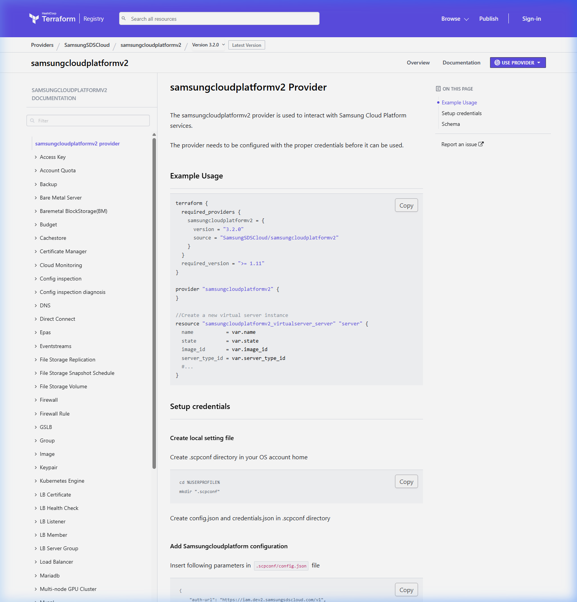

##### **2. 서비스 및 리소스 검색**
왼쪽 사이드바의 **[Resources]** 메뉴에서 필요한 서비스(예: VPC, Subnet)를 찾습니다. 검색창을 활용하면 수많은 리소스 중 원하는 것을 빠르게 필터링할 수 있습니다.

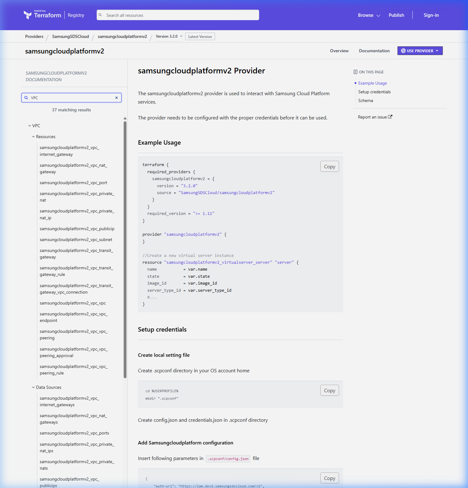

##### **3. 인수(Argument Reference) 확인**
리소스 문서의 **[Argument Reference]** 섹션은 코드를 작성할 때 입력해야 할 값들을 설명합니다.
- **Required (필수)**: 리소스 생성 시 반드시 지정해야 하는 속성입니다. 누락 시 오류가 발생합니다.
- **Optional (선택)**: 상황에 따라 추가할 수 있는 설정값입니다.

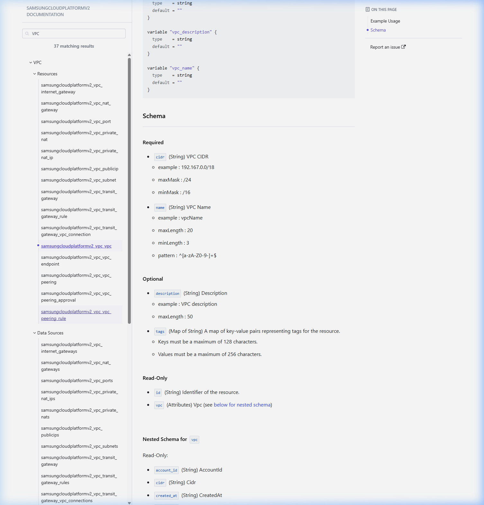

##### **4. 속성(Attributes Reference) 확인**
**[Attributes Reference]** 섹션은 리소스 배포 성공 후 테라폼이 읽어올 수 있는 값들을 보여줍니다. 이 값들은 다른 리소스의 입력값으로 사용되거나 `output`으로 출력됩니다.

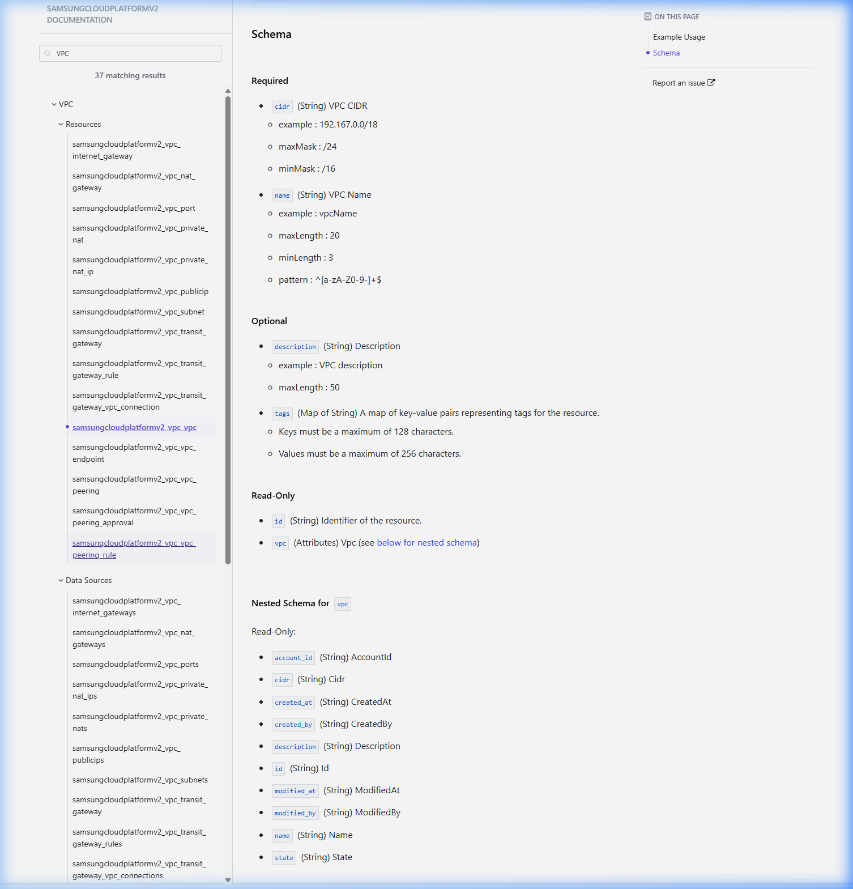

### 6.3 따라하기
#### Terraform Registry 문서 탐색: SCP VPC 리소스 분석
1. Terraform Registry에서 `samsungcloudplatformv2` Provider를 검색합니다.
2. 왼쪽 목록에서 Resources 아래 `samsungcloudplatformv2_vpc_vpc` 문서를 찾습니다.
3. 문서의 Argument Reference 섹션을 확인하여 `name` (String, Required)과 `cidr` (String, Required)이 필수 입력 값임을 확인합니다.
4. 문서의 Attributes Reference 섹션을 확인하여 `id` (String)와 `state` (String) 등이 생성 후 반환되는 속성임을 확인합니다.

<!-- 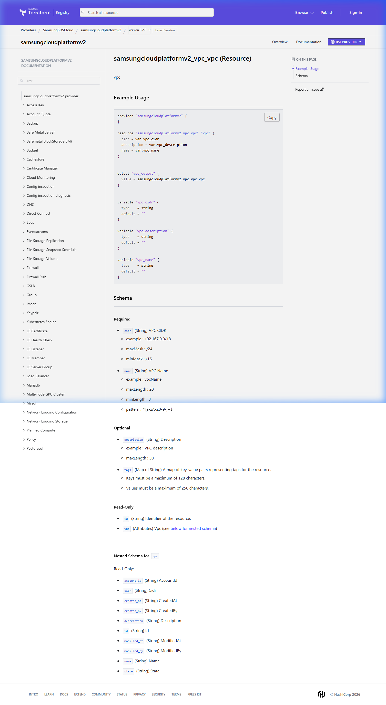 -->

### 6.4 정리하기
- 공식 레지스트리 문서를 참조하여 필수 인수와 반환값 속성을 찾아내어 올바른 구조로 매핑하는 기본 역량을 기를 수 있습니다.
- 다음 단계: 배운 내용을 바탕으로 실제 테라폼 워크플로우를 작동시키며 기초적인 SCP 네트워크 리소스를 빌드하는 실습을 진행합니다.


## 7. [실습] 테라폼 기초 실습 및 네트워크 리소스 정의

### 7.1 학습목표
- SCP v2 프로바이더를 사용하여 기본적인 네트워크 리소스(VPC, 인터넷 게이트웨이, 서브넷, 방화벽 규칙, 보안 그룹)를 정의할 수 있습니다.
- `terraform init`, `plan`, `apply`, `destroy`로 이어지는 테라폼 표준 배포 워크플로우를 실습하고 동작을 이해합니다.
- 변수(`variable`)와 출력(`output`)을 기초 코드에 구성하고, 이를 활용하여 1일차 과제 미션을 직접 코드로 확장하여 해결할 수 있습니다.

### 7.2 들어가기
이번 실습에서는 테라폼을 사용해 SCP 환경에 가장 기초가 되는 네트워크 및 보안 자원을 배포합니다. 2일차에서 다룰 복잡한 3-Tier 아키텍처를 올리기 전에, 단일 VPC와 서브넷, 그리고 하나의 인바운드 방화벽 허용 규칙을 가진 심플한 네트워크를 코드로 구현하며 테라폼의 작동 원리를 체득합니다.

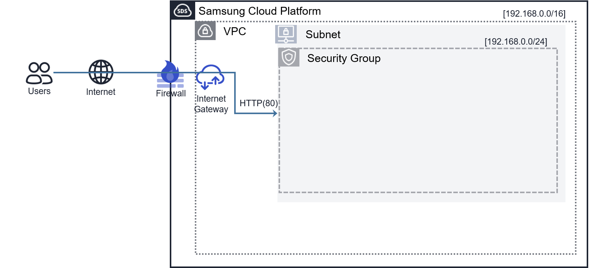
*(주: 1일차 기초 실습에서는 단일 서브넷과 단일 보안 그룹으로 구성된 간단한 환경을 배포합니다.)*

---

### 7.3 따라하기

#### 7.3.1 작업 디렉터리 준비 및 provider.tf 확인
Web-IDE 터미널에서 기존에 사용하던 day1 디렉토리를 그대로 사용하고, 이전 장에서 작성한 `provider.tf`가 준비되었는지 확인합니다.
```bash
cd day1
```
`provider.tf` 파일은 3장 및 4장에서 실습한 내용과 동일하게 구성되어 있어야 합니다.

#### 7.3.2 variables.tf 파일 생성
인프라의 유연성을 위해 VPC와 서브넷의 CIDR 블록 대역을 변수로 정의합니다.
```bash
code-server variables.tf
```

```hcl
variable "vpc_cidr" {
  type        = string
  default     = "192.168.0.0/16"
  description = "기초 VPC CIDR 대역"
}

variable "subnet_cidr" {
  type        = string
  default     = "192.168.0.0/24"
  description = "기초 일반 서브넷 CIDR 대역"
}

variable "subnet_dns_nameservers" {
    type = list(string)
    default = [ "8.8.8.8" ]
}

variable "igw_type" {
  type = string
  default = "IGW"
}
```

#### 7.3.3 infra.tf 파일 생성
VPC, 인터넷 게이트웨이, 서브넷, 방화벽 규칙, 보안 그룹을 정의합니다.
```bash
code-server infra.tf
```

```hcl
# 1. VPC 생성
resource "samsungcloudplatformv2_vpc_vpc" "my_vpc" {
  name        = "${local.name_prefix}-vpc-${local.environment}"
  cidr        = var.vpc_cidr
  description = "Vpc generated from Day 1 Basic Lab"
  tags        = local.common_tags
}

# 2. 인터넷 게이트웨이(IGW) 생성 및 VPC 연결
resource "samsungcloudplatformv2_vpc_internet_gateway" "my_igw" {
  vpc_id      = samsungcloudplatformv2_vpc_vpc.my_vpc.id
  type        = var.igw_type
  firewall_enabled = true
  firewall_loggable = false
  tags        = local.common_tags 
  description = "IGW for Day 1 Basic Lab"
}

# 3. 일반 서브넷 생성 (유형: GENERAL)
resource "samsungcloudplatformv2_vpc_subnet" "my_subnet" {
  name        = "${local.name_prefix}-subnet-${local.environment}"
  vpc_id      = samsungcloudplatformv2_vpc_vpc.my_vpc.id
  type        = "GENERAL"
  cidr        = var.subnet_cidr
  dns_nameservers = var.subnet_dns_nameservers
  description = "Subnet for Day 1 Basic Lab"
  tags        = local.common_tags
}

# 4. VPC 방화벽 규칙 추가 (HTTP 80 포트 인바운드 허용)
resource "samsungcloudplatformv2_firewall_firewall_rule" "my_fw_rule" {
  firewall_id = samsungcloudplatformv2_vpc_internet_gateway.my_igw.internet_gateway.firewall_id
  firewall_rule_create = {
  action = "ALLOW"
  description = "Rule from terraform"
  destination_address = ["192.168.0.0/24"]   # Loadbalancer 서비스 IP 대역
  direction = "INBOUND"
  service = [{
    service_type = "TCP"
    service_value = "80"
  }]
  source_address = ["0.0.0.0/0"]             # 모든 소스
  status = "ENABLE"
  }
}

# 5. 보안 그룹(Security Group) 생성
resource "samsungcloudplatformv2_security_group_security_group" "my_sg" {
  name        = "${local.name_prefix}-sg-${local.environment}"
  description = "Security group for Day 1 Basic Lab"
  loggable    = false
  tags        = local.common_tags
}

# 6. 보안 그룹 규칙(Security Group Rule) 추가 (HTTP 80 포트 인바운드 허용)
resource "samsungcloudplatformv2_security_group_security_group_rule" "my_sg_rule" {
  security_group_id = samsungcloudplatformv2_security_group_security_group.my_sg.id
  ethertype         = "IPv4"
  protocol          = "TCP"
  direction         = "ingress"
  description       = "Allow 80 inbound for Day 1 Basic Lab"
  remote_ip_prefix  = "0.0.0.0/0"
  port_range_min    = 80
  port_range_max    = 80
}

```

#### 7.3.4 outputs.tf 파일 생성
배포 완료 후 리소스 정보를 확인하고 후속 과제에서 활용할 수 있도록 출력값을 설정합니다.
```bash
code-server outputs.tf
```

```hcl
output "vpc_id" {
  description = "생성된 VPC의 ID"
  value       = samsungcloudplatformv2_vpc_vpc.my_vpc.id
}

output "subnet_id" {
  description = "생성된 서브넷의 ID"
  value       = samsungcloudplatformv2_vpc_subnet.my_subnet.id
}

output "security_group_id" {
  description = "생성된 보안 그룹의 ID"
  value       = samsungcloudplatformv2_security_group_security_group.my_sg.id
}
```

#### 7.3.5 테라폼 기본 배포 실행 및 확인
작성된 파일들을 초기화하고 실제로 빌드하여 결과를 확인합니다.

1. **테라폼 초기화**:
   ```bash
   terraform init
   ```
2. **배포 계획 검토**:
   ```bash
   terraform plan
   ```
3. **인프라 배포 적용**:
   ```bash
   terraform apply
   ```
   - 프롬프트 창에 `yes`를 입력하여 실행합니다. 배포 완료 후 화면에 출력되는 `vpc_id`, `subnet_id`, `security_group_id` 값을 기록해 둡니다.

---

### 7.4 [미션 1] 신규 개발팀을 위한 격리된 샌드박스 네트워크 구축

#### 🚩 과제 시나리오
**"여러분은 A개발팀의 인프라 담당자입니다."**
A팀에서 새로운 웹 애플리케이션 프로젝트를 테스트하기 위해 기존 VPC 내에 독립적인 테스트용 샌드박스 서브넷을 구축하고, 특정 포트로만 접근할 수 있는 보안 그룹 설정을 요구해 왔습니다. 앞서 구축한 기본 테라폼 코드를 확장하여 이 미션을 해결하십시오.

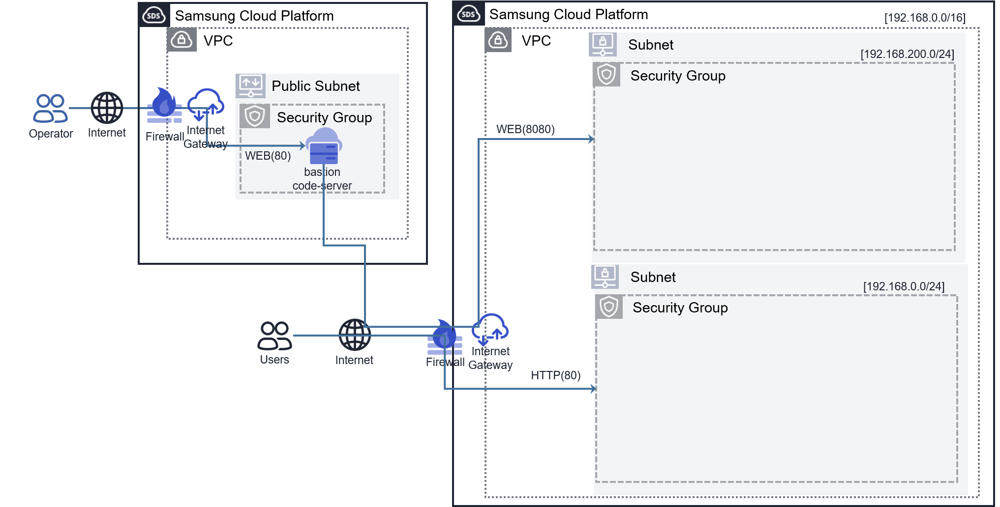


#### 📋 미션 요구사항
1. **네트워크 격리 (Subnet 추가)**:
   - 기존 VPC(`samsungcloudplatformv2_vpc_vpc.my_vpc` 참조) 내부에 CIDR 블록 **`192.168.200.0/24`** 대역을 사용하는 신규 서브넷을 생성하십시오.
   - 서브넷 리소스 이름은 `dev_team_subnet`으로 선언하고, 콘솔에 표시될 실제 이름(`name`)은 **`dev-team-subnet`**으로 지정하십시오.
   - 서브넷 유형(`type`)은 `GENERAL`을 선택하십시오.
2. **보안 정책 수립 (Security Group 및 Rule)**:
   - 해당 서브넷에 적용할 새로운 보안 그룹을 생성하십시오.
   - 보안 그룹 리소스 이름은 `dev_app_sg`로 선언하고, 콘솔 명칭(`name`)은 **`dev-app-sg`**로 지정하십시오.
   - 개발자 사무실 대역(임의 지정 또는 수강생의 Web-IDE IP 주소 대역)에서 전송되는 **`8080` 포트** 트래픽만 인바운드로 허용하는 보안 그룹 규칙(`samsungcloudplatformv2_security_group_security_group_rule`)을 코드로 작성하십시오.
3. **경계 보안 설정 (Firewall Rule)**:
   - 기존 인터넷 게이트웨이에 적용된 방화벽(`samsungcloudplatformv2_vpc_internet_gateway.my_igw` 참조)에 규칙을 추가하십시오.
   - 방화벽 규칙 리소스 이름은 `dev_team_fw_rule`로 지정하십시오.
   - 개발자 사무실 대역(출발지)에서 신규 개발팀 서브넷 대역(`192.168.200.0/24`, 목적지)의 **`8080` 포트**로 인바운드 통신을 허용(`ALLOW`)하는 방화벽 규칙(`samsungcloudplatformv2_firewall_firewall_rule`)을 구성하십시오.
4. **데이터 출력 (Outputs 구성)**:
   - 구축이 끝난 후 개발팀에 전달할 수 있도록 신규 서브넷 ID와 보안 그룹 ID를 `outputs.tf` 파일에 `output` 블록을 활용하여 노출하도록 설정하십시오.
5. **인프라 배포 및 확인**:
   - `terraform apply`를 실행하여 새로운 리소스들이 정상적으로 프로비저닝되는지 확인합니다.
6. **실습 환경 정리**:
   - 2일차 3-Tier 인프라 설정을 깨끗한 상태에서 진행하기 위해, 1일차 실습이 완료되면 반드시 모든 자원을 삭제해 줍니다.
   ```bash
   terraform destroy
   ```

#### 💡 구현 가이드 및 HCL 힌트

본 미션을 완수하기 위해 아래 가이드와 리소스 스켈레톤 코드를 참조하여 각각의 파일을 생성하고 작성하십시오.

##### `infra.tf`에 추가할 힌트 코드:
```hcl
# 신규 개발팀을 위한 샌드박스 서브넷
resource "samsungcloudplatformv2_vpc_subnet" "dev_team_subnet" {
  name            = "dev-team-subnet"
  vpc_id          = <VPC_리소스_참조>
  type            = "GENERAL"
  cidr            = <샌드박스_서브넷_CIDR_대역_입력>
  dns_nameservers = var.subnet_dns_nameservers
  description     = "Sandbox subnet for dev team"
  tags            = local.common_tags
}

# 신규 개발팀용 보안 그룹
resource "samsungcloudplatformv2_security_group_security_group" "dev_app_sg" {
  name        = "dev-app-sg"
  description = "SecurityGroup for dev team sandbox"
  loggable    = false
  tags        = local.common_tags
}

# 개발자 IP로부터의 8080 인바운드 트래픽 허용 규칙
resource "samsungcloudplatformv2_security_group_security_group_rule" "allow_dev_8080" {
  security_group_id = <보안그룹_리소스_참조>
  ethertype         = "IPv4"
  protocol          = "TCP"
  direction         = "ingress"
  description       = "Allow 8080 for dev team"
  remote_ip_prefix  = <허용할_출발지_IP_대역_참조> # 현재 web-ide 개발자 IP 대역 참조 변수/로컬 값 지정
  port_range_min    = <허용할_포트_시작_값>
  port_range_max    = <허용할_포트_끝_값>
}

# 샌드박스 서브넷 방화벽 규칙 (8080 포트 인바운드 허용)
resource "samsungcloudplatformv2_firewall_firewall_rule" "dev_team_fw_rule" {
  firewall_id = <인터넷게이트웨이_방화벽_참조>
  firewall_rule_create = {
    action = "ALLOW"
    description = "Allow 8080 for dev team subnet"
    destination_address = [<목적지_샌드박스_서브넷_CIDR_대역_입력>]
    direction = "INBOUND"
    service = [{
      service_type = "TCP"
      service_value = <허용할_포트_값_입력>
    }]
    source_address = [<출발지_IP_대역_참조>]
    status = "ENABLE"
  }
}
```

##### `outputs.tf`에 추가할 힌트 코드:
```hcl
output "dev_subnet_id" {
  description = "Dev Team Sandbox Subnet ID"
  value       = <샌드박스_서브넷_리소스_참조>
}

output "dev_security_group_id" {
  description = "Dev Team Security Group ID"
  value       = <보안그룹_리소스_참조>
}
```

---

### 7.5 정리하기
- **리소스 정의**: VPC, IGW, Subnet, Firewall Rule, SG 등 기초 인프라 구성 요소를 테라폼 코드로 정의하고 생성하였습니다.
- **워크플로우 체득**: `init` -> `plan` -> `apply` -> `destroy` 명령어 생명주기를 실습함으로써 테라폼의 기본적인 작동 원리를 마스터하였습니다.
- **코드 확장**: 강사 가이드를 단순 따라하는 것에 그치지 않고, 요구사항을 코드에 직접 확장 적용하여 스스로 솔루션을 구축하는 능력을 확보하였습니다.

---
## 8. 1일차 복습: 테라폼 기본 워크플로우 및 SCP 기초 리소스 구성 회고

### 8.1 학습목표
- 테라폼의 4대 핵심 워크플로우(`init`, `plan`, `apply`, `destroy`) 명령어 생명주기와 동작 메커니즘을 복습합니다.
- 1일차 미션으로 수행했던 샌드박스 네트워크 격리 인프라의 HCL 코드 구조와 리소스 간 속성 참조 방식을 리마인드합니다.

### 8.2 들어가기
#### 테라폼 4대 핵심 워크플로우 회고
테라폼으로 인프라를 프로비저닝하는 생명주기는 크게 4단계의 명령어를 거칩니다.

1. **`terraform init` (초기화)**:
   - 작성된 HCL 코드를 스캔하여 필요한 Provider 플러그인(예: `samsungcloudplatformv2`)을 테라폼 레지스트리에서 다운로드하고 작업 디렉터리를 초기화합니다.
2. **`terraform plan` (계획 수립)**:
   - 희망 상태(HCL 코드)와 현재 상태(실제 클라우드 및 State 파일)를 비교 분석하여 어떤 자원을 생성, 변경, 삭제할지 예측 계획서(Dry Run)를 보여줍니다.
3. **`terraform apply` (배포 적용)**:
   - 수립된 계획에 따라 실제 SCP API를 호출하여 리소스를 실시간 프로비저닝하고, 배포 결과를 `terraform.tfstate` 파일에 기록합니다.
4. **`terraform destroy` (자원 정리)**:
   - State 파일에 기록된 리소스의 소유 관계 및 의존성을 추적하여 생성된 모든 인프라를 역순으로 안전하게 삭제합니다.

> 💡 **1일차 자원 정리 확인**: 
> 2일차의 3-Tier 실습을 깨끗한 상태에서 진행하기 위해, 1일차 마지막에 `terraform destroy`를 실행하여 샌드박스 및 기초 자원을 정상적으로 삭제했는지 다시 한번 점검합니다.

### 8.3 [미션 1] 해결 코드 분석 회고
1일차에서 **[미션 1] 신규 개발팀을 위한 격리된 샌드박스 네트워크 구축**를 진행했습니다. 본 절에서는 핵심 설계 및 복습 포인트를 다시 되짚어봅니다.

#### 🔑 핵심 복습 포인트
* **암시적 의존성 (Implicit Dependency)**: `security_group_id = samsungcloudplatformv2_security_group_security_group.dev_app_sg.id` 와 같이 특정 리소스의 출력 속성(Attribute Reference)을 다른 리소스의 입력 인수로 참조하여 가져다 쓰면, 테라폼은 자동으로 "보안 그룹이 생성된 후 보안 그룹 룰을 생성해야 한다"는 의존 관계를 파악하고 순서를 보장합니다.
* **State 파일(tfstate)의 역할**: `apply`를 통해 배포된 결과는 반드시 `terraform.tfstate` 파일에 기록되며, 테라폼은 이를 '진실의 원천(Single Source of Truth)'으로 삼아 인프라의 상태와 의존성을 추적한다는 점을 꼭 기억해야 합니다.

### 8.4 정리하기
- 1일차에는 단일 리소스를 하드코딩된 값으로 간단하게 배포하고 역순으로 정리해 보았습니다.
- 다음 단계: 2일차 실습에서는 HCL 코드의 재사용성을 높이기 위해 입력 변수(`variable`)와 결과 출력(`output`)을 접목하여 리소스를 유연하게 정의하는 방법을 학습합니다.

---

## 9. Terraform으로 SCP 리소스 심화 정의 (변수와 출력)

### 9.1 학습목표
- 변수(`variable`)와 출력(`output`)을 사용하여 HCL 코드에서 하드코딩을 제거하고 재사용성이 높은 모듈화 코드를 설계할 수 있습니다.
- 리소스 간의 속성 참조(Attribute Reference) 방식을 통해 의존성을 체계적으로 정의할 수 있습니다.

### 9.2 들어가기
#### 변수(Variables)와 출력(Outputs)의 활용: 관리 용이성 향상
**하드코딩(Hardcoding)**은 코드의 재사용성을 저해하고 변경을 어렵게 만듭니다. 이를 피하기 위해 `variables`와 `outputs`를 전략적으로 사용해야 합니다.
- **변수의 활용**: 리소스에 직접 값을 입력하는 대신 `variable`을 사용하면, 환경별로 다른 값(예: 개발 환경의 리전, 운영 환경의 인스턴스 개수)을 쉽게 관리할 수 있습니다. (코드는 `main.tf`, 값은 `terraform.tfvars` 또는 CLI로 관리)
- **출력의 활용**: `outputs`는 현재 모듈(Current Module)에서 생성된 정보를 상위 모듈이나 다른 시스템(예: Jenkins, Ansible)으로 전달하는 통로 역할을 합니다. 생성된 VPC의 ID나 Public IP 주소 등을 `outputs`로 정의하여 후속 작업에 쉽게 활용합니다.

### 9.3 따라하기
#### 코드 작성 (VPC 예시): 모듈화된 구성 살펴보기
다음과 같이 파일로 분리하여 VPC를 정의하는 코드를 작성할 수 있습니다. (실제 복잡한 3-Tier 배포 실습은 10장부터 진행합니다.)

1. **variables.tf (입력 값 정의)**
```terraform
variable "vpc_name" {
  description = "생성할 VPC의 이름"
  type        = string
  default     = "terraform-lab-vpc"
}

variable "vpc_cidr" {
  description = "VPC에 할당할 IPv4 CIDR 블록"
  type        = string
  default     = "10.0.0.0/16"
}
```

2. **main.tf (리소스 정의 및 변수 사용)**
```terraform
resource "samsungcloudplatformv2_vpc_vpc" "lab_main" {
  # (1) 변수를 사용하여 name과 cidr 블록을 정의
  name             = var.vpc_name
  cidr             = var.vpc_cidr
  description      = "Terraform 실습용 VPC"
}
```

3. **outputs.tf (출력 값 정의)**
```terraform
output "created_vpc_id" {
  description = "생성된 VPC의 고유 ID"
  # (2) resource.type.name.attribute 형식으로 참조하여 출력
  value       = samsungcloudplatformv2_vpc_vpc.lab_main.id
}
```

4. **terraform.tfvars (실제 변수 값 주입 예시)**
```terraform
vpc_name = "my-scp-custom-vpc"
vpc_cidr = "10.10.0.0/16"
```

**코드 설명:**
- **변수 주입과 우선순위**: `variables.tf`에 선언된 변수(`var.vpc_name`, `var.vpc_cidr`)는 디폴트 값이 지정되어 있더라도, 4장에서 학습한 것처럼 `terraform.tfvars` 파일에 정의된 값이나 CLI 옵션(`-var`), 환경 변수(`TF_VAR_`)를 통해 덮어써지며 동적으로 주입될 수 있습니다.
- **`samsungcloudplatformv2_vpc_vpc.lab_main.id` (속성 참조)**: 생성된 VPC의 ID 값을 속성 참조(`attribute reference`)를 통해 가져와 출력으로 선언합니다.
- **리소스 간 의존성 및 출력 활용**: `outputs.tf`를 통해 노출된 출력값은 `terraform apply` 완료 시 터미널에 표시될 뿐만 아니라, 다른 리소스(예: Subnet)의 `vpc_id` 인수에 전달되어 리소스 간의 생성 순서(암시적 의존성)를 보장하는 기초 데이터가 됩니다. 또한, 상위 모듈이나 Jenkins/Ansible 같은 외부 시스템과 연동하는 통로로 활용됩니다.

### 9.4 정리하기
- 변수(`variable`)와 출력(`output`)을 사용하여 테라폼 코드의 재사용성을 극대화하고 하드코딩을 제거하는 방법을 학습하였습니다.
- 다음 단계: 3-Tier 네트워크 아키텍처 구현을 위해 여러 리소스를 생성하고 변수와 출력을 조합하여 실제 연동 인프라를 구축하는 실습을 진행합니다.

---

## 10. [실습] SCP 3-Tier 네트워크 인프라 구축
### 10.1 학습목표
Terraform을 사용하여 SCP 환경에 VPC, Subnet 등 핵심 네트워크 인프라를 구축할 수 있다.

### 10.2 들어가기
핵심 네트워크 개념: VPC, Subnet, Internet Gateway, NAT Gateway의 역할을 이해하고, 이들이 어떻게 상호작용하여 네트워크 환경을 구성하는지 학습합니다.

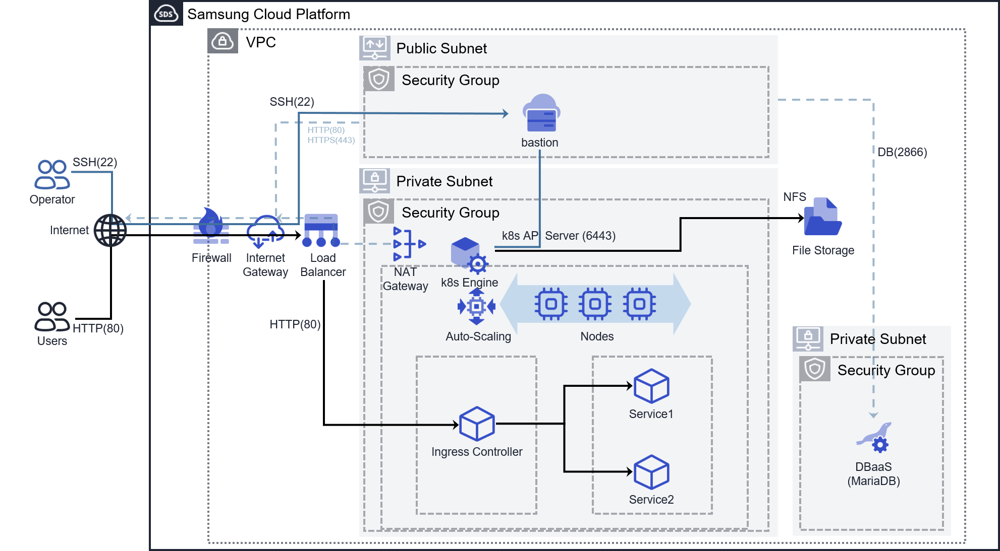

**주요 구성 요소:**

1.  **VPC 및 네트워크 격리 (Network Segmentation)**
    *   **VPC**: 독립된 가상 네트워크 환경을 제공합니다.
    *   **Public Subnet**: 인터넷과 직접 통신이 가능한 영역으로, 로드 밸런서(Load Balancer)와 베스천 호스트(Bastion Host)가 위치합니다.
    *   **Private Subnet**: 외부 인터넷과 격리된 영역으로, 실제 애플리케이션이 구동되는 Kubernetes 클러스터(SKE)와 데이터베이스(MariaDB)가 위치하여 보안을 강화합니다.

2.  **보안 그룹 (Security Group)**
    *   각 리소스(Bastion, K8s, DB)별로 전용 보안 그룹을 적용하여, 필요한 포트와 IP만 허용하는 최소 권한 원칙을 준수합니다.
    *   예: DB는 K8s와 Bastion에서의 접근만 허용합니다.

3.  **컴퓨팅 및 애플리케이션 (Compute & Application)**
    *   **Bastion Host**: 외부 관리자가 내부 프라이빗 리소스에 안전하게 접근하기 위한 단일 진입점(Jump Server) 역할을 합니다.
    *   **SKE (Samsung Kubernetes Engine)**: 컨테이너화된 애플리케이션을 관리하고 오케스트레이션하는 관리형 Kubernetes 서비스입니다.
    *   **Load Balancer**: 외부 트래픽을 받아 내부의 Kubernetes 서비스로 부하를 분산시킵니다.

4.  **데이터베이스 및 스토리지 (Database & Storage)**
    *   **MariaDB Cluster**: 고가용성과 관리가 용이한 관리형 데이터베이스 서비스입니다.
    *   **File Storage (NFS)**: 여러 컨테이너나 서버에서 공유하여 사용할 수 있는 파일 스토리지입니다.

이 아키텍처는 보안성, 가용성, 확장성을 고려한 엔터프라이즈급 표준 모델을 따르고 있습니다.

### 10.3 따라하기

#### 10.3.1 작업 디렉터리 준비 및 초기 파일 구성
2일차 3-Tier 실습을 위해 독립된 작업 폴더 `day2`를 생성하고 이동합니다. 1일차에 작성했던 `provider.tf` 파일을 복사해 오고, `main.tf` 파일은 새롭게 생성하여 실습 환경의 기초를 구성합니다.

```bash
mkdir day2
cd day2
cp ~/project/day1/provider.tf .
code-server main.tf
```

```hcl
# 프로젝트 메타데이터 설정
locals {
  # 리소스 이름 접두사 정의
  name_prefix = "tf"
  # 프로젝트 이름 정의
  project     = "Terraform-Advanced-Lab"
  # 환경 구분 정의
  environment = "lab"
  
  # 공통 태그 정의
  common_tags = {
    Project     = local.project
    Environment = local.environment
    ManagedBy   = "Terraform"
  }
}

# 현재 IP 주소 조회 데이터 소스
data "http" "my_public_ip" {
  url = "https://ipv4.icanhazip.com"
}

# 현재 IP 주소 변수 정의
locals {
  my_current_ip_address = chomp(data.http.my_public_ip.response_body)
}
```

> 💡 **안내**: 2일차 실습 환경에서는 `provider.tf` (인증 및 프로바이더 선언), `main.tf` (메타데이터 및 로컬 변수), `variables.tf` (변수 선언), 그리고 각각의 인프라 파일(`vpc.tf`, `subnets.tf` 등)을 별도 파일로 분리 구성하여 실무 환경에서의 관리 편의성을 극대화합니다.

#### 10.3.2 variables.tf 파일 생성

네트워크 구성 및 이후 실습에 필요한 주요 변수들을 정의합니다.

**구성 변수 요약:**

| 변수명 | 타입 | 기본값 | 설명 |
| :--- | :--- | :--- | :--- |
| `igw_type` | `string` | `"IGW"` | 인터넷 게이트웨이의 유형 |
| `vpc_cidr` | `string` | `"192.168.0.0/16"` | VPC 네트워크 CIDR 블록 |
| `subnet_type` | `string` | `"GENERAL"` | 서브넷 유형 |
| `subnet_cidrs` | `map(string)` | `(lb, k8s, db 맵)` | 각 용도별 서브넷 CIDR 맵 |
| `lb_cidr` | `string` | `"192.168.150.0/27"` | 로드밸런서용 CIDR 블록 |
| `vpc_wait_time` | `string` | `"30s"` | VPC 생성 후 대기 시간 |
| `kubernetes_version` | `string` | `"v1.31.8"` | SKE 클러스터 버전 |

`variables.tf` 파일을 생성하고 아래 내용을 작성합니다.

```bash
code-server variables.tf
```

```hcl
# 인터넷 게이트웨이 설정
variable "igw_type" {
  type = string
  default = "IGW"
}

# VPC 네트워크 CIDR 설정
variable "vpc_cidr" {
  type = string
  default = "192.168.0.0/16"
}

# 서브넷 타입 설정
variable "subnet_type" {
  type = string
  default = "GENERAL"
}

# 서브넷 네트워크 CIDR 설정
variable "subnet_cidrs" {
  description = "서브넷 CIDR 블록 맵"
  type        = map(string)
  default     = {
    lb      = "192.168.0.0/24"
    k8s     = "192.168.50.0/24"
    db      = "192.168.100.0/24"
  }
}

variable "subnet_dns_nameservers" {
    type = list(string)
    default = [ "8.8.8.8" ]
}

variable "lb_cidr" {
  description = "로드밸런서 CIDR 블록"
  type        = string
  default     = "192.168.150.0/27"
}

# 시간 설정
variable "vpc_wait_time" {
  description = "VPC 생성 후 대기 시간 (초)"
  type        = string
  default     = "30s"
}

# 쿠버네티스 설정
variable "kubernetes_version" {
  description = "SKE 클러스터 버전"
  type        = string
  default     = "v1.31.8"
}
```

**코드 설명:**
- **`igw_type`**: 인터넷 게이트웨이의 유형을 정의합니다. 기본값은 `IGW`입니다.
- **`subnet_cidrs`**: 각 서브넷(LB, Kubernetes, DB)에 할당할 CIDR 블록을 Map 형태로 정의합니다. 이를 통해 여러 서브넷을 반복문으로 쉽게 관리하거나 개별 참조할 수 있습니다.
- **`vpc_wait_time`**: VPC 생성 후 네트워크 안정화를 위해 대기할 시간을 설정합니다.
- **`kubernetes_version`**: 이후 실습에서 생성할 SKE(Samsung Kubernetes Engine) 클러스터의 버전을 정의합니다.

#### 10.3.3 vpc.tf 파일 생성

VPC(Virtual Private Cloud) 리소스를 생성합니다. 

**VPC 설정 상세:**

| 항목 | 설정값 | 설명 |
| :--- | :--- | :--- |
| **리소스 유형** | `samsungcloudplatformv2_vpc_vpc` | SCP VPC 구성을 위한 핵심 리소스 |
| **이름 (`name`)** | `${local.name_prefix}-vpc-${local.environment}` | 프로젝트 식별을 위한 고유 명칭 (`tf-vpc-hol4`) |
| **CIDR 대역 (`cidr`)** | `var.vpc_cidr` | VPC 네트워크 전체 주소 대역 (`192.168.0.0/16`) |
| **설명 (`description`)** | `"Vpc generated from Terraform"` | 리소스 관리용 설명 문구 |
| **태그 (`tags`)** | `local.common_tags` | 공통 관리 태그 적용 |

> [!TIP]
> **공식 문서 및 필수 설정**
> - **참고 문서**: [samsungcloudplatformv2_vpc_vpc](https://registry.terraform.io/providers/SamsungSDSCloud/samsungcloudplatformv2/latest/docs/resources/vpc_vpc)
> - **필수 설정 (`Required`)**:
>   - `name`: VPC를 식별할 고유 명칭
>   - `cidr`: VPC 내부에서 사용할 IPv4 주소 범위 (RFC 1918 권고 대역 권장)

`vpc.tf` 파일을 생성하고 아래 내용을 작성합니다.

```bash
code-server vpc.tf
```

```hcl
# VPC 리소스 - 기본 네트워크 구성
resource "samsungcloudplatformv2_vpc_vpc" "my_vpc" {
  name        = "${local.name_prefix}-vpc-${local.environment}"
  cidr        = var.vpc_cidr
  description = "Vpc generated from Terraform"
  tags        = local.common_tags
}
```

**코드 설명:**
- **`samsungcloudplatformv2_vpc_vpc`**: 논리적으로 격리된 네트워크 공간인 VPC를 생성합니다. 이름에는 프로젝트명과 환경 변수를 조합하여 일관성을 유지합니다.

##### outputs.tf 파일 편집

VPC ID를 출력하기 위해 `outputs.tf` 파일을 생성하거나 기존 파일에 아래 내용을 추가합니다.

```bash
code-server outputs.tf
```

```hcl
# VPC 출력
output "vpc_output" {
  value = samsungcloudplatformv2_vpc_vpc.my_vpc
}
```

#### 10.3.4 internetgateway.tf 파일 생성

인터넷 게이트웨이 리소스를 생성합니다. 

**인터넷 게이트웨이 설정 상세:**

| 항목 | 설정값 | 설명 |
| :--- | :--- | :--- |
| **리소스 유형** | `samsungcloudplatformv2_vpc_internet_gateway` | VPC와 외부 인터넷을 연결하는 관문 리소스 |
| **대상 VPC (`vpc_id`)** | `samsungcloudplatformv2_vpc_vpc.my_vpc.id` | 연결할 VPC ID |
| **유형 (`type`)** | `var.igw_type` | IGW 유형 설정 (기본값: `IGW`) |
| **보안 설정** | `firewall_enabled = true` | IGW 레벨의 방화벽 기능 활성화 |
| **설명 (`description`)** | `"Internet GW generated from Terraform"` | 리소스 식별용 설명 |
| **태그 (`tags`)** | `local.common_tags` | 공통 관리 태그 적용 |

> [!TIP]
> **공식 문서 및 필수 설정**
> - **참고 문서**: [samsungcloudplatformv2_vpc_internet_gateway](https://registry.terraform.io/providers/SamsungSDSCloud/samsungcloudplatformv2/latest/docs/resources/vpc_internet_gateway)
> - **필수 설정 (`Required`)**:
>   - `vpc_id`: 인터넷 게이트웨이를 연결할 대상 VPC의 ID
>   - `type`: 인터넷 게이트웨이의 물리적/논리적 유형 (`IGW` 등)

`internetgateway.tf` 파일을 생성하고 아래 내용을 작성합니다.

```bash
code-server internetgateway.tf
```

```hcl
# 인터넷 게이트웨이 - 외부 통신용
resource "samsungcloudplatformv2_vpc_internet_gateway" "my_igw" {
  vpc_id      = samsungcloudplatformv2_vpc_vpc.my_vpc.id
  type        = var.igw_type 
  firewall_enabled = true
  firewall_loggable = false
  description = "Internet GW generated from Terraform"
  tags        = local.common_tags
}
```

**코드 설명:**
- **`samsungcloudplatformv2_vpc_internet_gateway`**: 생성된 VPC에 인터넷 게이트웨이를 연결하여 외부 인터넷과의 통신을 가능하게 합니다. `type`은 `variables.tf`에서 정의한 `SHARED`를 사용합니다.

##### outputs.tf 파일 편집

Internet Gateway ID를 출력하기 위해 `outputs.tf` 파일에 아래 내용을 추가합니다.

```hcl
# Internet Gateway 출력
output "igw_output" {
  value = samsungcloudplatformv2_vpc_internet_gateway.my_igw
}
```

#### 10.3.5 subnets.tf 파일 생성

서브넷 리소스를 생성합니다. 각 용도별로 독립된 네트워크 영역을 할당합니다.

**서브넷 구성 요약:**

| 항목 | 설정값 | 설명 |
| :--- | :--- | :--- |
| **리소스 유형** | `samsungcloudplatformv2_vpc_subnet` | SCP 서브넷 리소스 |
| **유형 (`type`)** | `var.subnet_type` | 서브넷 유형 (기본값: `GENERAL`) |

**상세 서브넷 리스트:**

| 리소스 이름 | 서브넷 명칭 (`name`) | CIDR 대역 (`cidr`) | 설명 |
| :--- | :--- | :--- | :--- |
| `lb_subnet` | `tfPUBSUBhol4` | `192.168.0.0/24` | 로드밸런서용 서브넷 |
| `k8s_subnet` | `tfPRISUBhol4` | `192.168.50.0/24` | Kubernetes 클러스터용 서브넷 |
| `db_subnet` | `tfDBSUBhol4` | `192.168.100.0/24` | 데이터베이스용 서브넷 |

> [!TIP]
> **공식 문서 및 필수 설정**
> - **참고 문서**: [samsungcloudplatformv2_vpc_subnet](https://registry.terraform.io/providers/SamsungSDSCloud/samsungcloudplatformv2/latest/docs/resources/vpc_subnet)
> - **필수 설정 (`Required`)**:
>   - `name`: 서브넷 식별을 위한 이름
>   - `vpc_id`: 서브넷이 소속될 VPC의 ID
>   - `cidr`: 서브넷에 할당할 IPv4 주소 범위 (VPC CIDR 내에 포함되어야 함)
>   - `type`: 서브넷의 용도 유형 (`GENERAL` 등)

`subnets.tf` 파일을 생성하고 아래 내용을 작성합니다.

```bash
code-server subnets.tf
```

```hcl
# 로드밸런서를 위한 퍼블릭 서브넷
resource "samsungcloudplatformv2_vpc_subnet" "lb_subnet" {
  name        = "${local.name_prefix}PUBSUB${local.environment}"
  vpc_id      = samsungcloudplatformv2_vpc_vpc.my_vpc.id
  type        = var.subnet_type
  cidr        = var.subnet_cidrs["lb"]
  dns_nameservers = var.subnet_dns_nameservers
  description = "Loadbalancer  Subnet"
  tags        = local.common_tags
}

# 쿠버네티스 클러스터를 위한 프라이빗 서브넷
resource "samsungcloudplatformv2_vpc_subnet" "k8s_subnet" {
  name        = "${local.name_prefix}PRISUB${local.environment}"
  vpc_id      = samsungcloudplatformv2_vpc_vpc.my_vpc.id
  type        = var.subnet_type
  cidr        = var.subnet_cidrs["k8s"]
  dns_nameservers = var.subnet_dns_nameservers
  description = "k8s Subnet"
  tags        = local.common_tags
}

# 데이터베이스를 위한 프라이빗 서브넷
resource "samsungcloudplatformv2_vpc_subnet" "db_subnet" {
  name        = "${local.name_prefix}DBSUB${local.environment}"
  vpc_id      = samsungcloudplatformv2_vpc_vpc.my_vpc.id
  type        = var.subnet_type
  cidr        = var.subnet_cidrs["db"]
  dns_nameservers = var.subnet_dns_nameservers
  description = "DB Subnet"
  tags        = local.common_tags
}
```

**코드 설명:**
- **`samsungcloudplatformv2_vpc_subnet`**: 각 용도별(Load Balancer, Kubernetes, Database) 서브넷을 개별 리소스로 생성합니다.
  - **`lb_subnet`**: 로드밸런서용 퍼블릭 서브넷입니다.
  - **`k8s_subnet`**: 쿠버네티스 클러스터용 프라이빗 서브넷입니다.
  - **`db_subnet`**: 데이터베이스용 프라이빗 서브넷입니다.
- **`type = var.subnet_type`**: 서브넷의 유형을 변수로 지정합니다.
- **`cidr = var.subnet_cidrs["..."]`**: `variables.tf`에 정의된 Map에서 각 용도에 맞는 CIDR 블록을 참조합니다.

##### outputs.tf 파일 편집

Subnet IDs를 출력하기 위해 `outputs.tf` 파일에 아래 내용을 추가합니다.

```hcl
# Subnet 출력
output "lb_subnet_id" {
  description = "Load Balancer Subnet ID"
  value       = samsungcloudplatformv2_vpc_subnet.lb_subnet.id
}

output "k8s_subnet_id" {
  description = "Kubernetes Subnet ID"
  value       = samsungcloudplatformv2_vpc_subnet.k8s_subnet.id
}

output "db_subnet_id" {
  description = "Database Subnet ID"
  value       = samsungcloudplatformv2_vpc_subnet.db_subnet.id
}
```

#### 10.3.6 firewall.tf 파일 생성

VPC Firewall 리소스를 생성합니다. 인터넷 게이트웨이를 통과하는 트래픽에 대한 보안 규칙을 정의합니다.

**방화벽 규칙 구성 요약:**

| 항목 | 설정값 | 설명 |
| :--- | :--- | :--- |
| **리소스 유형** | `samsungcloudplatformv2_firewall_firewall_rule` | SCP 방화벽 규칙 리소스 |
| **방화벽 ID** | `samsungcloudplatformv2_vpc_internet_gateway.my_igw.internet_gateway.firewall_id` | IGW 소속 방화벽 ID 참조 |
| **기본 정책** | `action = "ALLOW"`, `status = "ENABLE"` | 허용 및 활성화 상태 |

**상세 규칙 상세:**

| 규칙 리소스 이름 | 방향 (Direction) | 프로토콜 | 포트 (Port) | 소스 (Source) | 대상 (Destination) |
| :--- | :--- | :--- | :--- | :--- | :--- |
| **my_igw_fwrule_systemupdate** | Outbound (송신) | TCP | 80, 443 | LB/K8s 서브넷 | `0.0.0.0/0` |
| **my_igw_fwrule_webservice** | Inbound (수신) | TCP | 80, 443 | `0.0.0.0/0` | LB 서브넷 |
| **my_igw_fwrule_k8s** | Inbound (수신) | TCP | 80, 443, 6443 | `0.0.0.0/0` | K8s 서브넷 |
| **my_igw_fwrule_ssh** | Inbound (수신) | TCP | 22 | 내 현재 IP 주소 | LB 서브넷 (Bastion용) |

> [!TIP]
> **공식 문서 및 필수 설정**
> - **참고 문서**: [samsungcloudplatformv2_firewall_firewall_rule](https://registry.terraform.io/providers/SamsungSDSCloud/samsungcloudplatformv2/latest/docs/resources/firewall_firewall_rule)
> - **필수 설정 (`Required`)**:
>   - `firewall_id`: 규칙을 적용할 방화벽의 고유 ID (보통 IGW 소속 방화벽 ID 참조)
>   - `firewall_rule_create`: 실제 규칙의 세부 내용을 정의하는 블록
>     - `direction`: 트래픽 방향 (`INBOUND` / `OUTBOUND`)
>     - `action`: 허용 여부 (`ALLOW` / `DROP`)
>     - `source_address` / `destination_address`: 출발지 및 목적지 IP 대역 (리스트 형식)
>     - `service`: 프로토콜 및 포트 정의 (서비스 타입과 값 지정)

`firewall.tf` 파일을 생성하고 아래 내용을 작성합니다.

```bash
code-server firewall.tf
```

```hcl
# 시스템 업데이트를 위한 아웃바운드 규칙
resource "samsungcloudplatformv2_firewall_firewall_rule" "my_igw_fwrule_systemupdate" {
  firewall_id = samsungcloudplatformv2_vpc_internet_gateway.my_igw.internet_gateway.firewall_id
  firewall_rule_create = {
    action = "ALLOW"
    description = "Rule from terraform"
    destination_address = ["0.0.0.0/0"]         # 모든 대상
    direction = "OUTBOUND"
    service = [{
      service_type = "TCP"
      service_value = "80"
    },
    {
      service_type = "TCP"
      service_value = "443"
    }]
    source_address = ["192.168.0.0/24", "192.168.50.0/24"]   # k8s 서브넷
    status = "ENABLE"
  }
}

# 웹 서비스 인바운드 접근 규칙
resource "samsungcloudplatformv2_firewall_firewall_rule" "my_igw_fwrule_webservice" {
  firewall_id = samsungcloudplatformv2_vpc_internet_gateway.my_igw.internet_gateway.firewall_id
  firewall_rule_create = {
    action = "ALLOW"
    description = "Rule from terraform"
    destination_address = ["192.168.0.0/24"]   # Loadbalancer 서비스 IP 대역
    direction = "INBOUND"
    service = [{
      service_type = "TCP"
      service_value = "80"
    },
    {
      service_type = "TCP"
      service_value = "443"
    }]
    source_address = ["0.0.0.0/0"]         # 모든 소스
    status = "ENABLE"
  }
  depends_on = [samsungcloudplatformv2_firewall_firewall_rule.my_igw_fwrule_systemupdate]
}

# 쿠버네티스 API 접근 규칙
resource "samsungcloudplatformv2_firewall_firewall_rule" "my_igw_fwrule_k8s" {
  firewall_id = samsungcloudplatformv2_vpc_internet_gateway.my_igw.internet_gateway.firewall_id
  firewall_rule_create = {
    action = "ALLOW"
    description = "Rule from terraform"
    destination_address = ["192.168.50.0/24"]                 # k8s 서브넷
    direction = "INBOUND"
    service = [{
      service_type = "TCP"
      service_value = "80"
    },
    {
      service_type = "TCP"
      service_value = "443"
    },
    {
      service_type = "TCP"
      service_value = "6443"
    }]
    source_address = ["0.0.0.0/0"]         # 모든 소스
    status = "ENABLE"
  }
  depends_on = [samsungcloudplatformv2_firewall_firewall_rule.my_igw_fwrule_webservice]
}

resource "samsungcloudplatformv2_firewall_firewall_rule" "my_igw_fwrule_ssh" {
  firewall_id = samsungcloudplatformv2_vpc_internet_gateway.my_igw.internet_gateway.firewall_id
  firewall_rule_create = {
    action = "ALLOW"
    description = "Rule from terraform"
    destination_address = ["192.168.0.0/24"]                 # LB/Public(Bastion) 서브넷
    direction = "INBOUND"
    service = [{
      service_type = "TCP"
      service_value = "22"
    }]
    source_address = ["${local.my_current_ip_address}"]  # 현재 IP만 허용
    status = "ENABLE"
  }
  depends_on = [samsungcloudplatformv2_firewall_firewall_rule.my_igw_fwrule_k8s]
}
```

**코드 설명:**
- **`samsungcloudplatformv2_firewall`**: VPC 레벨의 방화벽은 인터넷 게이트웨이와 함께 생성되고 여기에서는 인바운드/아웃바운드 규칙을 정의합니다. SSH는 현재 IP에서만 접근 가능하도록 제한하고, HTTP/HTTPS는 모든 곳에서 접근 가능하도록 설정합니다.

##### outputs.tf 파일 편집

Firewall ID를 출력하기 위해 `outputs.tf` 파일에 아래 내용을 추가합니다.

```hcl
# Firewall 출력
output "firewallrule_output1" {
  value = samsungcloudplatformv2_firewall_firewall_rule.my_igw_fwrule_systemupdate
}

output "firewallrule_output2" {
  value = samsungcloudplatformv2_firewall_firewall_rule.my_igw_fwrule_webservice
}

output "firewallrule_output3" {
  value = samsungcloudplatformv2_firewall_firewall_rule.my_igw_fwrule_k8s
}

output "firewallrule_output4" {
  value = samsungcloudplatformv2_firewall_firewall_rule.my_igw_fwrule_ssh
}
```

#### 10.3.7 securitygroup.tf 파일 생성

Security Group 리소스를 생성합니다. `securitygroup.tf` 파일을 생성하고 아래 내용을 작성합니다.

> [!TIP]
> **공식 문서 및 필수 설정**
> - **참고 문서**: [samsungcloudplatformv2_security_group_security_group](https://registry.terraform.io/providers/SamsungSDSCloud/samsungcloudplatformv2/latest/docs/resources/security_group_security_group)
> - **필수 설정 (`Required`)**:
>   - `name`: 보안 그룹을 식별할 고유 명칭

```bash
code-server securitygroup.tf
```

```hcl
# 로드밸런서용 보안 그룹
resource "samsungcloudplatformv2_security_group_security_group" "lb_sg" {
  name        = "${local.name_prefix}-lb-SG-${local.environment}"
  description = "SecurityGroup generated from terraform"
  loggable = false
  tags        = local.common_tags
}

# 배스천 호스트용 보안 그룹
resource "samsungcloudplatformv2_security_group_security_group" "bastion_sg" {
  name        = "${local.name_prefix}-bastion-SG-${local.environment}"
  description = "SecurityGroup generated from terraform"
  loggable = false
  tags        = local.common_tags
}

# 쿠버네티스 클러스터용 보안 그룹
resource "samsungcloudplatformv2_security_group_security_group" "k8s_sg" {
  name        = "${local.name_prefix}-k8s-SG-${local.environment}"
  description = "SecurityGroup generated from terraform"
  loggable = false
  tags        = local.common_tags
}
```

**코드 설명:**
- **`samsungcloudplatformv2_security_group_security_group`**: 인스턴스 레벨의 보안 그룹을 생성합니다.
  - **`lb_sg`**: 로드밸런서용 보안 그룹
  - **`bastion_sg`**: 배스천 호스트용 보안 그룹
  - **`k8s_sg`**: 쿠버네티스 클러스터용 보안 그룹
- **`loggable = false`**: 보안 그룹 로그 저장을 비활성화합니다.

##### outputs.tf 파일 편집

Security Group ID를 출력하기 위해 `outputs.tf` 파일에 아래 내용을 추가합니다.

```hcl
# Security Group 출력
output "lb_sg_id" {
  description = "Load Balancer Security Group ID"
  value       = samsungcloudplatformv2_security_group_security_group.lb_sg.id
}

output "bastion_sg_id" {
  description = "Bastion Security Group ID"
  value       = samsungcloudplatformv2_security_group_security_group.bastion_sg.id
}

output "k8s_sg_id" {
  description = "Kubernetes Security Group ID"
  value       = samsungcloudplatformv2_security_group_security_group.k8s_sg.id
}
```

#### 10.3.8 securitygroup_rules.tf 파일 생성

보안 그룹 규칙을 정의합니다. `securitygroup_rules.tf` 파일을 생성하고 아래 내용을 작성합니다.

> [!TIP]
> **공식 문서 및 필수 설정**
> - **참고 문서**: [samsungcloudplatformv2_security_group_security_group_rule](https://registry.terraform.io/providers/SamsungSDSCloud/samsungcloudplatformv2/latest/docs/resources/security_group_security_group_rule)
> - **필수 설정 (`Required`)**:
>   - `security_group_id`: 규칙을 적용할 보안 그룹의 ID
>   - `direction`: 트래픽 방향 (`IN` / `OUT`)
>   - `rule_type`: 규칙 유형 (주로 `IP`)
>   - `protocol`: 허용 프로토콜 (`TCP`, `UDP`, `ICMP` 등)
>   - `addresses_ipv4`: 허용할 대상 IP 대역 (리스트 형식)

| 규칙 리소스 이름 (Resource Name) | 적용 대상 (Security Group) | 방향 (Direction) | 프로토콜 | 포트 (Port) | 대상 (Remote IP/CIDR) | 설명 (Description) |
| :--- | :--- | :--- | :--- | :--- | :--- | :--- |
| **my_sg_rule_lb_http** | LB SG (`lb_sg`) | Inbound (수신) | TCP | 80 | `0.0.0.0/0` | 외부에서 로드밸런서로의 HTTP 접근 허용 |
| **my_sg_rule_lb_https** | LB SG (`lb_sg`) | Inbound (수신) | TCP | 443 | `0.0.0.0/0` | 외부에서 로드밸런서로의 HTTPS 접근 허용 |
| **my_sg_rule_kubectl** | K8s SG (`k8s_sg`) | Inbound (수신) | TCP | 6443 | `my_current_ip` | 내 PC(관리자)에서 K8s API 서버 접근 허용 |
| **my_sg_rule_update_http** | K8s SG (`k8s_sg`) | Outbound (송신) | TCP | 80 | `0.0.0.0/0` | K8s 노드의 시스템 업데이트를 위한 외부 통신 (HTTP) |
| **my_sg_rule_update_https** | K8s SG (`k8s_sg`) | Outbound (송신) | TCP | 443 | `0.0.0.0/0` | K8s 노드의 시스템 업데이트를 위한 외부 통신 (HTTPS) |
| **my_sg_rule_bastion_out_http** | Bastion SG (`bastion_sg`) | Outbound (송신) | TCP | 80 | `0.0.0.0/0` | Bastion Host의 외부 패키지 설치 등 (HTTP) |
| **my_sg_rule_bastion_out_https** | Bastion SG (`bastion_sg`) | Outbound (송신) | TCP | 443 | `0.0.0.0/0` | Bastion Host의 외부 패키지 설치 등 (HTTPS) |

<!-- | **allow_bastion_mariadb** | Bastion SG (`bastion_sg`) | Outbound (송신) | TCP | 2866 | `192.168.100.0/24` (DB Subnet) | Bastion Host에서 MariaDB 접근 허용 |
| **allow_k8s_mariadb** | K8s SG (`k8s_sg`) | Outbound (송신) | TCP | 2866 | `192.168.100.0/24` (DB Subnet) | K8s 클러스터에서 MariaDB 접근 허용 |
| **allow_ssh_internal** | Bastion SG (`bastion_sg`) | Inbound (수신) | TCP | 22 | `${local.my_current_ip_address}` | 내 PC(관리자)에서 Bastion Host로의 SSH 접근 허용 | -->

```bash
code-server securitygroup_rules.tf
```

```hcl
resource "samsungcloudplatformv2_security_group_security_group_rule" "my_sg_rule_lb_http" {
  security_group_id = samsungcloudplatformv2_security_group_security_group.lb_sg.id
  ethertype         = "IPv4"
  protocol          = "TCP"
  direction         = "ingress"
  description       = "SecurityGroup Rule generated from Terraform"
  remote_ip_prefix  = "0.0.0.0/0"
  port_range_min    = 80
  port_range_max    = 80
}

resource "samsungcloudplatformv2_security_group_security_group_rule" "my_sg_rule_lb_https" {
  security_group_id = samsungcloudplatformv2_security_group_security_group.lb_sg.id
  ethertype         = "IPv4"
  protocol          = "TCP"
  direction         = "ingress"
  description       = "SecurityGroup Rule generated from Terraform"
  remote_ip_prefix  = "0.0.0.0/0"
  port_range_min    = 443
  port_range_max    = 443
  # depends_on  = [samsungcloudplatformv2_security_group_security_group_rule.my_sg_rule_lb_http]
}

resource "samsungcloudplatformv2_security_group_security_group_rule" "my_sg_rule_kubectl" {
  security_group_id = samsungcloudplatformv2_security_group_security_group.k8s_sg.id
  ethertype         = "IPv4"
  protocol          = "TCP"
  direction         = "ingress"
  description       = "SecurityGroup Rule generated from Terraform"
  remote_ip_prefix  = "${local.my_current_ip_address}"
  port_range_min    = 6443
  port_range_max    = 6443
  # depends_on  = [samsungcloudplatformv2_security_group_security_group_rule.my_sg_rule_k8s_https]
}

resource "samsungcloudplatformv2_security_group_security_group_rule" "my_sg_rule_update_http" {
  security_group_id = samsungcloudplatformv2_security_group_security_group.k8s_sg.id
  ethertype         = "IPv4"
  protocol          = "TCP"
  direction         = "egress"
  description       = "SecurityGroup Rule generated from Terraform"
  remote_ip_prefix  = "0.0.0.0/0"
  port_range_min    = 80
  port_range_max    = 80
  # depends_on  = [samsungcloudplatformv2_security_group_security_group_rule.my_sg_rule_kubectl]
}

resource "samsungcloudplatformv2_security_group_security_group_rule" "my_sg_rule_update_https" {
  security_group_id = samsungcloudplatformv2_security_group_security_group.k8s_sg.id
  ethertype         = "IPv4"
  protocol          = "TCP"
  direction         = "egress"
  description       = "SecurityGroup Rule generated from Terraform"
  remote_ip_prefix  = "0.0.0.0/0"
  port_range_min    = 443
  port_range_max    = 443
  # depends_on  = [samsungcloudplatformv2_security_group_security_group_rule.my_sg_rule_update_http]
}

resource "samsungcloudplatformv2_security_group_security_group_rule" "my_sg_rule_bastion_out_http" {
  security_group_id = samsungcloudplatformv2_security_group_security_group.bastion_sg.id
  ethertype         = "IPv4"
  protocol          = "TCP"
  direction         = "egress"
  description       = "SecurityGroup Rule generated from Terraform"
  remote_ip_prefix  = "0.0.0.0/0"
  port_range_min    = 80
  port_range_max    = 80
  # depends_on  = [samsungcloudplatformv2_security_group_security_group_rule.my_sg_rule_update_https]
}

resource "samsungcloudplatformv2_security_group_security_group_rule" "my_sg_rule_bastion_out_https" {
  security_group_id = samsungcloudplatformv2_security_group_security_group.bastion_sg.id
  ethertype         = "IPv4"
  protocol          = "TCP"
  direction         = "egress"
  description       = "SecurityGroup Rule generated from Terraform"
  remote_ip_prefix  = "0.0.0.0/0"
  port_range_min    = 443
  port_range_max    = 443
  # depends_on  = [samsungcloudplatformv2_security_group_security_group_rule.my_sg_rule_bastion_out_http]
}


```

**코드 설명:**
- **`samsungcloudplatformv2_security_group_security_group_rule`**: 보안 그룹에 적용할 인바운드/아웃바운드 규칙을 정의합니다.
  - **`lb_sg` 규칙**: 로드밸런서용 보안 그룹에 HTTP(80) 및 HTTPS(443) 인바운드 트래픽을 모든 소스(`0.0.0.0/0`)로부터 허용합니다.
  - **`k8s_sg` 규칙**:
    - **Kubectl 접근**: 현재 IP(`local.my_current_ip_address`)에서만 쿠버네티스 API 서버 포트(6443)로의 접근을 허용합니다.
    - **시스템 업데이트**: 쿠버네티스 노드가 외부 저장소에서 패키지를 다운로드할 수 있도록 HTTP(80) 및 HTTPS(443) 아웃바운드 트래픽을 허용합니다.
    - **MariaDB 접근**: K8s 클러스터가 데이터베이스 서브넷(`192.168.100.0/24`)의 MariaDB(2866)에 접근할 수 있도록 허용합니다.
  - **`bastion_sg` 규칙**:
    - **SSH 접근**: 현재 IP(`local.my_current_ip_address`)에서만 Bastion Host(22)로의 접근을 허용합니다.
    - **외부 통신**: Bastion Host가 패키지 설치 등을 위해 외부(HTTP/HTTPS)로 나가는 트래픽을 허용합니다.
    - **MariaDB 접근**: Bastion Host가 데이터베이스 서브넷(`192.168.100.0/24`)의 MariaDB(2866)에 접근할 수 있도록 허용합니다.
- **`depends_on`**: 규칙 생성 순서를 제어하여 의존성 문제를 방지합니다.

#### 10.3.9 인프라 배포 실행 및 확인

지금까지 작성한 네트워크 인프라 코드를 검증하고 실제 SCP 환경에 배포합니다.

1. **작업 디렉터리 초기화**: 새 디렉터리(`day2`)에서 Provider 플러그인을 다운로드하고 초기 설정을 완료하기 위해 초기화를 진행합니다.
   ```bash
   terraform init
   ```
2. **코드 유효성 검사**: 작성한 HCL 코드에 문법적 오류나 논리적 오류가 없는지 확인합니다.
   ```bash
   terraform validate
   ```
3. **실행 계획 확인**: 변경 사항(생성될 네트워크 리소스 목록)을 미리 확인합니다.
   ```bash
   terraform plan
   ```
4. **인프라 배포 적용**: 계획된 인프라를 실제 SCP 환경에 배포합니다.
   ```bash
   terraform apply
   ```
   - 프롬프트가 나타나면 `yes`를 입력하여 배포를 승인합니다.
   - 배포가 완료되면 `outputs.tf`에 정의한 `vpc_output`, `lb_subnet_id`, `firewallrule_output1` 등의 결괏값을 화면에서 확인할 수 있습니다.

### 10.4 정리하기
- **변수 정의:** `variables.tf`를 통해 네트워크 구성에 필요한 값들을 모듈화하여 관리성을 높였습니다.
- **네트워크 인프라 구축:** 
  - `vpc.tf`: VPC 리소스를 생성하고 VPC ID를 출력
  - `internetgateway.tf`: 인터넷 게이트웨이를 생성하여 외부 통신 경로 설정
  - `subnets.tf`: 용도별 서브넷을 동적으로 생성 (`for_each` 활용)
  - `firewall.tf`: VPC 레벨의 방화벽 규칙 설정 (SSH, HTTP, HTTPS)
  - `securitygroup.tf`: 인스턴스 레벨의 보안 그룹 및 규칙 설정
- **출력 관리:** `outputs.tf`를 통해 생성된 리소스의 ID를 출력하여 다른 리소스에서 참조할 수 있도록 구성했습니다.


## 11. [실습] 데이터베이스 및 컴퓨팅 인프라 구축
### 11.1 학습목표
Terraform을 사용하여 관리형 데이터베이스와 Bastion Host를 배포하고, 보안 그룹으로 리소스 간 접근을 제어할 수 있다.

### 11.2 들어가기
- **관리형 데이터베이스(Managed Database)의 장점**: 직접 DB를 설치/운영하는 것 대비 관리형 서비스의 이점을 알아봅니다.
- **Bastion Host의 역할**: 내부 리소스에 안전하게 접근하기 위한 중계 서버로서의 Bastion Host의 개념을 이해합니다.


### 11.3 따라하기

> [!IMPORTANT]
> 본 실습은 **10장**에서 생성한 **`day2` 디렉터리(`~/project/day2`)**에서 이어서 진행합니다. 터미널의 현재 위치가 `~/project/day2` 인지 확인한 후 작업을 시작하십시오.

#### 11.3.1 MariaDB 리소스 구성 개요

Terraform을 사용하여 SCP MariaDB 인스턴스를 배포하기 위해서는 다음 리소스와 설정이 필요합니다:

**필수 리소스:**
- `samsungcloudplatformv2_mariadb_cluster`: MariaDB 데이터베이스 클러스터
- `samsungcloudplatformv2_security_group_security_group_rule`: MariaDB 포트(2866) 접근 제어

**주요 구성 요소:**
- **네트워크 연결**: VPC, Subnet, Security Group 설정
- **인스턴스 설정**: 버전, 타입, 스토리지 구성
- **백업 및 유지보수**: 자동 백업, 유지보수 윈도우
- **접근 관리**: 관리자 계정, 초기 데이터베이스 설정

이번 실습에서는 IaC 모범 사례에 따라 변수화, 모듈화, 출력 값 관리를 포함한 완전한 Terraform 구성을 작성합니다.

> [!TIP]
> **공식 문서 및 필수 설정**
> - **참고 문서**: [samsungcloudplatformv2_mariadb_cluster](https://registry.terraform.io/providers/SamsungSDSCloud/samsungcloudplatformv2/latest/docs/resources/mariadb_cluster)
> - **필수 설정 (`Required`)**:
>   - `vpc_id` & `subnet_id`: DB가 배치될 네트워크 위치
>   - `security_group_id`: DB 접근 제어를 위한 보안 그룹
>   - `engine_version_id`: MariaDB 엔진 버전 (특정 ID 값 사용)
>   - `server_type_name`: 서버 인스턴스 사양 (예: `db1v1m2`)
>   - `storage_size`: 할당할 스토리지 크기
>   - `database_name` / `user_id` / `user_password`: 초기 DB 환경 설정 정보

#### 11.3.2 MariaDB 변수 정의

`variables.tf` 파일에 MariaDB 관련 변수를 추가합니다.

```bash
code-server variables.tf
```

기존 `variables.tf` 파일 끝에 다음 변수를 추가합니다:

```hcl
# MariaDB 설정
variable "mariadb_engine_version_id" {
  description = "MariaDB Engine Version ID"
  type        = string
  default     = "3c9cfd89573940d2ac4fe40465976319" # MariaDB Community 10.11.13
}

variable "server_type_name" {
  description = "MariaDB 인스턴스 타입 ID"
  type        = string
  default     = "db2v1m2"
}

variable "mariadb_storage_size" {
  description = "MariaDB 스토리지 크기 (GB)"
  type        = number
  default     = 104
}

variable "mariadb_database_name" {
  description = "초기 데이터베이스 이름"
  type        = string
  default     = "mdb"
}

variable "mariadb_username" {
  description = "MariaDB 관리자 사용자명"
  type        = string
  default     = "dbadmin"
}

variable "mariadb_password" {
  description = "MariaDB 관리자 비밀번호"
  type        = string
  sensitive   = true
  default     = "ChangeMe123!@#"
}

variable "mariadb_timezone" {
  description = "MariaDB Timezone"
  type        = string
  default     = "Asia/Seoul"
}
```

**코드 설명:**
- **`mariadb_engine_version_id`**: 사용할 MariaDB 엔진 버전의 ID입니다. 아래 명령어로 확인할 수 있습니다.
  ```bash
  scp-cli mariadb engine version list
  ```
  **출력 예시:**
    ```text
  +----------------------------------+-------+---------------+----------------------------+
  | id                               | ...   | major_version | name                       |
  +----------------------------------+-------+---------------+----------------------------+
  | 3c9cfd89573940d2ac4fe40465976319 | False | 10.11         | MariaDB Community 10.11.13 |
  | 1cd2c28ba72447daaaf7e4d7e8dd720b | False | 10.11         | MariaDB Community 10.11.9  |
  ...
  ```
  
  | ID | Major Version | Name | Software Version |
  | :--- | :---: | :--- | :---: |
  | `3c9cfd89573940d2ac4fe40465976319` | 10.11 | MariaDB Community 10.11.13 | 10.11.13 |
  | `1cd2c28ba72447daaaf7e4d7e8dd720b` | 10.11 | MariaDB Community 10.11.9 | 10.11.9 |
  | `c21c03147c224dd2a12e7836418d1ca9` | 10.11 | MariaDB Community 10.11.8 | 10.11.8 |
  | `dc0c3347852a4ba3aab18d9e3370861d` | 10.6 | MariaDB Community 10.6.22 | 10.6.22 |
  | `04880dee3ed0400bb9202591e6c69cb7` | 10.6 | MariaDB Community 10.6.19 | 10.6.19 |
  | `3cd3172d60ea4fe9aea624628b53d353` | 10.6 | MariaDB Community 10.6.17 | 10.6.17 |
  | `fdfd7a655af24d03a0fb16f2965631fd` | 10.6 | MariaDB Community 10.6.16 | 10.6.16 |
  | `91295db3a8dc4169ad71c6b108083ba4` | 10.6 | MariaDB Community 10.6.15 | 10.6.15 |
  | `2d2e3949d3934748806b42f037fcfe49` | 10.6 | MariaDB Community 10.6.14 | 10.6.14 |
  | `0b8970e385084106ad3683dae871d6b3` | 10.6 | MariaDB Community 10.6.12 | 10.6.12 |
  | `a9a0456068b34f5fa067889702b2eced` | 10.6 | MariaDB Community 10.6.10 | 10.6.10 |
  | `1698f76d059b463b90a5ad9d00bf1652` | 10.6 | MariaDB Community 10.6.9 | 10.6.9 |
  | `97f664dae927422cb7e7eaa994c13d35` | 10.6 | MariaDB Community 10.6.5 | 10.6.5 |
- **`server_type_name`**: 데이터베이스 인스턴스의 사양(Type ID)입니다.
- **`mariadb_storage_size`**: 스토리지 크기입니다.
- **`mariadb_timezone`**: 데이터베이스 타임존 설정입니다.

> [!IMPORTANT]
> **민감 정보(비밀번호 등) 관리 모범 사례**
> 실습 편의상 `default` 값을 사용했으나, 실제 운영 환경에서는 아래 방식을 권장합니다.
> 1. **하드코딩 금지**: 코드 내에 비밀번호를 직접 적지 말고 `default` 값을 비워둡니다.
> 2. **환경 변수 활용**: 터미널에서 `TF_VAR_mariadb_password` 환경 변수를 설정하여 값을 주입합니다.
> 3. **변수 파일 사용**: `terraform.tfvars` 파일에 정의하되, 해당 파일은 반드시 `.gitignore`에 추가하여 버전 관리에서 제외합니다.
> 4. **State 파일 보안**: `sensitive = true` 옵션은 화면 출력만 가려줄 뿐, **State 파일에는 평문으로 저장**됩니다. State 파일이 저장되는 백엔드(Object Storage 등)의 접근 권한을 철저히 관리해야 합니다.


#### 11.3.3 MariaDB 리소스 생성

`mariadb.tf` 파일을 생성하여 MariaDB 데이터베이스 인스턴스를 정의합니다.

> [!TIP]
> **공식 문서 및 주요 속성**
> - **참고 문서**: [samsungcloudplatformv2_mariadb_cluster](https://registry.terraform.io/providers/SamsungSDSCloud/samsungcloudplatformv2/latest/docs/resources/mariadb_cluster)
> - **주요 설정 속성**:
>   - `subnet_id`: DB가 배치될 전용 서브넷 ID
>   - `dbaas_engine_version_id`: MariaDB 엔진 버전 ID (변수 활용)
>   - `service_state`: 서비스 상태 (보통 `RUNNING` 지정)
>   - `init_config_option`: 초기 DB 포트, 계정, 암호 등 설정 블록
>   - `instance_groups`: 서버 사양(`server_type_name`) 및 스토리지 설정을 포함하는 리스트 블록

```bash
code-server mariadb.tf
```

```hcl
# MariaDB 클러스터 생성
resource "samsungcloudplatformv2_mariadb_cluster" "my_mariadb" {
  # 기본 정보
  name = "mdb"
  subnet_id = samsungcloudplatformv2_vpc_subnet.db_subnet.id
  dbaas_engine_version_id = var.mariadb_engine_version_id
  instance_name_prefix = "${local.name_prefix}-mariadb"
  ha_enabled              = false
  timezone = var.mariadb_timezone
  nat_enabled = false
  service_state = "RUNNING"

  
  # 접근 제어 (허용할 IP 주소)
  allowable_ip_addresses  = ["192.168.0.0/24", "192.168.50.0/24"] # VPC CIDR 전체 허용 예시
  
  # 초기 설정
  init_config_option = {
    audit_enabled = false
   
    backup_option = { }

    database_character_set = "utf8"
    database_name          = var.mariadb_database_name
    database_port          = 2866
    database_user_name     = var.mariadb_username
    database_user_password = var.mariadb_password
  }
  
  # 인스턴스 그룹 설정
  instance_groups = [{
    role_type = "ACTIVE"
    server_type_name = var.server_type_name
    instances = [
        {
            role_type = "ACTIVE"

        }
    ]
    
    block_storage_groups = [{
      role_type   = "OS"
      size_gb     = var.mariadb_storage_size
      volume_type = "SSD"
    }]
  }]

  # 유지보수 설정
  maintenance_option = { }
  
  # 태그
  tags = local.common_tags
}
```

**코드 설명:**

1. **클러스터 기본 정보 설정**:
   - **`subnet_id`**: MariaDB가 생성될 전용 DB 서브넷(`db_subnet`)을 지정합니다. 보안 관점에서 DB는 외부 접근이 완전히 차단된 프라이빗 서브넷에 배치해야 합니다.
   - **`dbaas_engine_version_id`**: 변수 `mariadb_engine_version_id`로부터 전달받은 엔진 버전 ID(예: MariaDB 10.11.13)를 사용하여 클러스터를 생성합니다.
   - **`instance_name_prefix`**: 클러스터 내에 생성될 가상 서버들의 이름 접두사(예: `tf-mariadb`)를 정의합니다.
   - **`ha_enabled = false`**: 이중화(High Availability) 활성화 여부입니다. 실습 환경이므로 비용 절감을 위해 `false`로 설정했습니다. (운영 환경에서는 서비스 가용성을 위해 `true` 설정을 권장합니다.)
   - **`timezone`**: DB 서버의 표준 시간대를 서울 (`Asia/Seoul`)로 지정합니다.
   - **`service_state = "RUNNING"`**: 테라폼 배포 완료 후 클러스터의 초기 서비스 상태를 기동 상태(`RUNNING`)로 지정합니다.

2. **접근 제어 (`allowable_ip_addresses`)**:
   - DB에 접근을 허용할 IP 대역 리스트를 선언합니다. 예제에서는 VPC 내부 CIDR 대역(`192.168.0.0/24`, `192.168.50.0/24`)을 등록하여 내부망 내에서만 DB 접근이 가능하도록 1차 보안 설정을 적용했습니다.

3. **초기 설정 (`init_config_option`)**:
   - **`database_character_set = "utf8"`**: 다국어 지원을 위한 기본 캐릭터셋을 설정합니다.
   - **`database_name` & `database_port`**: 초기 데이터베이스 이름(`mdb`)과 기본 접속 포트를 **`2866`**으로 지정합니다. (MariaDB의 표준 포트는 `3306`이나, SCP의 보안 정책에 따라 임의의 전용 포트를 활용합니다.)
   - **`database_user_name` & `database_user_password`**: DB 관리자 계정명(`dbadmin`)과 패스워드를 지정합니다.

4. **인스턴스 및 스토리지 사양 (`instance_groups`)**:
   - **`server_type_name`**: DB 인스턴스의 컴퓨팅 사양(CPU/Memory)을 변수(`db1v1m2`)로부터 주입받아 설정합니다.
   - **`block_storage_groups`**: DB가 사용할 스토리지의 역할 유형(`role_type = "OS"`), 크기(변수로 주입받는 `104` GB), 그리고 고성능 처리를 위한 볼륨 타입(`volume_type = "SSD"`)을 정의합니다.

> 💡 **참고:** MariaDB 인스턴스 생성은 약 5~10분 정도 소요될 수 있습니다.


##### outputs.tf 파일 편집 (MariaDB 정보 추가)

생성된 MariaDB 클러스터의 접속 정보와 상태를 확인하기 위해 `outputs.tf` 파일에 아래 내용을 추가합니다.

```bash
code-server outputs.tf
```

```hcl
# MariaDB 클러스터 ID
output "mariadb_cluster_id" {
  value = samsungcloudplatformv2_mariadb_cluster.my_mariadb.id
}

# MariaDB 인스턴스 서비스 IP 리스트
output "mariadb_instance_ips" {
  description = "MariaDB Cluster Instance Service IPs"
  value       = flatten(samsungcloudplatformv2_mariadb_cluster.my_mariadb.instance_groups[*].instances[*].service_ip_address)
}

# MariaDB 서비스 상태
output "mariadb_service_state" {
  value = samsungcloudplatformv2_mariadb_cluster.my_mariadb.service_state
}
```

**출력 정보 설명:**
- **`mariadb_instance_ips`**: 데이터베이스 클러스터 내 모든 인스턴스의 서비스 IP 주소 리스트입니다. 접속 시 이 IP 중 하나를 사용합니다.
- **`service_state`**: 리소스 생성이 완료된 후 실제 서비스가 `RUNNING` 상태인지 확인할 수 있습니다.


#### 11.3.4 Keypair 생성 및 로컬 저장

Bastion Host에 SSH로 접속하기 위해서는 Keypair가 필요합니다. Terraform을 사용하여 Keypair를 생성하고, Private Key를 로컬 파일로 저장합니다.

> [!TIP]
> **공식 문서 및 필수 설정**
> - **참고 문서**: [samsungcloudplatformv2_virtualserver_keypair](https://registry.terraform.io/providers/SamsungSDSCloud/samsungcloudplatformv2/latest/docs/resources/virtualserver_keypair)
> - **필수 설정 (`Required`)**:
>   - `name`: 키페어를 식별할 고유 명칭 (중복 불가)

##### keypair.tf 파일 생성

```bash
code-server keypair.tf
```

```hcl
# SSH Keypair 생성
resource "samsungcloudplatformv2_virtualserver_keypair" "keypair" {
  name = "${local.name_prefix}-keypair-${local.environment}"
  tags = local.common_tags
}

# Private Key를 로컬 파일로 저장
resource "local_file" "my_keypair" {
  content  = samsungcloudplatformv2_virtualserver_keypair.keypair.private_key
  filename = pathexpand("./${local.name_prefix}-keypair-${local.environment}.pem") # 저장될 파일 경로 및 이름

  # 파일 권한 설정 (선택 사항, Linux/macOS)
  file_permission = "0600" # 소유자만 읽기/쓰기 가능
}
```

**코드 설명:**

1. **Keypair 리소스 생성**:
   - **`samsungcloudplatformv2_keypair`**: SSH 접속용 Keypair를 생성합니다.
   - **`name`**: Keypair의 고유한 이름을 지정합니다.
   - **`tags`**: 리소스 관리를 위한 태그를 추가합니다.

2. **Private Key 로컬 저장**:
   - **`local_file`**: 테라폼의 `local` 프로바이더를 사용하여 실행 환경의 파일 시스템에 파일을 생성합니다. 생성된 개인키(Private Key)를 로컬 파일로 자동 저장하여 수동 작업의 실수를 방지합니다.
   - **`content`**: 생성된 Keypair 리소스의 `private_key` 속성값을 가져옵니다.
   - **`filename`**: 저장될 파일의 경로와 이름을 지정합니다. (`.pem` 확장자 사용)
   - **`file_permission = "0600"`**: 보안을 위해 소유자만 읽기/쓰기가 가능하도록 설정합니다. (리눅스/macOS 기반 SSH 접속 시 필수 보안 요건)

#### 11.3.5 Public IP 주소 생성

Bastion Host와 NAT Gateway가 인터넷과 통신하기 위해서는 고정된 공인 IP 주소(Public IP)가 필요합니다. `publicip.tf` 파일을 생성하고 아래 내용을 작성합니다.

> [!TIP]
> **공식 문서 및 필수 설정**
> - **참고 문서**: [samsungcloudplatformv2_vpc_publicip](https://registry.terraform.io/providers/SamsungSDSCloud/samsungcloudplatformv2/latest/docs/resources/vpc_publicip)
> - **필수 설정 (`Required`)**:
>   - `type`: 공인 IP의 용도 유형 (`IGW` 등)

```bash
code-server public_ip.tf
```

```hcl
# Bastion Host용 Public IP 생성
resource "samsungcloudplatformv2_vpc_publicip" "bastion_publicip" {
    description = "Bastion Public ip"
    type = "IGW"
    tags = local.common_tags
}

# NAT Gateway용 Public IP 생성
resource "samsungcloudplatformv2_vpc_publicip" "natgw_publicip" {
    description = "NAT Gateway Public ip"
    type = "IGW"
    tags = local.common_tags
}
```

**코드 설명:**
- **`samsungcloudplatformv2_vpc_publicip`**: SCP 내에서 사용할 수 있는 공인 IP 주소를 신청합니다.
- **`type = "IGW"`**: 인터넷 게이트웨이(IGW)를 통해 인터넷과 통신하는 용도의 Public IP임을 명시합니다.

##### outputs.tf 파일 편집

Public IP 정보를 확인하기 위해 `outputs.tf` 파일에 아래 내용을 추가합니다.

```hcl
# Public IP 출력
output "bastion_public_ip_address" {
  value = samsungcloudplatformv2_vpc_publicip.bastion_publicip.publicip
}

output "natgw_public_ip_address" {
  value = samsungcloudplatformv2_vpc_publicip.natgw_publicip.publicip
}
```

#### 11.3.6 Bastion Host용 Virtual Server 생성

Bastion Host는 외부에서 내부 네트워크의 리소스(예: MariaDB)에 안전하게 접근하기 위한 중계 서버입니다. Ubuntu 운영체제를 사용하는 Virtual Server를 Bastion Host로 구성합니다.

##### Bastion Host 아키텍처 패턴

```
Internet → Bastion Host (Public IP) → Internal Resources (Private IP)
         (SSH 접근 제어)             (DB, App Servers)
```

**Bastion Host의 역할:**
- 외부에서 내부 리소스로의 유일한 진입점 역할
- SSH 접근에 대한 중앙 집중식 보안 제어
- 접근 로그 및 감사 추적 단일화
- 내부 리소스는 Private IP만 사용하여 보안 강화

##### Ubuntu 이미지 조회를 위한 변수 추가

먼저 `variables.tf`에 Bastion Host용 Virtual Server 변수를 추가합니다:

```bash
code-server variables.tf
```

기존 `variables.tf` 파일 끝에 다음 변수를 추가합니다:

```hcl
# Bastion Host (Virtual Server) 설정
variable "bastion_server_type" {
  description = "Bastion Host 인스턴스 타입"
  type        = string
  default     = "s2v1m2"
}

variable "bastion_disk_size" {
  description = "Bastion Host 디스크 크기 (GB)"
  type        = number
  default     = 48
}
```

<!-- ##### outputs.tf 파일 편집

```hcl
output "keypair_output" {
  value = samsungcloudplatformv2_virtualserver_keypair.keypair
}
```

**코드 설명:**
- **`keypair_output`**: 생성된 Keypair 리소스의 전체 정보를 출력합니다. 이를 통해 Keypair ID, 이름, 지문(Fingerprint) 등의 속성을 확인할 수 있습니다. -->

##### virtualserver.tf 파일 생성

```bash
code-server virtualserver.tf
```

> [!TIP]
> **공식 문서 및 필수 설정**
> - **참고 문서**: [samsungcloudplatformv2_virtualserver_server](https://registry.terraform.io/providers/SamsungSDSCloud/samsungcloudplatformv2/latest/docs/resources/virtualserver_server)
> - **필수 설정 (`Required`)**:
>   - `name`: 가상 서버를 식별할 이름
>   - `image_id`: 서버에 설치할 운영체제 이미지 ID
>   - `vpc_id` & `subnet_id`: 서버가 위치할 네트워크 정보
>   - `security_group_ids`: 적용할 보안 그룹 ID 리스트
>   - `server_type`: 서버 인스턴스 사양 (예: `s1v1m2`)
>   - `keypair_id`: 접속에 사용할 SSH 키페어 ID

```hcl
# Bastion Host용 Virtual Server 생성
resource "samsungcloudplatformv2_virtualserver_server" "bastion" {
  # 기본 정보
  name = "${local.name_prefix}-bastion-${local.environment}"
  state = "ACTIVE"
  
  # 네트워크 설정
  # vpc_id              = samsungcloudplatformv2_vpc_vpc.my_vpc.id
  # subnet_id           = samsungcloudplatformv2_vpc_subnet.lb_subnet.id
  security_groups = [samsungcloudplatformv2_security_group_security_group.bastion_sg.id]
  
  image_id = "b8cd519a-c8ce-4a51-ac8d-aab9888339bc"
  server_type_id = var.bastion_server_type
  
  # 스토리지 설정
  boot_volume = {
    size = var.bastion_disk_size
    type = "SSD"
  }

  networks = {
    interface_1 = {
      subnet_id = samsungcloudplatformv2_vpc_subnet.lb_subnet.id
       public_ip_id = samsungcloudplatformv2_vpc_publicip.bastion_publicip.id
    },
   
  }
  
  # Keypair 연결
  keypair_name  = samsungcloudplatformv2_virtualserver_keypair.keypair.name
  
  
  # 태그
  tags = merge(
    local.common_tags,
    {
      Name = "${local.name_prefix}-bastion-${local.environment}"
      Role = "Bastion Host"
      Purpose = "Secure Gateway"
    }
  )
}
```

**코드 설명:**

1. **가상 서버 기본 정보 설정**:
   - **`name`**: 로컬 변수인 `name_prefix`와 `environment`를 활용하여 `${local.name_prefix}-bastion-${local.environment}` 형식의 유일하고 일관된 명명 규칙을 가진 가상 서버 이름을 정의합니다.
   - **`state = "ACTIVE"`**: 가상 서버가 프로비저닝된 직후 즉시 가동(ACTIVE) 상태가 되도록 제어합니다.

2. **네트워크 보안 설정 (`security_groups`)**:
   - **`security_groups`**: Bastion Host 전용 보안 그룹인 `bastion_sg` 리소스의 ID를 배열 형태로 바인딩합니다. 이를 통해 외부 IP로부터의 특정 포트(예: SSH 22번 포트) 접근 제어 규칙을 가상 서버에 적용합니다.

3. **운영체제 이미지 및 서버 사양 (`image_id`, `server_type_id`)**:
   - **`server_type_id`**: 서버의 스펙(CPU, Memory 등)을 정의하는 서버 타입 ID입니다. 변수(`bastion_server_type`, 기본값 `s1v1m2`)를 통해 외부에서 사양을 유연하게 조절할 수 있도록 설계했습니다.
   - **`image_id`**: Bastion Host로 사용할 운영체제인 Ubuntu 24.04의 이미지 고유 ID(`b8cd519a-c8ce-4a51-ac8d-aab9888339bc`)를 지정합니다. 
     아래 명령어로 사용 가능한 이미지 목록을 확인할 수 있습니다.
     ```bash
     scp-cli virtualserver image list
     ```
     **출력 예시:**

     ```
     | Name | OS Distro | Created At | ID |
     | :--- | :--- | :--- | :--- |
     | `ubuntu-22.04-nvidia-535.183.06-kube-v1.32.8-ske.p3.n1` | ubuntu | 2025-10-14 | `57fff509-a671-458c-a4ce-3cba4473f4f4` |
     | `ubuntu-22.04-kube-v1.32.8-ske.p3.n1` | ubuntu | 2025-10-14 | `532fae5b-2dd5-479e-94c9-7a4bdfd5f21c` |
     | `rhel-9.4-kube-v1.32.8-ske.p3.n1` | rhel | 2025-10-14 | `78a6ca3f-ffe0-40fa-b73c-ce81ef252012` |
     | `Windows_2022_Standard_ENG` | windows | 2025-06-27 | `28d98f66-44ca-4858-904f-636d4f674a62` |
     | `Windows_2019_Standard_ENG` | windows | 2025-06-27 | `c063cd65-3548-4eb9-bb84-6c076148f21c` |
     ...

     ```
     
     | Name | OS Distro | Created At | ID |
     | :--- | :--- | :--- | :--- |
     | `ubuntu-22.04-nvidia-535.183.06-kube-v1.32.8-ske.p3.n1` | ubuntu | 2025-10-14 | `57fff509-a671-458c-a4ce-3cba4473f4f4` |
     | `ubuntu-22.04-kube-v1.32.8-ske.p3.n1` | ubuntu | 2025-10-14 | `532fae5b-2dd5-479e-94c9-7a4bdfd5f21c` |
     | `rhel-9.4-kube-v1.32.8-ske.p3.n1` | rhel | 2025-10-14 | `78a6ca3f-ffe0-40fa-b73c-ce81ef252012` |
     | `Windows_2022_Standard_ENG` | windows | 2025-06-27 | `28d98f66-44ca-4858-904f-636d4f674a62` |
     | `Windows_2019_Standard_ENG` | windows | 2025-06-27 | `c063cd65-3548-4eb9-bb84-6c076148f21c` |
     | `ubuntu-22.04-nvidia-535.183.06-kube-v1.31.8-ske.p3.n1` | ubuntu | 2025-06-23 | `5237f667-8b9c-4bb7-84bc-a8168d9b4e79` |
     | `ubuntu-22.04-kube-v1.31.8-ske.p3.n1` | ubuntu | 2025-06-23 | `2fa3358e-a8d2-4e76-95e6-ca240bf7d829` |
     | `rhel-8.8-kube-v1.31.8-ske.p3.n1` | rhel | 2025-06-23 | `63f778d0-2ad5-433f-8ef8-4043cb084a67` |
     | `RHEL 8.10 GPU (ND 535.183.06)` | rhel | 2025-04-25 | `aae15ae8-cfd3-466d-9bb6-0480e6cf7c34` |
     | `ubuntu-22.04-nvidia-535.183.06-kube-v1.30.6-ske.p3.n1` | ubuntu | 2025-03-11 | `5d0dbda9-86a5-4c46-b3f2-bf5d5144d6cf` |
     | `ubuntu-22.04-nvidia-535.183.06-kube-v1.29.8-ske.p3.n1` | ubuntu | 2025-03-11 | `25c8b9bd-265f-4876-b263-3ee4d861d219` |
     | `ubuntu-22.04-kube-v1.30.6-ske.p3.n1` | ubuntu | 2025-03-11 | `493cb097-af2e-4ab2-8801-0794bc9c0ce9` |
     | `ubuntu-22.04-kube-v1.29.8-ske.p3.n1` | ubuntu | 2025-03-11 | `a40b9f82-303b-4793-b738-0369810cca3f` |
     | `rhel-8.8-kube-v1.30.6-ske.p3.n1` | rhel | 2025-03-11 | `2e306a90-6037-4129-ba2b-e338fe2d8c43` |
     | `rhel-8.8-kube-v1.29.8-ske.p3.n1` | rhel | 2025-03-11 | `435cecbe-43e3-45ab-950e-62530f67dd6c` |
     | `Alma 9.4` | alma | 2025-02-20 | `f6e4d9cc-c466-4912-974e-01232499f756` |
     | `Alma 8.10` | alma | 2025-02-20 | `61593317-8db3-4e16-81ed-b143d098c7a0` |
     | `Rocky 9.4` | rocky | 2025-02-20 | `253a91ea-1221-49d7-af53-a45c389e7e1a` |
     | `Rocky 8.10` | rocky | 2025-02-20 | `e0cf2914-2235-4df6-b675-89403ea9e67b` |
     | `Ubuntu 24.04` | ubuntu | 2025-02-20 | `b8cd519a-c8ce-4a51-ac8d-aab9888339bc` |
     | `Oracle Linux 8.10` | oracle | 2025-02-20 | `c558f0db-5dc1-4719-ae73-5dfc31b740a2` |
     | `Oracle Linux 9.4` | oracle | 2025-02-20 | `7cf48c40-7c7c-42d4-a657-8cbd8fd91180` |
     | `Ubuntu 22.04 GPU (ND 535.183.06)` | ubuntu | 2025-02-20 | `f6719ea2-01f1-49bf-964d-f9a3c5818d2c` |
     | `RHEL 8.10` | rhel | 2025-02-20 | `580ae5db-caaa-459b-8251-2938d4fe49cb` |
     | `RHEL 9.4` | rhel | 2025-02-20 | `c4712cdb-d081-4438-bafb-7645b8e84701` |
     | `Ubuntu 22.04` | ubuntu | 2025-02-20 | `8a4320da-616e-44e1-8957-75f3475afe13` |
     | `RHEL 9.2` | rhel | 2025-02-20 | `0251b3f6-52b1-4136-a1d7-5e0c2d1aa260` |
     | `Rocky 8.6` | rocky | 2025-02-20 | `418bdc8a-0912-4950-8927-67a36afa69ca` |
     | `Alma 8.6` | alma | 2025-02-20 | `781a22cf-8eb2-42f1-b920-cf097eaabbfe` |
     | `RHEL 8.8` | rhel | 2025-02-20 | `75389494-917d-42a5-89b8-d24e045d3ca0` |
     | `RHEL 8.5` | rhel | 2025-02-20 | `7ad4a594-dc8a-4108-9e52-829407c62e1b` |
     | `Windows 2022 Standard ENG` | windows | 2025-02-20 | `616bab49-bf44-4772-87e4-8b9e24c7866d` |
     | `Windows 2019 Standard ENG` | windows | 2025-02-20 | `a1b49ae2-5212-4de2-9751-f7ff4040d5f6` |

4. **루트/부트 스토리지 설정 (`boot_volume`)**:
   - **`boot_volume` 블록**: 운영체제가 설치되고 기본 시스템이 기동되는 부트 볼륨 크기를 지정합니다. 변수(`bastion_disk_size`, 기본값 `48` GB)를 사용하여 동적으로 볼륨 크기를 주입합니다.

5. **서브넷 배치 및 공인 IP 연동 (`networks`)**:
   - **`networks` 블록**: 가상 서버에 연결될 네트워크 인터페이스 카드를 정의하는 핵심 블록입니다.
     - **`subnet_id`**: 가상 서버가 배치될 퍼블릭/로드밸런서 서브넷(`lb_subnet`)을 지정하여 해당 네트워크 대역의 사설 IP를 할당받습니다.
     - **`public_ip_id`**: 인터넷을 통한 SSH 원격 접속을 제공하기 위해 앞서 정의한 `bastion_publicip` 리소스의 공인 IP ID를 매핑합니다. 이를 통해 가상 서버 생성과 동시에 해당 공인 IP가 인터페이스 카드에 바인딩됩니다.

6. **SSH 인증 키페어 매핑 (`keypair_name`)**:
   - **`keypair_name`**: 비밀번호 기반 접속 대신 보안성이 높은 SSH 키쌍(Keypair) 방식 인증을 적용하기 위해, 앞 단계에서 생성한 키페어 리소스의 이름(`samsungcloudplatformv2_virtualserver_keypair.keypair.name`)을 명시하여 로그인 자격 증명을 바인딩합니다.

7. **리소스 태그 관리 (`tags`)**:
   - 로컬 변수의 공통 태그(`local.common_tags`)와 Bastion Host 전용 태그(`Name`, `Role = "Bastion Host"`, `Purpose = "Secure Gateway"`)를 `merge` 함수로 병합하여 할당합니다. SCP 콘솔 상에서 검색, 그룹화 및 비용 할당 추적이 쉬워집니다.

##### Bastion Host 보안 고려사항

> 💡 **보안 권장사항:**
> - Security Group에서 SSH 포트(22)는 신뢰할 수 있는 IP 주소로만 제한하세요
> - 정기적으로 OS 및 보안 패치를 적용하세요
> - SSH 키 기반 인증만 사용하고, 비밀번호 인증은 비활성화하세요
> - 접근 로그를 중앙 로깅 시스템으로 전송하여 감사 추적을 유지하세요
> - 필요시 Multi-Factor Authentication(MFA)를 추가하세요

#### 11.3.7 Security Group 규칙 추가

데이터베이스와 Bastion Host에 안전하게 접근하기 위한 보안 그룹 규칙을 추가합니다. 이번 단계에서 추가할 보안 그룹 규칙 요약은 다음과 같습니다.

| 규칙 리소스 이름 (Resource Name) | 적용 대상 (Security Group) | 방향 (Direction) | 프로토콜 | 포트 (Port) | 대상 (Remote IP/CIDR) | 설명 (Description) |
| :--- | :--- | :--- | :--- | :--- | :--- | :--- |
| **allow_bastion_mariadb** | Bastion SG (`bastion_sg`) | Outbound (송신) | TCP | 2866 | `192.168.100.0/24` (DB Subnet) | Bastion Host에서 MariaDB 접근 허용 |
| **allow_k8s_mariadb** | K8s SG (`k8s_sg`) | Outbound (송신) | TCP | 2866 | `192.168.100.0/24` (DB Subnet) | K8s 클러스터에서 MariaDB 접근 허용 |
| **allow_ssh_internal** | Bastion SG (`bastion_sg`) | Inbound (수신) | TCP | 22 | `${local.my_current_ip_address}` | 내 PC(관리자)에서 Bastion Host로의 SSH 접근 허용 |

##### MariaDB 포트 규칙 추가

`securitygroup_rules.tf` 파일을 수정하여 MariaDB 포트(2866)에 대한 접근 규칙을 추가합니다.
기존 `securitygroup_rules.tf` 파일 끝에 다음 규칙을 추가합니다:

```bash
code-server securitygroup_rules.tf
```


```hcl
resource "samsungcloudplatformv2_security_group_security_group_rule" "allow_bastion_mariadb" {
  security_group_id = samsungcloudplatformv2_security_group_security_group.bastion_sg.id
  ethertype         = "IPv4"
  protocol          = "TCP"
  direction         = "egress"
  description       = "SecurityGroup Rule generated from Terraform"
  remote_ip_prefix  = "192.168.100.0/24"
  port_range_min    = 2866
  port_range_max    = 2866
  # depends_on  = [samsungcloudplatformv2_security_group_security_group_rule.my_sg_rule_update_http]
}

resource "samsungcloudplatformv2_security_group_security_group_rule" "allow_k8s_mariadb" {
  security_group_id = samsungcloudplatformv2_security_group_security_group.k8s_sg.id
  ethertype         = "IPv4"
  protocol          = "TCP"
  direction         = "egress"
  description       = "SecurityGroup Rule generated from Terraform"
  remote_ip_prefix  = "192.168.100.0/24"
  port_range_min    = 2866
  port_range_max    = 2866
  # depends_on  = [samsungcloudplatformv2_security_group_security_group_rule.allow_bastion_mariadb]
}


resource "samsungcloudplatformv2_security_group_security_group_rule" "allow_ssh_internal" {
  security_group_id = samsungcloudplatformv2_security_group_security_group.bastion_sg.id
  ethertype         = "IPv4"
  protocol          = "TCP"
  direction         = "ingress"
  description       = "SecurityGroup Rule generated from Terraform"
  remote_ip_prefix  = "${local.my_current_ip_address}"
  port_range_min    = 22
  port_range_max    = 22
  # depends_on  = [samsungcloudplatformv2_security_group_security_group_rule.allow_k8s_mariadb]
}
```

**코드 설명:**
- **`allow_bastion_mariadb`**: Bastion Host가 데이터베이스 서브넷(`192.168.100.0/24`)의 MariaDB(2866)에 아웃바운드로 접근할 수 있도록 허용합니다.
- **`allow_k8s_mariadb`**: K8s 클러스터가 데이터베이스 서브넷(`192.168.100.0/24`)의 MariaDB(2866)에 아웃바운드로 접근할 수 있도록 허용합니다.
- **`allow_ssh_internal`**: 현재 IP(`local.my_current_ip_address`)에서만 Bastion Host(22)로의 SSH 인바운드 접근을 허용합니다.
- **`port_range_min/max`**: 서비스에 따라 MariaDB 포트(2866) 또는 SSH 포트(22)의 범위를 지정합니다.

#### 11.3.8 생성 순서 및 리소스 의존성 검토

지금까지 데이터베이스(MariaDB)와 컴퓨팅 인프라(Bastion Host)를 구축하기 위한 모든 리소스를 정의했습니다. 여기서 중요한 점은 각 리소스의 생성 순서와 의존 관계입니다.

1. **MariaDB 우선 구성**: 서비스의 핵심 데이터 저장소인 MariaDB를 먼저 정의하고 변수화했습니다.
2. **접속 인프라 준비**: MariaDB에 접속하기 위한 관문(Bastion Host)인 Keypair와 Public IP를 이어서 구성했습니다.
3. **가상 서버 배포**: 정의된 Keypair와 Public IP를 사용하여 Bastion Host용 Virtual Server를 생성했습니다.
4. **보안 강화**: 모든 리소스가 정의된 후, 마지막으로 `securitygroup_rules.tf`를 통해 MariaDB 포트(2866)와 SSH 포트(22)를 정밀하게 제어했습니다.

Terraform은 위 리소스들 사이의 암시적/명시적 의존성(`depends_on`)을 분석하여 최적의 순서로 인프라를 프로비저닝합니다.

#### 11.3.9 인프라 배포 실행 및 확인

데이터베이스와 컴퓨팅 인프라(Bastion Host) 코드를 검증하고 배포합니다.

1. **코드 유효성 검사**:
   ```bash
   terraform validate
   ```
2. **실행 계획 확인**: 새로 추가될 MariaDB와 Bastion Host 관련 리소스를 확인합니다.
   ```bash
   terraform plan
   ```
3. **인프라 배포 적용**:
   ```bash
   terraform apply
   ```
   - 프롬프트에 `yes`를 입력합니다. (MariaDB 클러스터 생성에는 약 5~10분이 소요될 수 있습니다.)
   - 완료 후 `mariadb_instance_ips`, `bastion_public_ip_address` 등의 출력값을 확인하여 접속에 활용합니다.

#### 11.3.10 Web-IDE에서 Bastion Host 접속 및 MariaDB 연결 테스트

이제 배포된 Bastion Host에 Web-IDE에서 SSH로 접속하여 MariaDB 데이터베이스 연결을 테스트합니다.

##### 1. Private Key 파일 권한 설정

Web-IDE 터미널에서 생성된 Private Key 파일의 권한을 설정합니다:

```bash
ls -l tf-keypair-lab.pem
# chmod 600 tf-keypair-hol4.pem
```

**예상 출력:**
```
-rw------- 1 user user 1679 Nov 27 14:30 tf-keypair-hol4.pem
```

##### 2. Bastion Host SSH 접속

Terraform 출력에서 확인한 `ssh_connection_command`를 사용하거나, 직접 명령어를 입력합니다:

```bash
ssh -i tf-keypair-lab.pem ubuntu@<bastion_public_ip>
```

> 💡 **참고:** 처음 접속 시 호스트 키 확인 메시지가 나타나면 `yes`를 입력합니다.

**예상 출력:**
```
The authenticity of host '203.0.113.10 (203.0.113.10)' can't be established.
ECDSA key fingerprint is SHA256:xxxxx.
Are you sure you want to continue connecting (yes/no/[fingerprint])? yes
Warning: Permanently added '203.0.113.10' (ECDSA) to the list of known hosts.
Welcome to Ubuntu 22.04 LTS (GNU/Linux 5.15.0-1023-aws x86_64)
...
ubuntu@tf-bastion-hol4:~$
```

##### 3. 시스템 정보 확인 (선택사항)

Bastion Host가 정상적으로 구성되었는지 확인합니다:

```bash
cat /etc/os-release
free -h
df -h
```

##### 4. MariaDB 클라이언트 설치

```bash
sudo apt update
sudo apt install -y mariadb-client
```

**예상 출력:**
```
Reading package lists... Done
Building dependency tree... Done
...
Setting up mariadb-client-core-10.6 (1: 10.6.7-0ubuntu0.22.04.1) ...
Setting up mariadb-client-10.6 (1:10.6.7-0ubuntu0.22.04.1) ...
...
```

##### 5. MariaDB 연결 테스트

Terraform 출력에서 확인한 MariaDB 가상 IP(Virtual IP)를 사용하여 데이터베이스에 접속합니다:

```bash
mariadb -h <mariadb_virtual_ip> -P 2866 -u dbadmin -p
```

예시:
```bash
mariadb -h 192.168.0.100 -P 2866 -u dbadmin -p
```

비밀번호 입력 프롬프트가 나타나면 `variables.tf`에 설정한 비밀번호(`ChangeMe123!@#`)를 입력합니다.

**예상 출력:**
```
Enter password:
Welcome to the MariaDB monitor.  Commands end with ; or \g.
Your MariaDB connection id is 42
Server version: 10.6.7-MariaDB managed by Samsung Cloud Platform

Copyright (c) 2000, 2018, Oracle, MariaDB Corporation Ab and others.

Type 'help;' or '\h' for help. Type '\c' to clear the current input statement.

MariaDB [(none)]>
```

##### 7. 데이터베이스 확인

MariaDB에 성공적으로 접속하면 다음 명령어로 데이터베이스를 확인합니다:

```sql
SHOW DATABASES;
```

**예상 출력:**
```
+--------------------+
| Database           |
+--------------------+
| arch               |
| information_schema |
| mdb                |
| mysql              |
| performance_schema |
| sys                |
| tmp                |
+--------------------+
4 rows in set (0.001 sec)
```

데이터베이스가 생성되어 있는 것을 확인할 수 있습니다.


##### 8. 연결 종료

```sql
EXIT;
```

Virtual Server(Bastion Host)에서 SSH 로그아웃:

```bash
exit
```

이제 Web-IDE 터미널로 돌아옵니다.

> ✅ **성공:** Terraform으로 구성한 인프라(Keypair, Bastion Host, MariaDB)가 모두 정상적으로 작동하며, SSH 접속과 데이터베이스 연결이 성공적으로 완료되었습니다!

### 11.4 정리하기

이번 실습에서는 다음 Terraform 구성 기법을 학습했습니다:

**리소스 구성:**
- **데이터베이스 구성**: `mariadb.tf`에 MariaDB 인스턴스 리소스 선언 및 네트워크, 백업, 고가용성 설정
- **변수 관리**: `variables.tf`에 MariaDB 및 Bastion Host 관련 변수 정의, `sensitive` 속성 활용
- **Keypair 관리**: `keypair.tf`에서 SSH Keypair 생성 및 `local_file` provider로 Private Key를 로컬에 안전하게 저장
- **Bastion Host 배포**: `virtualserver.tf`에서 Ubuntu 이미지 조회 및 Bastion Host용 Virtual Server 생성, Public IP 할당
- **보안 규칙**: `securitygroup_rules.tf`에 MariaDB(2866) 및 SSH(22) 포트 접근 제어 규칙 추가
- **출력 관리**: `outputs.tf`에 MariaDB 연결 정보와 Bastion Host 접속 정보 출력

**Terraform 모범 사례:**
- 리소스 간 의존성 관리 (`depends_on`)
- 데이터 소스 활용 (Ubuntu 이미지 조회)
- 로컬 파일 생성 및 권한 설정 (`local_file`, `file_permission`)
- 태그를 활용한 리소스 분류 및 관리
- 변수 기본값 설정으로 재사용성 향상
- 출력 값을 통한 리소스 정보 공유 및 접속 명령어 자동 생성

**실습 검증:**
- Web-IDE에서 SSH를 통한 Bastion Host 접속
- Bastion Host에서 MariaDB 클라이언트 설치 및 데이터베이스 연결 테스트
- 테이블 생성 및 데이터 삽입을 통한 완전한 인프라 동작 확인

다음 장에서는 Kubernetes 클러스터를 배포하여 애플리케이션 실행 환경을 구성하겠습니다.

## 12. [실습] Kubernetes 클러스터 배포 (미션 수행형)
### 12.1 학습목표
Terraform을 사용하여 SCP Kubernetes Engine(SKE) 클러스터를 배포할 수 있다.

### 12.2 들어가기
- **Kubernetes 클러스터 구성 요소**: 마스터 노드와 워커 노드의 역할을 이해하고, SKE가 이를 어떻게 관리하는지 알아봅니다.
- **클러스터 의존성 리소스**: Kubernetes 클러스터가 정상적으로 작동하기 위해 필요한 파일 스토리지, 로드 밸런서 등의 역할을 학습합니다.


### 12.3 [미션 2] 엔터프라이즈 3-Tier 서비스 플랫폼(SKE) 통합 완성

#### 🚩 과제 시나리오
**"데이터베이스와 관리용 베스천 서버의 프로비저닝이 완료되었습니다. 이제 최종 비즈니스 로직 애플리케이션이 구동될 대규모 쿠버네티스(SKE) 컨테이너 플랫폼을 연동해야 합니다."**
웹 트래픽의 스파이크에 대응할 수 있는 확장성과 프라이빗 영역의 안전한 외부 통신을 고려해야 합니다. 다음 요구사항을 충족하는 테라폼 코드를 작성하고 배포하십시오.

> [!IMPORTANT]
> 본 실습은 **10장 및 11장**에서 진행한 **`day2` 디렉터리(`~/project/day2`)**에서 이어서 진행합니다. 터미널의 현재 위치가 `~/project/day2` 인지 확인한 후 작업을 시작하십시오.

#### 📋 미션 요구사항
1. **영구 저장소 확보 (File Storage 생성)**:
   - Stateful한 컨테이너 데이터의 지속성을 보장하기 위해 NFS 프로토콜 기반의 HDD 스펙 파일 스토리지(`samsungcloudplatformv2_filestorage_volume`)를 생성하십시오.
   - 리소스 이름은 `k8s_file_storage`로 지정하십시오.
2. **SKE 클러스터 구축 (SKE Cluster 생성)**:
   - 이전 10장에서 정의했던 `k8s-subnet` 대역과 보안 그룹을 활용하여 Kubernetes 버전을 `v1.31.8`로 지정한 SKE 클러스터(`samsungcloudplatformv2_ske_cluster`)를 생성하고 파일 스토리지를 연결하십시오.
   - 리소스 이름은 `my_cluster`로 지정하십시오.
3. **오토스케일링 노드풀 구성 (Node Pool 생성)**:
   - 사용률에 따라 자동으로 워커 노드가 스케일 인/아웃될 수 있도록 최소 1대에서 최대 3대 범위 of 오토스케일링이 활성화된 노드풀(`samsungcloudplatformv2_ske_nodepool`)을 바인딩하십시오.
   - 워커 노드 사양은 `s1v2m4`로 정의하십시오.
   - 리소스 이름은 `nodepool`로 지정하십시오.
4. **아웃바운드 경로 확보 (NAT Gateway 생성)**:
   - SKE 워커 노드들이 프라이빗 영역에서 OS 패키지나 컨테이너 이미지를 외부 인터넷으로부터 안전하게 다운로드받을 수 있도록 NAT 게이트웨이(`samsungcloudplatformv2_vpc_nat_gateway`)를 구성하여 최종적으로 연동하십시오.
   - 리소스 이름은 `natgateway`로 지정하십시오.

#### 🛠️ 미션 수행 가이드 및 HCL 힌트

본 미션을 완수하기 위해 아래 가이드와 리소스 스켈레톤 코드를 참조하여 각각의 파일을 생성하고 작성하십시오.

##### 1. `filestorage.tf` 파일 생성
- **참고 문서**: [samsungcloudplatformv2_filestorage_volume](https://registry.terraform.io/providers/SamsungSDSCloud/samsungcloudplatformv2/latest/docs/resources/filestorage_volume)
- **가이드**: 파일 스토리지 볼륨을 선언하고 NFS 프로토콜과 HDD 타입을 지정합니다. 테라폼 프로바이더 특성상 `access_rules`를 빈 리스트(`[]`)로 명시하지 않으면 배포 에러가 발생할 수 있으니 주의하십시오.
- **HCL 힌트 (스케치)**:
  ```hcl
  resource "samsungcloudplatformv2_filestorage_volume" "k8s_file_storage" {
    name         = "${local.name_prefix}fs${local.environment}"
    protocol     = "NFS"
    type_name    = "HDD"
    access_rules = [] # 필수 공란 규칙 추가
    tags         = local.common_tags
  }
  ```

##### 2. `kubernetes_engine.tf` 파일 생성
- **참고 문서**: [samsungcloudplatformv2_ske_cluster](https://registry.terraform.io/providers/SamsungSDSCloud/samsungcloudplatformv2/latest/docs/resources/ske_cluster)
- **가이드**: SKE 클러스터를 생성할 때는 10장에서 구성한 VPC, K8s Subnet, K8s 보안 그룹의 ID 속성을 동적으로 참조해야 합니다. 또한 방금 선언한 파일 스토리지를 `volume_id`로 연결하고, API 서버 접속에 사용할 본인의 Web-IDE IP(`local.my_current_ip_address`)를 설정하십시오.
- **HCL 힌트 (스케치)**:
  ```hcl
  resource "samsungcloudplatformv2_ske_cluster" "my_cluster" {
    name                            = "${local.name_prefix}k8s${local.environment}"
    vpc_id                          = <VPC_리소스_참조>
    subnet_id                       = <K8s_서브넷_리소스_참조>
    security_group_id_list          = [<K8s_보안그룹_리소스_참조>]
    volume_id                       = <파일스토리지_리소스_참조>
    kubernetes_version              = "v1.31.8"
    public_endpoint_access_control_ip = local.my_current_ip_address
    cloud_logging_enabled           = false
    service_watch_logging_enabled   = false
  }
  ```

##### 3. `kubernetes_node_pool.tf` 파일 생성
- **참고 문서**: [samsungcloudplatformv2_ske_nodepool](https://registry.terraform.io/providers/SamsungSDSCloud/samsungcloudplatformv2/latest/docs/resources/ske_nodepool)
- **가이드**: 노드풀은 소속될 SKE 클러스터 ID(`cluster_id`)를 참조해야 합니다. 오토스케일링(`is_auto_scale = true`)을 활성화하고 최소/최대 노드 수(`min_node_count`, `max_node_count`) 및 희망 노드 수(`desired_node_count`)를 설정하십시오. 워커 노드 사양(`server_type_id`)은 `s1v2m4`로 정의합니다. OS 종류와 버전은 `"ubuntu"`, `"22.04"`로 지정하고 Keypair와 볼륨 유형(`SSD`, 104GB)을 설정하십시오.
- **HCL 힌트 (스케치)**:
  ```hcl
  resource "samsungcloudplatformv2_ske_nodepool" "nodepool" {
    name               = "${local.name_prefix}nodepool${local.environment}"
    cluster_id         = <SKE_클러스터_리소스_참조>
    image_os           = "ubuntu"
    image_os_version   = "22.04"
    server_type_id     = "s1v2m4"
    is_auto_scale      = true
    min_node_count     = 1
    max_node_count     = 3
    desired_node_count = 1
    keypair_name       = <키페어_리소스_참조>
    kubernetes_version = "v1.31.8"
    volume_type_name   = "SSD"
    volume_size        = "104"
    is_auto_recovery   = false
  }
  ```

##### 4. `nat_gateway.tf` 파일 생성
- **참고 문서**: [samsungcloudplatformv2_vpc_nat_gateway](https://registry.terraform.io/providers/SamsungSDSCloud/samsungcloudplatformv2/latest/docs/resources/vpc_nat_gateway)
- **가이드**: 프라이빗 대역의 워커 노드들이 외부 아웃바운드 패키지 통신을 하기 위해 NAT 게이트웨이가 필요합니다. NAT 게이트웨이가 위치할 Subnet ID(`k8s_subnet` ID)와 외부와 통신하기 위해 미리 생성된 Public IP ID(`natgw_publicip` ID)를 참조하여 구성하십시오.
- **HCL 힌트 (스케치)**:
  ```hcl
  resource "samsungcloudplatformv2_vpc_nat_gateway" "natgateway" {
    subnet_id   = <K8s_서브넷_리소스_참조>
    publicip_id = <NATGW_공인IP_리소스_참조>
    description = "NAT Gateway generated from Terraform"
    tags        = local.common_tags
  }
  ```

#### 🚀 미션 수행 및 배포 실행

작성한 4개의 HCL 파일(`filestorage.tf`, `kubernetes_engine.tf`, `kubernetes_node_pool.tf`, `nat_gateway.tf`)을 검증하고 실제 인프라로 배포합니다.

1. **코드 유효성 검사**:
   ```bash
   terraform validate
   ```
2. **실행 계획 확인**:
   ```bash
   terraform plan
   ```
3. **인프라 배포 적용**:
   ```bash
   terraform apply
   ```
   - 프롬프트 창에 `yes`를 입력하여 실행합니다. SKE 클러스터 및 노드풀 배포는 약 10~15분 이상 소요될 수 있습니다.

#### 🎯 핵심 평가 항목
- 파일 스토리지, SKE 클러스터, SKE 노드풀 간의 리소스 ID 참조 및 의존성(`depends_on` 또는 자연 참조) 관리 능력
- 오토스케일링 구성 옵션(`min_node_count`, `max_node_count`)의 정상 정의
- NAT 게이트웨이와 프라이빗 서브넷, Public IP의 결합 검증

---

### 12.4 [미션 2] 해결 코드 분석 및 정답 가이드

본 미션의 모범답안 HCL 코드 및 상세 설명은 교재 마지막 장인 **[15. [모범답안] 실습 미션 모범답안 (Day 1 & Day 2)](#15-모범답안-실습-미션-모범답안-day-1--day-2)**에서 확인하실 수 있습니다. 미션을 완수하셨다면 정답 코드를 통해 작성 상태를 점검해 보고 리소스 간 구조적 관계를 복습하십시오.

---

### 12.5 정리하기
Terraform을 사용하여 복잡한 애플리케이션 플랫폼인 Kubernetes 클러스터를 코드로 프로비저닝하는 과정을 요약합니다.


## 13. 환경 정리 및 라이프사이클 마무리
### 13.1 학습목표
terraform destroy 명령어를 사용하여 생성했던 모든 클라우드 리소스를 안전하게 삭제할 수 있다.

### 13.2 들어가기
- **terraform destroy의 작동 방식**: Terraform이 상태 파일을 참조하여 생성된 모든 리소스를 역순으로 삭제하는 과정을 이해합니다.
- **실행 시 주의사항**: destroy 명령어는 되돌릴 수 없으므로, 실행 전 plan -destroy를 통해 삭제될 리소스 목록을 반드시 확인해야 함을 학습합니다.

### 13.3 따라하기

#### 13.3.1 Terraform을 이용한 인프라 전체 삭제

`terraform destroy` 명령을 실행하여 Terraform으로 생성했던 모든 SCP 리소스(VPC, Subnet, NAT GW, SFS, K8S 클러스터, VM 등)를 한 번에 삭제합니다. `apply`의 역순으로 리소스를 안전하게 제거합니다.

```bash
cd ~/project/day2

terraform destroy
```

- **확인:** Terraform이 삭제할 리소스 목록을 보여줍니다. 내용을 확인한 후, `yes`를 입력하여 삭제를 승인합니다.
- **소요 시간:** 리소스가 완전히 삭제되기까지 약 10~15분 정도 소요될 수 있습니다.

#### 13.3.2 SCP 콘솔에서 수동 생성 리소스 삭제

Terraform으로 관리되지 않는 리소스들은 SCP 콘솔에 직접 접속하여 수동으로 삭제해야 합니다.

 **Code-Server(Web-IDE) 관련 인프라 삭제**
   - `terraform destroy` 명령이 정상적으로 완료되었다면 Kubernetes 클러스터 관련 리소스는 전부 자동으로 삭제됩니다.
   - 단, 직접 생성한 `web-ide` 관련 리소스의 경우, 수동으로 삭제가 필요합니다. SCP 콘솔에서 다음 순서에 따라 직접 삭제를 진행합니다. 리소스 간의 종속성 때문에 삭제 순서가 중요합니다.

     1. **Virtual Server 삭제**: `web-ide` 서버를 삭제합니다.
     2. **Keypair 삭제**: `mykey-hol4`를 삭제합니다.
     3. **Public IP 반납**: `web-ide` 서버에 할당된 Public IP를 반납합니다.
     4. **Security Group 삭제**: `pubsub-sg-hol4`를 삭제합니다.
     5. **Subnet 삭제**: `pubsubhol4` VPC 내의 Subnet을 삭제합니다.
     6. **Firewall 규칙 삭제**: `FW_IGW_vpc-webide-hol4` Firewall 규칙을 삭제합니다.
     7. **Internet Gateway 삭제**: VPC에 연결된 Internet Gateway를 삭제합니다.
     8. **VPC 삭제**: `vpc-webide-hol4`를 삭제합니다.
     9. **인증키 삭제**: 인증키를 삭제합니다.

### 13.4 정리하기
terraform destroy를 이용한 안전한 리소스 정리 방법을 요약하고, 전체 과정의 핵심 내용을 복습하며 Q&A 시간을 가집니다.


## 14. [부록] Gateway API 및 Gateway Controller 배포

> [!WARNING]
> **실습 진행 순서 주의**
> 본 장은 부록 실습 과정으로, 진행 여부가 선택 사항입니다.
> 단, 이 실습을 진행하고자 하는 경우 반드시 **13장 [환경 정리 및 라이프사이클 마무리]**를 수행하여 테라폼 리소스를 삭제하기 전에 **먼저** 진행해야 합니다. 13장을 먼저 수행하여 클러스터를 삭제한 후에는 본 실습을 진행할 수 없습니다.

### 14.1 학습목표

- Gateway API의 핵심 개념(GatewayClass, Gateway, HTTPRoute)을 이해할 수 있다.
- 기존 Ingress Controller의 EOS(End Of Service)에 따른 Gateway API로의 마이그레이션 필요성을 이해한다.
- Kubernetes 표준 Gateway API CRD를 클러스터에 설치할 수 있다.
- Helm을 사용하여 클라우드 네이티브 표준인 **Envoy Gateway**를 배포하고 Gateway 리소스를 생성할 수 있다.
- Gateway 리소스가 SCP Load Balancer와 연동되는 과정을 이해하고, 할당된 공인 IP를 확인할 수 있다.

### 14.2 들어가기

#### 14.2.1 서비스 개념도 (마이그레이션 배경)

쿠버네티스 커뮤니티에서는 기존의 Ingress API가 가진 한계를 극복하고, 보다 정교하고 역할 중심적인(Role-oriented) 트래픽 관리를 위해 **Gateway API**를 표준으로 채택하였습니다. 특히 기존에 널리 사용되던 많은 Ingress Controller들이 **EOS(End Of Service)** 됨에 따라, 최신 환경에서는 Gateway API로의 전환이 필수적입니다.

Gateway API는 인프라 설정(Gateway)과 서비스 네트워킹 규칙(HTTPRoute)을 분리하여 관리 효율성을 높였으며, 기존 Ingress 대비 훨씬 더 풍부한 기능을 표준으로 제공합니다. 본 실습에서는 CNCF 프로젝트이자 클라우드 네이티브 표준으로 자리 잡고 있는 **Envoy Gateway**를 사용합니다.

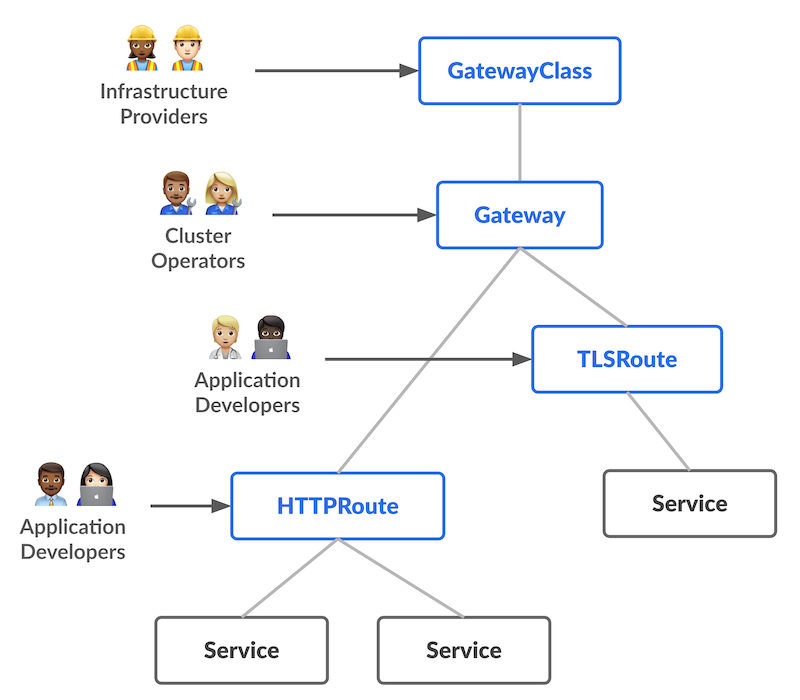

**Gateway API 리소스 모델 및 권한 체계:**
Gateway API는 위 다이어그램과 같이 세 가지 주요 페르소나(Persona)와 이에 대응하는 리소스로 구성되어 있습니다.

1. **Infrastructure Provider (인프라 제공자)**: 클러스터에 실제 게이트웨이 서비스(NGINX, Envoy 등)를 제공하며 `GatewayClass`를 통해 그 종류와 설정을 정의합니다. 
2. **Cluster Operator (클러스터 운영자)**: `Gateway` 리소스를 생성하여 실제 인프라 엔드포인트(Load Balancer 등)를 배포하고, 어떤 네임스페이스의 트래픽이 인입될 수 있는지 보안과 정책을 관리합니다.
3. **Application Developer (애플리케이션 개발자)**: 본인이 관리하는 서비스에 대해 `HTTPRoute`를 작성하여 `Gateway`에 연결함으로써 구체적인 라우팅 규칙(경로, 호스트 등)을 정의합니다.

이러한 **관심사 분리(Separation of Concerns)**를 통해 인프라 담당자와 서비스 개발자가 서로의 영역을 침범하지 않고 독립적이고 안전하게 트래픽을 관리할 수 있습니다.

##### [참고] Ingress vs. Gateway API 비교

| 구분 | Ingress | Gateway API |
| :--- | :--- | :--- |
| **리소스 모델** | 단일 리소스 (`Ingress`)에 관리자/개발자 설정 혼재 | `GatewayClass`, `Gateway`, `HTTPRoute` 등으로 역할 분리 |
| **확장성** | 기능 확장을 위해 주로 비표준 `Annotation` 사용 | 표준 `Filter` 및 `Extension`을 통해 공식 기능 확장 지원 |
| **프로토콜 지원** | 주로 HTTP/HTTPS에 국한 | HTTP 외 TCP, UDP, gRPC 등 멀티 프로토콜 표준 지원 |
| **관리 주체** | 클러스터 관리자와 개발자가 동일한 리소스 공유 | 인프라 관리자(인프라), 운영자(진입점), 개발자(라우팅) 간 명확한 분리 |
| **주요 장점** | 단순하고 익숙함 | 고도로 정교하고 유연하며 역할 중심적인 관리 가능 |

#### 14.2.2 관련 용어

| No | 용어 | 설명 |
| --- | --- | --- |
| 1 | Gateway API | Ingress를 대체하는 차세대 쿠버네티스 서비스 네트워킹 표준 인터페이스입니다. |
| 2 | GatewayClass | 클러스터 운영자가 정의하는 템플릿으로, 사용할 컨트롤러(예: Envoy Gateway)를 지정합니다. |
| 3 | Gateway | 인프라 수준의 엔드포인트를 정의합니다. 이 리소스가 생성되면 SCP의 Load Balancer가 실제로 생성됩니다. |
| 4 | HTTPRoute | 개발자가 정의하는 라우팅 규칙으로, 특정 호스트나 경로를 어떤 서비스로 보낼지 결정합니다. (Ingress의 역할을 분담) |
| 5 | Envoy Gateway | Envoy 프록시를 기반으로 Gateway API를 구현한 클라우드 네이티브 표준 컨트롤러입니다. |

### 14.3 따라하기

#### 14.3.1 Kubeconfig 설정 및 클러스터 접속 확인

Terraform 배포가 완료된 후, 생성된 쿠버네티스 클러스터에 `kubectl` 명령어로 접근하기 위해 `kubeconfig` 파일을 설정해야 합니다. SCP v2 환경에서는 콘솔에서 직접 kubeconfig 정보를 다운로드하여 설정합니다.

##### Kubeconfig 파일 설정 (수동)
- **1. SCP 콘솔 접속:** **[서비스] → [Container] → [Kubernetes Engine]** 메뉴로 이동합니다.
- **2. 클러스터 선택:** 목록에서 방금 생성한 `tfk8shol4` 클러스터를 클릭합니다.
- **3. Kubeconfig 다운로드:** 클러스터 상세 화면에서 **[Kubeconfig 다운로드]** 버튼을 클릭하여 YAML 형식의 설정 파일을 다운로드합니다.
    > ⚠️ **주의:** Kubeconfig 파일은 보안상 **1회만 다운로드**할 수 있습니다. 다운로드 후 반드시 안전한 곳에 저장하고 관리하세요.

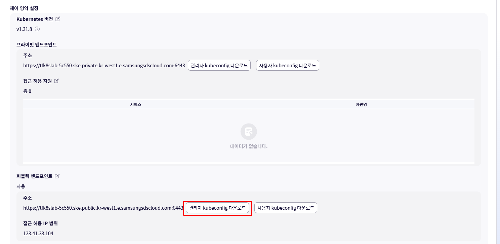


- **5. 설정 파일 복사 및 붙여넣기:**
    - 다운로드한 `kubeconfig` 파일을 텍스트 편집기로 열어 전체 내용을 복사합니다.
    - web-ide 터미널에서, `~/.kube/config` 파일을 생성하고 복사한 내용을 붙여넣습니다.
    - 아래 명령어를 사용하면 web-ide 편집기로 파일을 열 수 있습니다.

```bash
# 먼저 디렉토리가 없으면 생성합니다.
mkdir -p ~/.kube
# vi 편집기로 파일을 엽니다.
code-server ~/.kube/config
```

    - 에디터에서 복사한 kubeconfig 내용을 붙여넣고 저장합니다.

##### 클러스터 접속 테스트
`kubeconfig` 설정이 완료되면, 아래 명령어를 실행하여 클러스터와 정상적으로 통신이 되는지 확인합니다.

##### 버전 확인
```bash
# kubectl 클라이언트(CLI)와 쿠버네티스 서버(API 서버)의 버전을 확인합니다.
# Client Version과 Server Version이 모두 표시되어야 정상입니다.
kubectl version
```
결과
```
Client Version: v1.xx.x
Kustomize Version: v5.0.4-0.20230601165947-6ce0bf390ce3
Server Version: v1.xx.x-ske.p2
```

##### 클러스터 정보 확인
```bash
# 클러스터의 마스터 주소와 서비스 주소 등 기본 정보를 확인합니다.
kubectl cluster-info
```
결과
```
Kubernetes control plane is running at https://tfk8shol4-xxxxx.ske.kr-west.samsungsdscloud.com:6443
CoreDNS is running at https://tfk8shol4-xxxxx.ske.kr-west.samsungsdscloud.com:6443/api/v1/namespaces/kube-system/services/kube-dns:dns/proxy

To further debug and diagnose cluster problems, use 'kubectl cluster-info dump'.
```

##### 노드 정보 확인

```bash
# 클러스터에 포함된 워커 노드들의 목록과 상태(STATUS)를 확인합니다.
# 모든 노드의 상태가 'Ready'로 표시되어야 정상입니다.
kubectl get nodes
```
결과
```
NAME                             STATUS   ROLES    AGE     VERSION
ske-tfnodepoolhol4-2qz6c-kq7vh   Ready    <none>   3m21s   v1.31.8-ske.p3
```

#### 14.3.2 작업 디렉토리 준비
**설명:** Gateway API 배포에 필요한 설정 파일들을 저장할 작업 디렉토리를 생성하고 이동합니다.

```bash
mkdir gateway
cd gateway
```

#### 14.3.3 Gateway API 표준 CRD 설치

**설명:** Gateway API는 쿠버네티스 기본 API에 포함되지 않은 확장 API이므로, 컨트롤러를 설치하기 전에 표준 CRD를 먼저 클러스터에 설치해야 합니다.

```bash
kubectl apply -f https://github.com/kubernetes-sigs/gateway-api/releases/download/v1.1.0/standard-install.yaml
```

#### 14.3.4 Envoy Gateway 설치

**설명:** Helm을 사용하여 Envoy Gateway를 설치합니다. Envoy Gateway는 OCI 기반의 Helm 차트를 제공합니다.

```bash
# Envoy Gateway 및 Gateway API CRD 설치
helm install eg oci://docker.io/envoyproxy/gateway-helm \
  --version v1.7.1 \
  -n envoy-gateway-system \
  --create-namespace
```

**설치 확인:** 컨트롤러 포드가 `Running` 상태가 될 때까지 기다립니다.
```bash
kubectl wait --timeout=5m -n envoy-gateway-system deployment/envoy-gateway --for=condition=Available
```

#### 14.3.5 Subnet 및 Security Group ID 확인
설명: Envoy Gateway와 연동할 Load Balancer가 생성될 Subnet과 적용할 Security Group of ID를 SCP 콘솔에서 미리 확인해야 합니다.

- Subnet ID 확인 경로:
  - SCP 콘솔 접속 → 서비스 → Networking → VPC
  - Load Balancer용 Public Subnet인 `tfPUBSUBhol4`를 선택하고 ID 복사.

- Security Group ID 확인 경로:
  - SCP 콘솔 접속 → 서비스 → Networking → Security Group
  - Kubernetes Engine용 `tf-k8s-SG-hol4` 보안 그룹 상세 정보에서 ID 복사.

#### 14.3.6 Gateway 리소스 생성 및 SCP Load Balancer 연동

Gateway API의 핵심 개념인 '역할 분리(Separation of Concerns)'를 명확히 이해하기 위해, 리소스를 3개의 개별 YAML 파일로 분리하여 작성합니다. 본격적인 실습에 앞서 각 리소스의 역할을 이해하는 것이 중요합니다.

##### 1. 핵심 리소스 개념 이해
- **EnvoyProxy (인프라 설정)**: 실제 프록시 엔진인 Envoy의 세부 설정을 담당합니다. 이번 실습에서는 SCP의 로드밸런서와 연동하기 위한 다양한 어노테이션(Public IP 사용 여부, 서브넷 ID 등)을 이 리소스에서 정의합니다. 하드웨어/인프라 수준의 구성을 코드로 관리하는 영역입니다.
- **GatewayClass (게이트웨이 템플릿)**: 클러스터 내에서 게이트웨이를 생성하기 위한 '설계도' 또는 '템플릿' 역할을 합니다. 어떤 컨트롤러(여기서는 `gateway.envoyproxy.io`)가 관리를 맡을지 결정하고, 위에서 만든 `EnvoyProxy` 설정을 참조하여 기본 인프라 설정을 상속받습니다.
- **Gateway (실제 진입점)**: 실제 트래픽이 들어오는 '문'을 정의합니다. 포트(80, 443 등), 프로토콜(HTTP, TCP 등), 그리고 어떤 라우팅 규칙들을 허용할지 결정합니다. 이 리소스가 클러스터에 적용되는 순간, SCP 상에서 실제 Load Balancer 인스턴스가 생성됩니다.

##### 2. SCP Load Balancer 어노테이션 설명
| 어노테이션 키 | 설명 |
| :--- | :--- |
| `service.beta.kubernetes.io/scp-load-balancer-public-ip-enabled` | 생성되는 Load Balancer에 공인 IP(`PUBLIC NAT IP`)를 할당하도록 설정합니다. (`true`) |
| `service.beta.kubernetes.io/scp-load-balancer-subnet-id` | Load Balancer가 생성될 서브넷의 고유 ID를 지정합니다. |
| `service.beta.kubernetes.io/scp-load-balancer-security-group-id` | Kubernetes Engine에 적용할 보안 그룹의 고유 ID를 지정합니다. |
| `service.beta.kubernetes.io/scp-load-balancer-source-ranges-firewall-rules` | 서비스의 `loadBalancerSourceRanges` 필드에 지정된 IP 대역에 대한 방화벽 규칙을 자동으로 생성합니다. |
| `service.beta.kubernetes.io/scp-load-balancer-snat-healthcheck-firewall-rules` | 방화벽 규칙( LB Source NAT IP, HealthCheck IP → 멤버 IP:Port )을 자동으로 추가합니다.  |

##### 3. EnvoyProxy 생성 (인프라 설정)
**인프라 전용 어노테이션(SCP Load Balancer 연동)을 정의합니다.**

```bash
code-server envoyproxy.yaml
```

> ⚠️ **필수 수정:** `<여기에_Subnet_ID를_입력하세요>`와 `<여기에_Security_Group_ID를_입력하세요>`를 앞서 14.3.5 단계에서 복사한 값으로 변경하세요.

```yaml
apiVersion: gateway.envoyproxy.io/v1alpha1
kind: EnvoyProxy
metadata:
  name: scp-envoy-proxy
  namespace: envoy-gateway-system
spec:
  provider:
    type: Kubernetes
    kubernetes:
      envoyService:
        type: LoadBalancer
        annotations:
          # SCP Load Balancer 연동을 위한 어노테이션
          service.beta.kubernetes.io/scp-load-balancer-public-ip-enabled: "true"
          service.beta.kubernetes.io/scp-load-balancer-subnet-id: "<여기에_Subnet_ID를_입력하세요>" 
          service.beta.kubernetes.io/scp-load-balancer-security-group-id: "<여기에_Security_Group_ID를_입력하세요>" 
```

##### 4. GatewayClass 생성 (게이트웨이 템플릿)
**위에서 만든 EnvoyProxy 설정을 참조하는 템플릿을 정의합니다.**

```bash
code-server gatewayclass.yaml
```

```yaml
apiVersion: gateway.networking.k8s.io/v1
kind: GatewayClass
metadata:
  name: scp-gateway-class
spec:
  controllerName: gateway.envoyproxy.io/gatewayclass-controller
  parametersRef:
    group: gateway.envoyproxy.io
    kind: EnvoyProxy
    name: scp-envoy-proxy
    namespace: envoy-gateway-system
```

##### 5. Gateway 생성 (실제 라우팅 진입점)
**실제 로드밸런서 생성을 트리거하는 인프라 진입점을 정의합니다.**

```bash
code-server gateway.yaml
```

```yaml
apiVersion: gateway.networking.k8s.io/v1
kind: Gateway
metadata:
  name: hol4-main-gateway
  namespace: envoy-gateway-system
spec:
  gatewayClassName: scp-gateway-class
  listeners:
  - name: http
    protocol: HTTP
    port: 80
    allowedRoutes:
      namespaces:
        from: All
```

##### 6. 리소스 일괄 적용
**작성한 3개의 파일을 클러스터에 적용합니다.**

```bash
kubectl apply -f envoyproxy.yaml
kubectl apply -f gatewayclass.yaml
kubectl apply -f gateway.yaml
```


#### 14.3.7 Gateway API 배포 확인

**설명:** `envoy-gateway-system` 네임스페이스의 관련 리소스들이 정상적으로 생성되고 `Running` 상태인지 확인합니다. 특히 `envoy-gateway-system` 서비스의 `TYPE`이 `LoadBalancer`로 되어 있는지 확인해야 합니다.

```bash
kubectl get all -n envoy-gateway-system 
```
결과
```bash
NAME                                                                  READY   STATUS    RESTARTS        AGE
pod/envoy-envoy-gateway-system-hol4-main-gateway-cf4604c8-7c56nhj7p   2/2     Running   0               29m
pod/envoy-gateway-58f7cb84b5-4lnks                                    1/1     Running   1 (3h23m ago)   18h

NAME                                                            TYPE           CLUSTER-IP      EXTERNAL-IP                  PORT(S)                                            AGE
service/envoy-envoy-gateway-system-hol4-main-gateway-cf4604c8   LoadBalancer   172.20.82.157   123.41.32.219,192.168.0.60   80:30856/TCP                                       29m
service/envoy-gateway                                           ClusterIP      172.20.99.33    <none>                       18000/TCP,18001/TCP,18002/TCP,19001/TCP,9443/TCP   18h

NAME                                                                    READY   UP-TO-DATE   AVAILABLE   AGE
deployment.apps/envoy-envoy-gateway-system-hol4-main-gateway-cf4604c8   1/1     1            1           29m
deployment.apps/envoy-gateway                                           1/1     1            1           18h

NAME                                                                               DESIRED   CURRENT   READY   AGE
replicaset.apps/envoy-envoy-gateway-system-hol4-main-gateway-cf4604c8-7c5667db9b   1         1         1       29m
replicaset.apps/envoy-gateway-58f7cb84b5                                           1         1         1       18h

```

#### 14.3.8 Load Balancer 연동 확인 및 PUBLIC NAT IP 확인

**설명:** SCP v2 환경에서는 쿠버네티스에서 `EnvoyProxy`의 `Type: LoadBalancer`로 서비스를 배포하면, SCP가 이를 감지하여 자동으로 **Load Balancer 리소스와 리스너를 생성**하고 서비스에 연결합니다. 이 과정을 통해 외부 트래픽이 클러스터 내부의 서비스로 전달될 수 있습니다. 이제 Envoy Gateway 서비스에 의해 생성된 Load Balancer와 접속에 필요한 공인 IP(`PUBLIC NAT IP`)를 확인합니다.

##### 1. 서비스 경로
- 서비스 → **Networking** → **Load Balancer**

##### 2. **확인 절차:**

1. **Load Balancer 목록 확인:** Load Balancer 메뉴로 이동하면 `envoy-gateway-system` 서비스에 의해 자동으로 생성된 Load Balancer 항목을 찾을 수 있습니다. 이 Load Balancer는 쿠버네티스 서비스에 의해 동적으로 생성된 것입니다.

2. **리스너 확인:** 생성된 Load Balancer를 클릭하여 상세 정보로 이동한 후, **[연결된 자원]** 탭을 선택합니다. Gateway API가 사용하는 포트(일반적으로 80, 443)에 대한 리스너가 자동으로 생성되어 있는지 확인합니다.

3. **공인 IP(PUBLIC NAT IP) 확인:** Load Balancer 목록 또는 상세 정보에서 **`PUBLIC NAT IP`** 주소를 확인하고 반드시 메모해 둡니다. 이 IP 주소는 앞으로 Jenkins, ArgoCD, 그리고 최종 애플리케이션에 접근하기 위한 공용 주소로 계속 사용됩니다.

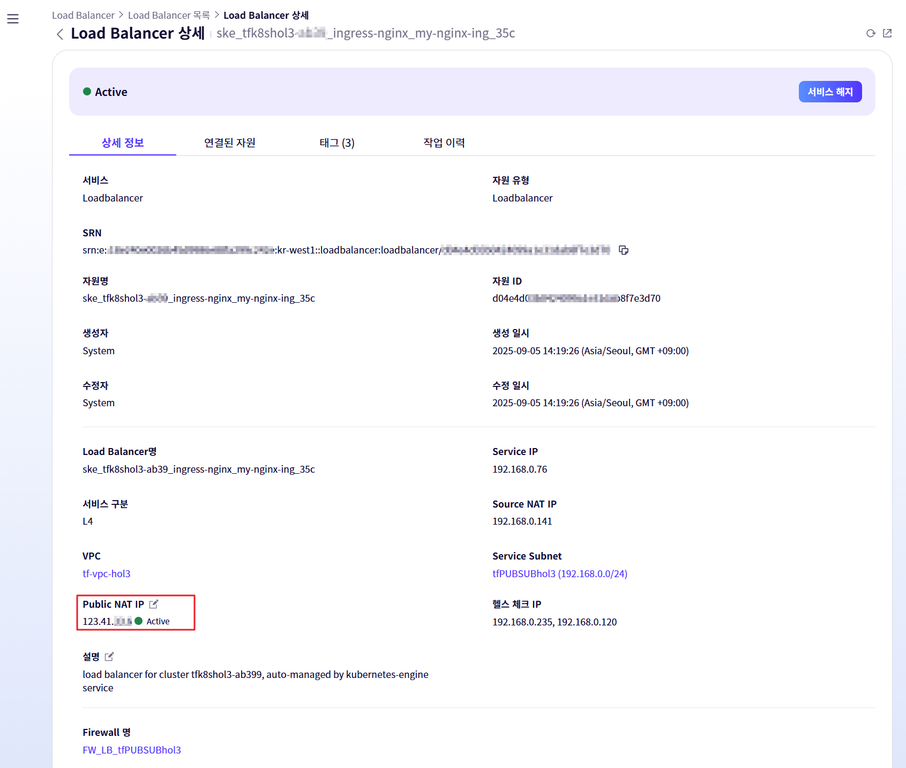

> 💡 **sslip.io와 함께 사용:** 이 공인 IP 주소는 `sslip.io`와 같은 와일드카드 DNS 서비스와 결합하여 `jenkins.123.45.67.89.sslip.io` 와 같은 도메인을 즉시 만들어 사용하는 데 활용됩니다.

> ⚠️ **중요:** 이 `PUBLIC NAT IP` 주소는 실습 전반에 걸쳐 사용되므로, 정확히 확인하고 메모해두는 것이 매우 중요합니다.


#### 14.3.9 로드밸런서용 자동 생성 Firewall 미사용 처리

LoadBalancer 타입의 서비스를 생성하면 해당 LoadBalancer용 Firewall(`FW_LB_tfPUBSUBhol4`)이 자동으로 생성됩니다. Internet Gateway에 이미 Firewall이 설정되어 있으므로, Load Balancer에 Firewall을 이중으로 설정하면 보안은 강화되지만 설정 복잡도가 높아집니다.

따라서 본 실습에서는 Terraform으로 생성한 Security Group으로만 접근을 제어하기 위해 Load Balancer용 Firewall은 미사용으로 설정합니다.

- **경로:** 서비스 → Networking → Firewall 목록
- **설정:** 목록에서 `FW_LB_tfPUBSUBhol4` Firewall을 찾아 **[미사용]**으로 설정합니다.

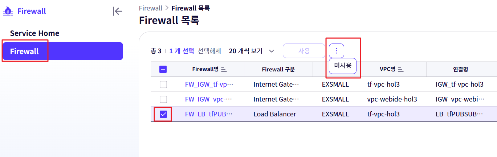


#### 14.3.10 로드밸런서 헬스체크 확인

`14.3.9` 단계에서 Load Balancer용 Firewall을 미사용으로 처리한 후, 로드밸런서의 헬스체크 상태가 Unhealthy에서 Healthy로 정상 변경되는지 확인합니다.

##### 1. 서비스 경로
- 서비스 → Networking → Load Balancer → LB 서버 그룹
##### 2. 확인 절차
1. LB 서버 그룹 목록에서 Envoy Gateway에 의해 생성된 서버 그룹을 선택합니다.
2. **[연결된 자원]** 탭을 클릭합니다.
3. 등록된 Worker Node들의 **헬스 체크 상태**가 **Healthy**로 표시되는 것을 최종적으로 확인합니다. 처음에는 Unhealthy 상태였다가, Firewall 정책이 적용된 후 Healthy로 변경됩니다.

이 과정을 통해 Envoy Gateway와 Load Balancer가 정상적으로 연동되었음을 검증할 수 있습니다.

#### 14.3.11 Gateway API 동작 확인 (curl)

이제 Load Balancer의 Public IP로 직접 HTTP 요청을 보내 Gateway API가 정상적으로 응답하는지 확인합니다. 아직 아무런 Gateway 규칙을 설정하지 않았기 때문에 `404 Not Found` 응답이 오는 것이 정상입니다. 중요한 것은 외부 요청이 Envoy Gateway까지 도달하여 정상적으로 수신되는지(`server: envoy` 헤더) 확인하는 것입니다.

1. web-ide 터미널을 엽니다.
2. `14.3.8` 단계에서 확인한 Load Balancer의 **PUBLIC NAT IP**를 사용하여 아래 `curl` 명령어를 실행합니다. (`-I` 옵션을 사용하여 응답 헤더 정보만 확인합니다.)

```bash
curl -I http://<LB-PUBLIC-NAT-IP>.sslip.io
```

**정상 응답 예시:**

아래와 같이 `server: envoy` 헤더가 표시되고 `404 Not Found` 상태 코드가 반환되면 Gateway API가 외부 요청을 정상적으로 수신하고 있는 것입니다.

```text
HTTP/1.1 404 Not Found
server: envoy
date: Tue, 07 Apr 2026 01:09:16 GMT
content-length: 0
```

만약 응답이 없거나(Timeout) 다른 오류가 발생하면, Load Balancer, Security Group, Firewall 설정을 다시 한번 확인해야 합니다.

### 14.4 정리하기

- **Envoy Gateway 배포:** 성공적으로 배포된 Envoy Gateway와 SCP Load Balancer 연동을 통해 클러스터의 단일 외부 진입점을 확보했습니다.
- **표준 기반 관리:** Gateway API의 `EnvoyProxy`, `GatewayClass`, `Gateway` 리소스를 활용하여 고도로 유연한 인프라 제어가 가능해졌습니다.
- **확장성 확보:** 향후 배포할 Gitea, Jenkins, ArgoCD 및 마이크로서비스 애플리케이션을 단일 공인 IP 하위의 서로 다른 도메인으로 서비스할 수 있는 인프라 기반을 완성했습니다.

#### 14.4.1 Gateway Controller 및 Gateway 삭제

> [!WARNING]
> **중요 (로드밸런서 잔존 및 과금 방지)**:
> 생성된 Gateway 리소스는 실제 SCP의 Load Balancer 및 공인 IP와 연동되어 있습니다.
> 만약 이 리소스들을 사전에 삭제하지 않은 채 **쿠버네티스 클러스터(SKE)를 삭제하거나 `terraform destroy`를 수행할 경우, SCP 상에 리소스가 비정상 잔존(Orphaned Load Balancer)**하여 삭제 프로세스가 락(Lock)에 걸릴 수 있습니다.
> 따라서 **클러스터 삭제 및 환경 정리 전에 반드시 아래 명령어를 실행하여 Gateway 리소스들을 먼저 완전 삭제**해야 합니다.

실습 완료 후 생성된 Gateway 및 Envoy Gateway Controller를 클러스터에서 삭제하려면 다음 명령어를 실행합니다.

```bash
# Gateway Controller 및 Gateway 삭제
kubectl delete -f gateway.yaml
kubectl delete -f gatewayclass.yaml
kubectl delete -f envoyproxy.yaml
helm uninstall eg -n envoy-gateway-system
```


## 15. [모범답안] 실습 미션 모범답안 (Day 1 & Day 2)

본 장은 1일차 및 2일차 과정의 마지막 세션에서 진행된 시나리오 기반 실습 미션의 모범답안(정답 HCL 코드)과 해설을 제공합니다. 미션을 스스로 해결해 본 후, 작성한 코드와 비교하여 검토해 보시기 바랍니다.

### 15.1 [1일차 미션] 신규 개발팀을 위한 격리된 샌드박스 네트워크 구축

1일차에 해결했던 **[미션 1] 신규 개발팀을 위한 격리된 샌드박스 네트워크 구축**의 정답 HCL 코드와 설계 포인트입니다.

#### 15.1.1 정답 HCL 코드

##### `infra.tf` 파일 추가 내용:
```hcl
# 1. 신규 개발팀을 위한 격리된 서브넷 생성
resource "samsungcloudplatformv2_vpc_subnet" "dev_team_subnet" {
  name            = "dev-team-subnet"
  vpc_id          = samsungcloudplatformv2_vpc_vpc.my_vpc.id # 기존 VPC ID 속성 참조
  type            = "GENERAL"
  cidr            = "192.168.200.0/24" # 1일차 기초 대역과 겹치지 않는 대역 할당
  dns_nameservers = var.subnet_dns_nameservers
  description     = "Sandbox subnet for dev team"
  tags            = local.common_tags
}

# 2. 신규 보안 그룹 생성
resource "samsungcloudplatformv2_security_group_security_group" "dev_app_sg" {
  name        = "dev-app-sg"
  description = "SecurityGroup for dev team sandbox"
  loggable    = false
  tags        = local.common_tags
}

# 3. 개발자 IP로부터의 8080 인바운드 트래픽 허용 규칙 정의
resource "samsungcloudplatformv2_security_group_security_group_rule" "allow_dev_8080" {
  # 생성한 보안 그룹의 ID를 속성 참조 방식으로 연결 (의존성 생성)
  security_group_id = samsungcloudplatformv2_security_group_security_group.dev_app_sg.id
  ethertype         = "IPv4"
  protocol          = "TCP"
  direction         = "ingress"
  description       = "Allow 8080 for dev team"
  remote_ip_prefix  = local.my_current_ip_address # 현재 web-ide 개발자 IP 대역 지정 (실습 편의상 "0.0.0.0/0"으로 대체 가능)
  port_range_min    = 8080
  port_range_max    = 8080
}

# 4. 샌드박스 서브넷 방화벽 규칙 정의 (8080 포트 인바운드 허용)
resource "samsungcloudplatformv2_firewall_firewall_rule" "dev_team_fw_rule" {
  firewall_id = samsungcloudplatformv2_vpc_internet_gateway.my_igw.internet_gateway.firewall_id
  firewall_rule_create = {
    action = "ALLOW"
    description = "Allow 8080 for dev team subnet"
    destination_address = ["192.168.200.0/24"]
    direction = "INBOUND"
    service = [{
      service_type = "TCP"
      service_value = "8080"
    }]
    source_address = [local.my_current_ip_address] # 실제 환경에서는 수강생의 개발자 IP 대역 지정 (또는 ["0.0.0.0/0"])
    status = "ENABLE"
  }
}
```

##### `outputs.tf` 파일 추가 내용:
```hcl
output "dev_subnet_id" {
  description = "Dev Team Sandbox Subnet ID"
  value       = samsungcloudplatformv2_vpc_subnet.dev_team_subnet.id
}

output "dev_security_group_id" {
  description = "Dev Team Security Group ID"
  value       = samsungcloudplatformv2_security_group_security_group.dev_app_sg.id
}
```

#### 15.1.2 해결 코드 분석 및 핵심 설계 포인트
* **암시적 의존성 (Implicit Dependency)**: `security_group_id = samsungcloudplatformv2_security_group_security_group.dev_app_sg.id` 와 같이 특정 리소스의 출력 속성(Attribute Reference)을 다른 리소스의 입력 인수로 참조하여 가져다 쓰면, 테라폼은 자동으로 "보안 그룹이 생성된 후 보안 그룹 룰을 생성해야 한다"는 의존 관계를 파악하고 순서를 보장합니다.
* **State 파일(tfstate)의 역할**: `apply`를 통해 배포된 결과는 반드시 `terraform.tfstate` 파일에 기록되며, 테라폼은 이를 '진실의 원천(Single Source of Truth)'으로 삼아 인프라의 상태와 의존성을 추적한다는 점을 꼭 기억해야 합니다.

---

### 15.2 [2일차 미션] 엔터프라이즈 3-Tier 서비스 플랫폼(SKE) 통합 완성

2일차에 해결했던 **[미션 2] 엔터프라이즈 3-Tier 서비스 플랫폼(SKE) 통합 완성**의 정답 HCL 코드와 설계 포인트입니다.

#### 15.2.1 정답 HCL 코드

##### `filestorage.tf` 파일 내용:
```hcl
resource "samsungcloudplatformv2_filestorage_volume" "k8s_file_storage" {
  name         = "${local.name_prefix}fs${local.environment}"
  protocol     = "NFS"
  type_name    = "HDD"
  access_rules = []
  tags         = local.common_tags
}
```

##### `kubernetes_engine.tf` 파일 내용:
```hcl
resource "samsungcloudplatformv2_ske_cluster" "my_cluster" {
  name                            = "${local.name_prefix}k8s${local.environment}"
  vpc_id                          = samsungcloudplatformv2_vpc_vpc.my_vpc.id
  subnet_id                       = samsungcloudplatformv2_vpc_subnet.k8s_subnet.id
  security_group_id_list          = [samsungcloudplatformv2_security_group_security_group.k8s_sg.id]
  volume_id                       = samsungcloudplatformv2_filestorage_volume.k8s_file_storage.id
  kubernetes_version              = "v1.31.8"
  public_endpoint_access_control_ip = local.my_current_ip_address
  cloud_logging_enabled           = false
  service_watch_logging_enabled   = false
}
```

##### `kubernetes_node_pool.tf` 파일 내용:
```hcl
resource "samsungcloudplatformv2_ske_nodepool" "nodepool" {
  name               = "${local.name_prefix}nodepool${local.environment}"
  cluster_id         = samsungcloudplatformv2_ske_cluster.my_cluster.id
  image_os           = "ubuntu"
  image_os_version   = "22.04"
  server_type_id     = "s1v2m4"
  is_auto_scale      = true
  min_node_count     = 1
  max_node_count     = 3
  desired_node_count = 1
  keypair_name       = samsungcloudplatformv2_virtualserver_keypair.keypair.name
  kubernetes_version = "v1.31.8"
  volume_type_name   = "SSD"
  volume_size        = "104"
  is_auto_recovery   = false
}
```

##### `nat_gateway.tf` 파일 내용:
```hcl
resource "samsungcloudplatformv2_vpc_nat_gateway" "natgateway" {
  subnet_id   = samsungcloudplatformv2_vpc_subnet.k8s_subnet.id
  publicip_id = samsungcloudplatformv2_vpc_publicip.natgw_publicip.id
  description = "NAT Gateway generated from Terraform"
  tags        = local.common_tags
}
```

#### 15.2.2 해결 코드 분석 및 의존성 설명
1. **자연적인 암시적 의존성 (Implicit Dependency)**:
   - SKE 클러스터(`samsungcloudplatformv2_ske_cluster.my_cluster`)는 `volume_id` 인수를 통해 파일 스토리지(`samsungcloudplatformv2_filestorage_volume.k8s_file_storage.id`)를 참조합니다.
   - SKE 노드풀(`samsungcloudplatformv2_ske_nodepool.nodepool`)은 `cluster_id` 인수를 통해 SKE 클러스터(`samsungcloudplatformv2_ske_cluster.my_cluster.id`)를 참조합니다.
   - 테라폼은 이러한 속성 참조를 해석하여 **File Storage 생성 ➡️ SKE Cluster 생성 ➡️ SKE Node Pool 생성**의 순서를 자동으로 보장하며 배포를 진행합니다.
2. **NAT Gateway 구성**:
   - `nat_gateway.tf`에서 사용되는 `subnet_id`와 `publicip_id`는 각각 SKE 클러스터 노드들이 있는 프라이빗 서브넷과 외부 게이트웨이용 공인 IP를 매핑합니다. 이를 통해 노드들이 프라이빗 환경에 숨겨진 상태에서 아웃바운드 패키지 통신만 가능하게 합니다.
3. **오토스케일링 설정**:
   - `is_auto_scale = true`와 `min_node_count`/`max_node_count` 설정을 통해 워커 노드가 자원 사용량에 따라 1대에서 3대까지 자동 조절되도록 지원합니다.
